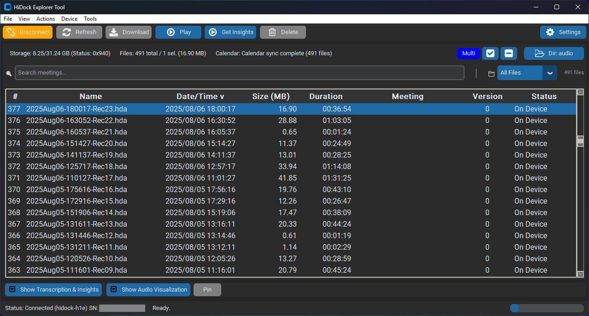

# HiDock Next 🎵

**Professional Desktop & Web Applications for HiDock Device Management**

[](https://opensource.org/licenses/MIT)
[](https://www.python.org/downloads/)
[](https://www.typescriptlang.org/)
[](https://github.com/sgeraldes/hidock-next/releases)


*HiDock Desktop - Professional audio recording management with AI transcription*

## ✨ Features

- 🎙️ **Complete Device Management** - Full control over HiDock recording devices
- 🎵 **Advanced Audio Player** - Built-in player with waveform visualization
- 🤖 **AI Transcription** - Support for 11+ AI providers (OpenAI, Gemini, Claude, etc.)
- 📅 **Calendar Integration** - Automatic meeting correlation (Windows)
- 📁 **Smart File Management** - Batch operations, filtering, and organization
- 🌐 **Cross-Platform** - Windows, macOS, and Linux support
- 🚀 **High Performance** - Optimized for large file collections

## 🚀 Quick Start

### Windows
```cmd
git clone https://github.com/sgeraldes/hidock-next.git
cd hidock-next
setup-windows.bat
run-desktop.bat
```

### macOS / Linux
```bash
git clone https://github.com/sgeraldes/hidock-next.git
cd hidock-next
./setup-unix.sh
./run-desktop.sh
```

## 📦 Applications

### [Desktop App](apps/desktop/) - Full-Featured Management
- Complete USB device control
- Advanced audio playback with visualization
- AI transcription with multiple providers
- Calendar integration (Windows)
- Batch file operations

### [Web App](apps/web/) - Modern Web Interface
- React/TypeScript implementation
- Real-time device monitoring
- Responsive design
- Cross-browser support

### [Audio Insights](apps/audio-insights/) - AI Analysis Tool
- Audio file analysis
- Transcription extraction
- Insights generation

## 🛠️ Requirements

- **Python** 3.12 or higher
- **Node.js** 18 or higher (for web apps)
- **USB Driver** for HiDock devices
- **OS**: Windows 10+, macOS 12+, Ubuntu 20.04+

## 📊 Platform Support

| Feature | Windows | macOS | Linux |
|---------|---------|-------|-------|
| Device Management | ✅ Full | ✅ Full | ✅ Full |
| Audio Processing | ✅ Full | ✅ Full | ✅ Full |
| Calendar Integration | ✅ Outlook | ❌ | ❌ |
| AI Transcription | ✅ All Providers | ✅ All Providers | ✅ All Providers |

## 📂 Project Structure

```
hidock-next/
├── apps/               # Applications
│   ├── desktop/       # Desktop application (Python/Tkinter)
│   ├── web/          # Web application (React/TypeScript)
│   └── audio-insights/ # Audio analysis tool
├── research/          # Research and reverse engineering tools
├── firmware/          # Device firmware files
├── docs/             # Documentation
├── scripts/          # Utility scripts
└── config/           # Configuration files
```

## 🔧 Development

### Setup Development Environment
```bash
python setup.py
# Choose option 2 (Developer)
```

### Running Tests
```bash
cd apps/desktop
pytest tests/
```

### Building for Distribution
```bash
python scripts/build/build_desktop.py
```

## 📝 Documentation

- [Getting Started](docs/getting-started/QUICK_START.md)
- [Desktop App Guide](apps/desktop/README.md)
- [Web App Guide](apps/web/README.md)
- [API Documentation](docs/api/)
- [Troubleshooting](docs/TROUBLESHOOTING.md)

## 🤝 Contributing

We welcome contributions! Please see our [Contributing Guide](CONTRIBUTING.md) for details.

1. Fork the repository
2. Create a feature branch
3. Make your changes
4. Submit a pull request

## 📄 License

This project is licensed under the MIT License - see the [LICENSE](LICENSE) file for details.

## 🙏 Acknowledgments

- HiDock hardware team for device specifications
- Open source community for libraries and tools
- All contributors and testers

## 📞 Support

- **Issues**: [GitHub Issues](https://github.com/sgeraldes/hidock-next/issues)
- **Discussions**: [GitHub Discussions](https://github.com/sgeraldes/hidock-next/discussions)
- **Documentation**: [Full Docs](docs/)

---

**HiDock Next v1.0-RC1** - Ready for production use!