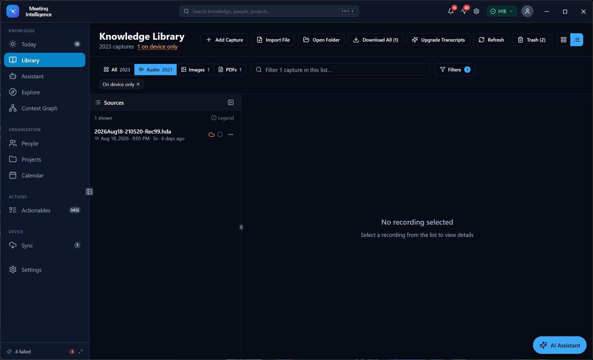
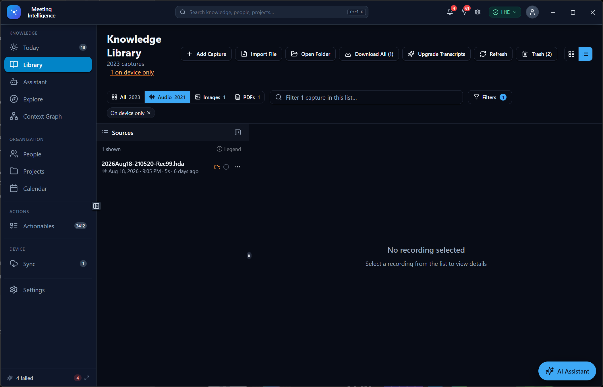
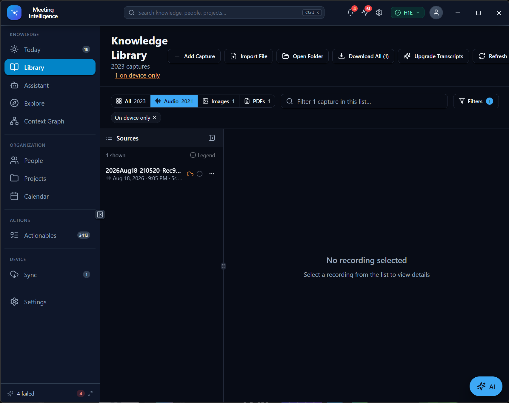
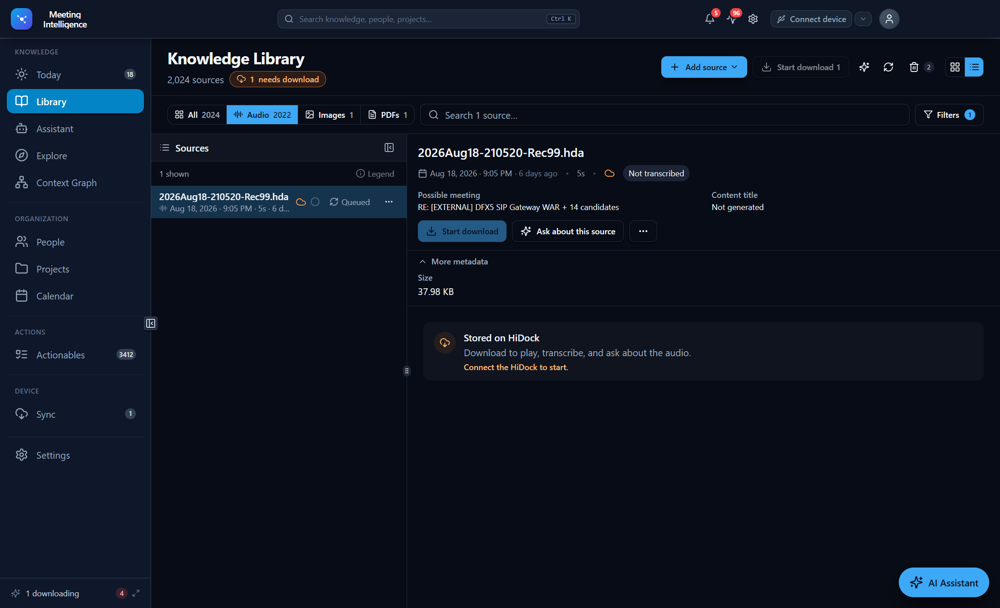
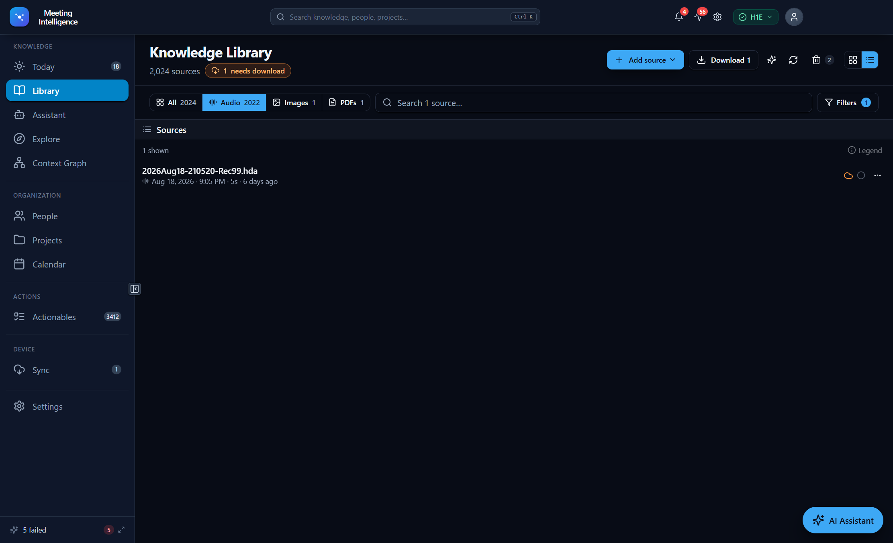
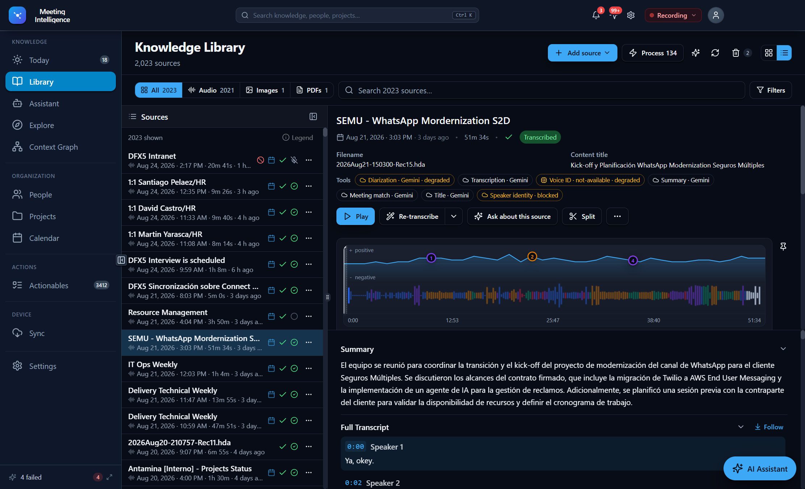
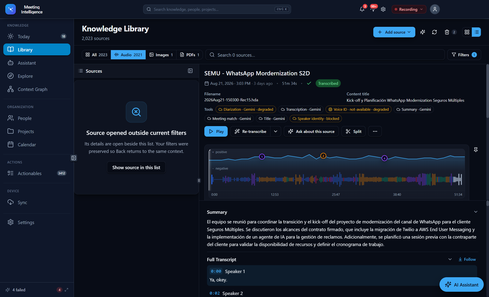
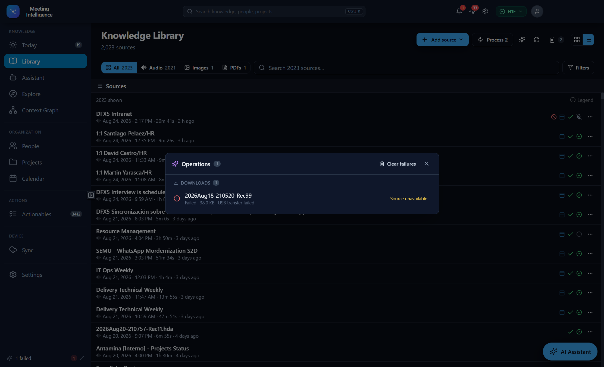

# Knowledge Library, Source Reader, and Operations Audit

**Audit date:** 2026-08-24  
**Surfaces:** Electron Library, responsive header/filter toolbar, source rail, source reader, Operations panel  
**Methods:** supplied screenshots, running-app inspection through the existing Electron session, keyboard/history checks,
read-only app IPC/database reconciliation, focused automated tests, and one Impeccable detector pass  
**USB boundary:** no exploratory USB scripts, descriptors, direct opens, or repeated connection attempts were used.

## Outcome

The audited flow was not merely visually rough. It prevented reliable operation: the application advertised a deleted
recording as device-only, offered an impossible download, mixed audio-only controls into universal artifact views,
reserved most of the workspace for an empty reader, and treated failed operations as notices without a complete recovery
path.

The corrected implementation is capability-driven, list-first, responsive, and operationally truthful. The specific
`2026Aug18-210520-Rec99.hda` source is no longer shown in the live Library because the device had already confirmed its
deletion and reconciliation found no copy anywhere. Its failed download remains honest Operations history and is labelled
**Source unavailable** rather than being offered for another blind retry.

## Evidence baseline

### 1. Header and filter entry point — Blocker

The orange **1 on device only** text sat beneath/alongside the total as an improvised link. At narrower widths it wrapped
under the title while unrelated actions competed for the same line. The user could see the count but could not predict
whether it was status, navigation, or a filter.

**Resolution:** It is now a labelled count control tied to the exact availability query. Header actions collapse into a
smaller utility set, source language is universal, and the active filter appears in the filter system rather than as a
random second link.

### 2. Type and advanced filters — Blocker

Images and PDFs inherited Duration, conversation categories, transcription status, and audio actions. The Inclusive /
Exclusive location mode exposed implementation accounting instead of a user task. This also failed the add-on model:
new artifact types could not contribute appropriate capabilities without modifying the Library.

**Resolution:** Type facets come from renderer-safe artifact descriptors. Universal facets stay visible; Duration,
conversation category, transcription, device availability, and sorting appear only when the selected descriptor supports
them. Changing type clears incompatible hidden filters. Exact availability replaces overlapping set math.

### 3. Responsive Library layout — Needs attention

The header treated every action as equally important, so resizing produced arbitrary title wraps, clipped utilities,
and excessive vertical churn. The source list remained narrow even when no detail was open.

**Resolution:** Add source is the primary action; secondary utilities are compact, counts remain attached to their
labels, and the list receives the full Library workspace until a source is opened. Selecting a source then contracts the
list into a stable rail and reveals the reader.

### 4. Device-only result and operational state — Blocker

The row existed only because a durable deleted record was projected back into the live Library. The progress indicator
began at a fabricated-looking `0%`, and the detail area implied the source was still downloadable.

**Device finding:** the normal app download reached the Jensen transfer path and failed at 0 bytes. The exact filename
had already received successful delete responses, the device cache contained no entry, and reconciliation reported
`Not found anywhere`. The remaining database row had `location='deleted'`, `on_device=0`, `on_local=0`, and no local path.

**Resolution:** deleted tombstones are excluded in both the database query and renderer projection. No retry was issued.
Zero progress is described as **Starting** or **Queued**, while real byte-backed download progress may use a percentage.

### 5. Source reader hierarchy — Needs attention

The prior reader placed Download, Ask, and overflow controls directly against the More metadata separator, then devoted
the entire remaining canvas to **No transcript available** or **Stored on HiDock**. This reduced metadata legibility and
made an unavailable document appear like a large broken content viewer.

**Resolution:** identity and status lead, high-value metadata uses a responsive grid, actions form one spaced group,
More metadata has its own separated disclosure row, and unavailable content is a compact contextual state. Local audio
prioritizes the player/waveform and transcript content instead of blank acreage.

### 6. Source outside active filters — Needs attention

Opening a failure from another surface previously either lost the source because the current Library filter excluded it,
or required destroying the user's filter context. That made recovery navigation unpredictable.

**Resolution:** the reader resolves the selected source from the live corpus, independently of the visible list query.
The rail explains the mismatch and offers **Show source in this list**. That action clears the conflicting query only when
the user chooses it. The result count live region now also updates when filters are cleared; it no longer retains a stale
`Showing 0` announcement beside 2,023 visible sources.

### 7. Failed Operations — Blocker

The old flow allowed Retry and an ambiguous navigation action, but no per-item Dismiss or bulk clearing. Navigation could
go to a linked meeting instead of the Library source, so Back did not restore the user's prior working surface. Failed
downloads omitted by the active renderer queue could disappear even though the durable failure still counted.

**Resolution:** Operations and the title-bar notification badge now merge durable download history with renderer
transcription state and provide labelled
**View source**, **Retry**, **Dismiss**, **Clear failures**, and copyable details. View source always history-pushes the
Library reader. A live Today -> View source -> Back check returned to Today. One real old transcription failure was
dismissed through the app, and the visible failed count dropped from five to four. Reconciliation then compared failed
attempt timestamps with durable transcript creation timestamps: all three transcription failures had later successful
transcripts, so they disappeared automatically. The title bar and sidebar now agree on the one unresolved failure—the
deleted Rec99 download. A restart check restored that durable row as **Failed · USB transfer failed**, labelled it
**Source unavailable**, suppressed Retry, and exposed both a per-item **Dismiss** and bulk **Clear failures**. Stalled
downloads now follow the same retained-history contract instead of disappearing after five seconds. A transcript older
than a failed re-transcription does not hide that newer failure.

### 8. Accessibility and state truth — Needs attention

Findings included icon-only recovery controls, hidden incompatible filters, stale live-region result counts, weak
distinction between opening and bulk selection, and status text that implied precision the provider did not expose.

**Resolution:** core recovery actions have visible labels and accessible names; the filter badge matches inspectable
chips; plain open and modified bulk selection are separate; source changes replace reader content atomically; result
announcements use universal source language; transcription shows named state rather than invented percentages.

### 9. Visual consistency — Healthy after correction

The final pass reuses the existing dark theme, spacing scale, typography, borders, Lucide icons, and button primitives.
No new visual language was invented. The one required Impeccable detector run returned no findings for the changed
Library and Operations components.

### 10. Cross-surface device state — Blocker

A clean restart exposed a final operational contradiction: the title-bar pill showed **H1E** while the Library subtitle
said **Device disconnected**. This was not only duplicate copy. Library's private stale boolean also guarded Download,
device deletion, and bulk-device actions. Its initial-load effect unsubscribed from device events when loaded state
changed, then returned early without subscribing again.

**Resolution:** Library now reads the same reactive app-store connection state as the title bar and Device Sync. Its
device listeners are lifetime subscriptions in a separate effect, used only to refresh source data. The redundant
global disconnect label was removed from the universal Library summary; contextual device-only actions still explain
when a connection is required. After a clean restart, the real app showed **H1E**, completed a 330-file normal app scan,
updated the Library without an error page, and retained the correct source list and reader actions.

### 11. Reader workspace control — Blocker

The reader previously changed the waveform presentation as a side effect of scrolling. The only preference—**keep the
timeline expanded while scrolling**—described an implementation detail, not a predictable workspace state. Metadata,
summary, and transcript had no equivalent controls, there was no way to allocate vertical space, and repeated ellipsis
buttons made section layout indistinguishable from source actions.

**Resolution:** Player, Metadata, Summary, and Full transcript now share explicit **Expanded**, **Minimized**, **Docked**,
**Hidden**, and **Maximized** states. Each section has a labelled Layout menu; hidden sections remain recoverable from a
visible restore strip. The persisted vertical resize handle allocates space between the context/player workspace and the
summary/transcript workspace. Scrolling never changes a section mode. Maximizing collapses the source list to its labelled
rail and provides **Return to reader**, restoring the exact prior list state.

Live testing on the real 46m 35s DFX5 Intranet source found two additional failures that the component test did not expose:
SourceReader was remounted when the source list collapsed, which discarded component-local maximize state, and TanStack
Virtual retained the removed list scroll element, leaving a blank source list after return. Maximize intent now lives in
the Library store so it survives the pane remount, and the virtualizer observes the replacement scroll element. The
full maximize -> return cycle was repeated in the running app; the selected source and populated source list both returned.
The actual window was also narrowed to 1,032 px, the vertical handle was dragged, and the window was restored to full size.

## Remaining product recommendations

These are follow-on improvements, not blockers for the repaired flow:

1. Persist each add-on's namespaced filter schema and saved query values so disabling/re-enabling an add-on can restore a
   deliberate prior query without retaining invisible active constraints.
2. Add a compact operation-history time range or archive view once dismissed/completed history grows; do not overload the
   actionable failure panel with a permanent audit log.
3. Replace filename-first identity with generated content title wherever confidence is sufficient, retaining filename as
   provenance rather than the primary label.
4. Add screenshot regression coverage at the app's minimum supported width for the header, type strip, selected reader,
   filter overflow, Operations panel, and device-disconnected source state.
5. Add a small status legend entry or tooltip for **Source unavailable** that distinguishes deleted, missing local file,
   disconnected device, and add-on-disabled states without exposing raw storage internals by default.

## Verification record

- Running Electron app: Audio, Image, PDF, exact availability, selected reader, filtered deep link, Operations recovery,
  Back navigation, clean restart, connection-state convergence, and post-connect source refresh exercised.
- Real target source: one normal app download attempt observed; no direct USB access and no repeat after deletion evidence.
- Durable state: deleted row excluded; active Library total changed from 2,024 to 2,023 and device-only count disappeared.
- Accessibility: result live region corrected from stale `Showing 0 of 2024 captures` to current source counts.
- Automated validation: focused Library, filter, row/card, reader, Operations, store, database, and device-service tests plus
  Electron typecheck.
- Reader workspace: real-source expand/minimize/dock/scroll/hide/restore/maximize/return flows, 1,032 px responsive pass,
  and persisted vertical resize exercised in the running Electron app.
