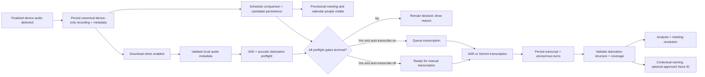

# SPEC-009: Recording Enrichment and Transcription Pipeline

- **Status:** In progress — no-speech gate and persistent acoustic speaker-linking foundation implemented
- **Date:** 2026-08-12; amended 2026-08-14 and 2026-08-24
- **Change registry:** `../CHANGE_REGISTRY.md` (`CHANGE-2026-08-14-001`)
- **Scope:** Electron app; HiDock recordings first, with the same post-ingestion contract for imported audio
- **Governs:** Detection, metadata capture, calendar matching, provisional UI enrichment, VAD/diarization,
  transcription, analysis, and final meeting resolution
- **Supersedes:** The sequencing portions of SPEC-004 and SPEC-006 where they conflict with this document
- **Speaker-linking amendment:** SPEC-011 supersedes this document's earlier dedicated-enrollment/biometric assumptions.

## 1. Purpose

Define one reliable end-to-end pipeline that turns a newly detected HiDock recording into a meeting-aware, diarized
transcript. The pipeline must enrich the recording as early as the available evidence allows and must not request
transcription before all mandatory preflight work has reached a terminal state.

The central product rule is:

> Detect early, enrich immediately, show provisional truth, preprocess the audio, and only then transcribe.

The user must see the recording's known date, time, duration, likely meeting, and possible calendar organizer/invitees
before transcription completes and, when the device provides enough metadata, before the download completes.

## 2. Normative language

`MUST`, `MUST NOT`, `SHOULD`, and `MAY` are normative.

- **Detected** means a finalized recording appears in an incremental or completed HiDock file-list response. An
  in-progress device recording is not finalized and MUST NOT be downloaded or transcribed.
- **Candidate meeting** means a calendar event that plausibly corresponds to the recording based on its time window and
  other pre-transcription metadata.
- **Provisional** means useful, visible metadata that has not yet been confirmed by transcript content or by the user.
- **Preflight** means metadata capture, schedule comparison, local-file readiness, and audio preprocessing.
- **Provider request** means the first call or subprocess invocation that performs speech-to-text or multimodal audio
  transcription. Merely creating an internal pipeline job is not a provider request.
- **ASR** means a speech-to-text provider. Gemini is treated as a multimodal transcription provider even when it also
  performs analysis.
- **Diarization** means acoustic speaker segmentation and clustering. Mapping anonymous acoustic clusters to human names
  is a separate speaker-identification step.
- **Contextual speaker naming** means mapping a diarized label to a person using self-identification, forms of address,
  calendar context, transcript content, or user input. It is inference from context, not biometric voice recognition.
- **Persistent acoustic speaker linking (Voice ID)** means comparing acoustic speaker-cluster embeddings with anonymous
  cross-recording voice memory. It requires no dedicated enrollment recording. A real-person name is attached only
  after independent manual or first-person self-identification evidence, as defined by SPEC-011.
- **Diarization quality** means whether speaker turns are structurally valid, cover the detected speech timeline, and
  preserve honest uncertainty. A transcript may be text-complete while its diarization is incomplete or invalid.
- **Processing provenance** means the exact tool/provider, model, version, execution location, run, usage/cost,
  and quality status that produced one derived result. It is stage-specific: transcription provenance does not
  automatically describe diarization, summary, title, or analysis provenance.
- **Source filename** means the immutable name reported by the source device or import operation. A local converted or
  renamed file may additionally have a current local filename, but neither filename is a content title.
- **Meeting subject** means the calendar event subject. It belongs to the linked or candidate meeting and is not the
  recording's editable content title.
- **Content title** means the short descriptive title produced from the transcript or explicitly edited by the user. It
  is distinct from both the meeting subject and the full summary.
- **Speaker** means a diarized voice cluster with non-zero speech evidence. A name proposed by transcript analysis does
  not become a verified speaker identity without a link to such a cluster.
- **No speech** (`no_speech`) means a successful terminal content outcome in which independent local preprocessing
  found too little sustained audio activity for safe automatic transcription, or the provider explicitly returned the
  no-speech sentinel. It is not a provider failure and MUST NOT create a transcript, summary, content title, inferred
  participants, action items, or an automatic meeting link.
- **Invitee** means a person in the calendar organizer/attendee snapshot. Invitation does not prove attendance or
  speech.
- **Mentioned person** means a person named in transcript content without evidence that the person spoke. Mention alone
  MUST NOT promote the person to speaker, attendee, organizer, or host.

## 3. Goals

1. Capture every trustworthy piece of recording metadata as soon as the device reports it.
2. Compare the recording window with the schedule immediately after start time and duration are known.
3. Persist all plausible meeting candidates, not only a winner.
4. Show a provisional meeting name and possible calendar organizer/invitees in the app before transcription.
5. Use local VAD and acoustic diarization before ASR whenever those capabilities are available.
6. Prevent long-silence hallucinations by excluding or explicitly marking non-speech regions before provider
   transcription.
7. Send recording metadata, candidate meetings, ambiguity, and typed people spelling hints to the selected transcription
   provider.
8. Start automatic transcription only after every mandatory preflight gate is satisfied and only when auto-transcribe is
   enabled.
9. Reconcile the provisional schedule match with transcript content without silently forcing a wrong meeting.
10. Make the pipeline restart-safe, idempotent, observable, and testable without real USB hardware.
11. Preserve and independently display the source filename, meeting subject and metadata, content title, and summary.
12. Preserve people provenance so calendar organizer/invitees, actual speakers, and mentioned people cannot be silently
    merged into one misleading participant list.
13. Validate diarization output before treating speaker labels or inferred identities as reliable.
14. Make the active diarization engine, quality result, speaker-naming method, confidence, and Voice ID availability
    visible and auditable.
15. Show compact, stage-specific tool/model provenance so users can attribute quality, latency, privacy, and cost
    to each result.
16. Preserve a usable transcript viewport at ordinary laptop/desktop resolutions; fixed metadata and waveform surfaces
    must not consume the reading area.

## 4. Non-goals

- Real-time transcription while the HiDock is still recording.
- Automatic deletion of device recordings.
- Treating calendar invitees as proof that they spoke.
- Treating diarization labels as verified human identities.
- Using acoustic voice similarity for authentication, access control, or security decisions.
- Requiring a cloud provider when a complete local transcription path is configured.

Persistent speaker linking is governed by SPEC-011. Anonymous acoustic continuity is a pipeline capability; claiming a
real person still requires an explicit evidence anchor and honest provenance.

## 5. Current-state findings

This section records the implementation baseline that motivated the specification. It is descriptive, not the target
behavior.

1. `useDeviceSubscriptions.ts` and `device-sync-actions.ts` receive device filename, size, duration, and creation date
   and can start auto-download. The discovery path does not consistently create a durable, device-only `recordings` row
   and provisional meeting metadata at detection time.
2. `download-service.ts` calls `markRecordingDownloaded(...)` and then immediately calls
   `queueTranscriptionIfEnabled(...)`. It does not wait for a schedule-match or preprocessing gate.
3. `transcription.ts` currently finds candidate meetings inside `transcribeRecording(...)`. Candidate rows are written
   after transcription and transcript analysis, which is too late for pre-transcription context and provisional UI
   visibility.
4. `recording-watcher.ts` can correlate a locally discovered file by start time, but it initially stores no duration and
   selects only one best meeting. This is not an ambiguity-preserving end-to-end path.
5. `recording_meeting_candidates` can store multiple candidates, but it is mainly populated after AI analysis. It must
   also represent pre-transcription schedule candidates.
6. Local ASR supports a `--diarize` option, and a local WhisperX + pyannote spike demonstrated materially better
   acoustic segmentation than the Gemini-only path. The production pipeline has no provider-independent VAD/diarization
   preflight contract yet.
7. `SourceRow` displays a linked meeting, but there is no guaranteed surface for a provisional candidate or an ambiguity
   list before final linking.
8. `getDisplayTitle(...)` currently gives a linked meeting subject priority over `recordings.title` and transcript title
   suggestions, while the adjacent edit action writes `knowledge_captures.title`. The visible text and edited field can
   therefore differ, as demonstrated by the Library screenshots that motivated this revision.
9. The source filename exists in recording metadata but is not guaranteed to remain visible near the title after a
   meeting is assigned. A meeting association must never make the original source identity disappear.
10. The current people UI can combine calendar-linked contacts and transcript-derived names under `Participants`, while
    transcript analysis asks for people who are speaking **or mentioned**. This can promote a person merely discussed in
    the meeting into an apparent attendee or speaker, and it can omit a calendar organizer who was not captured in the
    attendee list.
11. Production Gemini transcription performs provider-managed diarization in the same call. The WhisperX + pyannote path
    proven by `docs/experiments/diarization-spike.md` is not integrated as the pre-ASR production path. Enabling the
    local ASR diarization setting does not make a Gemini transcription use that local acoustic pipeline.
12. `re-diarize.ts` currently queues another transcription using the selected provider. With Gemini selected, this
    retries Gemini's coupled transcription/diarization; it is not independent local audio re-segmentation and may repeat
    the same failure.
13. **Historical finding (2026-08-14; superseded by SPEC-011):** the production schema originally had contextual
    identity only and no acoustic cross-recording matcher. SPEC-011 now defines and implements the missing persistent
    anonymous voice-cluster store and acoustic matcher without dedicated enrollment.
14. In recording `2026Aug13-120444-Rec62.hda` (`POC Amazon Connect - Banco Davivienda`), Gemini 3.5 Flash stored 90
    turns across four labels, but its final timed position is 12:33 for a 16:44 recording. The remaining 4:11 of
    multi-person dialogue is packed into a zero-duration `Speaker 1` turn. The app still marks the result complete, so
    no structural diarization quality gate currently protects the UI or downstream identity inference.
15. For that recording, `Speaker 2 → Sebastián Geraldes` is a `speaker-inference` result at confidence `0.7`, not a
    Voice ID match. The UI does not show that provenance or confidence, so the name appears stronger than its evidence.
16. The same reader shows Yaraví, Juan, and Sebas from transcript-derived `meeting_contacts` belonging to the preceding
    `Rec61`, alongside the current recording's four diarized labels. Meeting-level contact aggregation therefore leaks
    sibling-recording names into a current-recording list labeled `From transcripts`.
17. `transcripts.transcription_provider` and `transcription_model` identify the ASR/multimodal transcription tool,
    and an older detail drawer can display them. `SourceReader` does not expose them as persistent provenance.
    The same transcript row has no independent provider/model/run ownership for summary, title, diarization,
    or other analysis.
18. `SourceReader` currently docks the title/meta strip, actions, rich waveform, meeting card, participants, and
    a separate Essentials block above the only scrollable Summary/Transcript body. At ordinary viewport heights
    this fixed stack can consume nearly all available space, leaving the transcript invisible until the user scrolls
    or uses a 4K-class screen.

19. On 2026-08-14, `2026Aug14-170410-Rec73` contained only a cough/noise event and approximately 99% silence. The
    production path sent the whole file plus four overlapping calendar candidates to Gemini, accepted 458 fabricated
    words and two fabricated speakers, generated a summary/title/actions, and auto-linked a cancelled meeting at
    confidence `0.85`. The recorded VAD run was provider-managed metadata derived from the same response rather than an
    independent pre-provider measurement. This incident is the normative regression fixture for the no-speech gate.
20. On 2026-08-18, a 322-entry cached device snapshot replayed hundreds of historical files as `recording:new`. Every
    event attempted a complete renderer aggregation of roughly 2,000 recordings. Eighteen genuinely unsynced files were
    persisted and queued, but the renderer-side queue executor did not receive a reliable post-enqueue handoff, leaving
    all 18 rows `pending`. The same session also scheduled more than one quick reconnect attempt after a disconnect.
    This incident is the normative regression fixture for snapshot reconciliation, bounded renderer work, queue
    execution handoff, and USB reconnect restraint.

## 6. Required end-to-end behavior

### 6.1 Happy path

1. The app detects a finalized recording from the HiDock file list.
2. The app immediately creates or updates one canonical, device-only recording row using stable recording identity.
3. The app stores all metadata already available from the device and filename.
4. If auto-download is enabled, the app queues the download without waiting for calendar matching. Download and
   pre-download enrichment MAY run concurrently.
5. As soon as start time and duration are valid, the app compares the recording interval with the locally cached
   schedule.
6. The app stores every plausible meeting candidate and a deterministic score breakdown.
7. The app publishes the enriched recording to the renderer. The Library and Device surfaces show:
   - the immutable source filename;
   - date, local time, and duration;
   - download/location status;
   - the provisional meeting subject when there is a leading candidate;
   - the candidate organizer and invitees as calendar-derived possibilities;
   - a visible ambiguity state when more than one meeting is plausible.
8. After the download is complete, the app validates local audio metadata and recomputes the recording window and
   candidates if the authoritative local duration materially differs.
9. The app runs audio preprocessing:
   - decode/normalize for analysis without altering the user's original file;
   - voice activity detection;
   - acoustic speaker segmentation and clustering when available;
   - creation of a timestamp-preserving speech/segment manifest.
10. The transcription gate opens only when metadata, schedule comparison, local-file readiness, and preprocessing are
    all terminal and successful or explicitly skipped under the capability rules.
11. If auto-transcribe is enabled, the recording enters the transcription queue. If it is disabled, the recording
    remains `ready_for_transcription` and the user can start it manually through the same gate.
12. The selected ASR or multimodal provider receives the prepared audio plus the complete transcription context
    contract.
13. The app persists the raw transcript and timestamped anonymous speaker turns before optional downstream analysis.
14. The app validates diarization structure and timeline coverage. Invalid diarization remains available for diagnosis,
    but is marked degraded/failed and cannot silently feed automatic speaker naming as trusted evidence.
15. Transcript analysis produces a content title, full summary, topics, action items, proposed speaker identities,
    mentioned people, and a content-based meeting decision. Every people result retains its evidence type.
16. The app resolves the provisional candidate set into a final link, a pending-confirmation suggestion, or no link,
    while preserving the candidate audit trail.
17. Contextual speaker naming runs only after diarization quality validation, using self-identification, invitee names,
    trusted contacts, and transcript evidence. It MUST link a proposed name to a diarized cluster with speech evidence,
    retain method/confidence, and MUST NOT overwrite a user-confirmed speaker identity.
18. Persistent acoustic speaker linking runs before provider transcription when locally available. It can return an
    anonymous stable voice or `needs_review`; contextual inference MUST NOT be labeled as an acoustic match.
19. The UI independently renders the source filename, meeting subject and meeting metadata, content title, full summary,
    calendar people, speakers, and mentioned people. Editing one field MUST NOT mutate another.

### 6.2 Required ordering



The following order is forbidden:

```text
download complete -> provider request -> candidate discovery -> candidate persistence
```

### 6.3 Device snapshot reconciliation and execution handoff

1. A complete device file list is a **snapshot**, not a stream of newly created recordings. Before inserting a row, the
   app MUST resolve the device-native filename against both `filename` and `original_filename`, including supported
   device/local extension transformations such as `.hda` to `.wav`.
2. A historical file already represented locally MUST update that canonical row's device-presence metadata. It MUST NOT
   create a temporary `.hda` shadow row, schedule duplicate enrichment, or emit a new-recording notification.
3. One completed snapshot MAY discover many genuinely unsynced recordings, but it MUST publish at most one batched
   renderer discovery notification and trigger at most one cache-only Library rebuild for that snapshot.
4. Starting an auto-download session MUST include an explicit execution handoff to the queue owner after persistence.
   A broadcast state event MAY update observers, but MUST NOT be the only mechanism that starts queued transfers.
5. If a persisted auto-download session has pending eligible items while the device is ready and no transfer is active,
   restart reconciliation or the queue watchdog MUST resume it idempotently.
6. One unexpected disconnect MAY schedule at most one guarded quick reconnect attempt. The normal low-frequency watcher
   remains the backstop; reconnect logic MUST NOT create rapid or overlapping USB open/close cycles.

### 6.4 Authoritative operation projection and renderer work bounds

1. Location indicators MUST be derived from factual `on_device`/`on_local`, synced-file, and valid local-path evidence.
   The existence of a durable metadata row alone MUST NOT turn a device-only recording into `Synced`.
2. A queued or processing operation MUST override an older completed capture for status display while preserving the
   old output for reading until replacement succeeds. The Library row, detail reader, Operations panel, and bulk-action
   counts MUST describe the same effective state.
3. `Process All` MUST exclude recordings already pending or processing. Enqueue is idempotent per recording across
   automatic, manual, and bulk paths; at most one `pending`/`processing` queue row may exist for a recording.
4. On restart, a persisted download row whose file is already proven local/synced MUST be removed rather than rendered
   or downloaded again. A persisted `downloading` row with no active transfer MUST recover as `queued` with zero progress.
5. Renderer queue hydration/reconciliation MUST query only actionable rows. Terminal queue history MUST NOT be shipped
   to the renderer on a timer.
6. Real-time main-process events are the primary progress path. A reconciliation poll is a missed-event safety net and
   MUST run no more frequently than every 30 seconds under normal operation.
7. One reconciliation snapshot MUST update the renderer queue in one store transaction. Audio progress events MUST NOT
   force the Library to rebuild or re-render its complete recording corpus unless the semantic operation status changes.

## 7. Pipeline state model

The pipeline MUST be represented durably. UI state alone is insufficient.

### 7.1 Orthogonal stage fields

- `metadata_status`: `pending`, `ready`, or `failed`. Gate terminal: `ready`.
- `schedule_match_status`: `pending`, `matched`, `ambiguous`, `none`, `calendar_unavailable`, or `failed`. Gate
  terminal: `matched`, `ambiguous`, `none`, or `calendar_unavailable`.
- `download_status`: `device_only`, `queued`, `downloading`, `ready`, `failed`, or `cancelled`. Gate terminal: `ready`.
- `preprocess_status`: `waiting_for_audio`, `processing`, `complete`, `skipped_unavailable`, or `failed`. Gate terminal:
  `complete` or `skipped_unavailable`.
- `transcription_gate`: `blocked`, `ready`, `queued`, `processing`, `complete`, `failed`, or `cancelled`.
- `diarization_quality_status`: `pending`, `valid`, `degraded`, `failed`, or `not_available`.
- `speaker_identity_status`: `pending`, `contextual_complete`, `anonymous_complete`, `needs_review`,
  `voice_id_complete`, `unavailable`, or `failed` (`not_enrolled` is a deprecated legacy value).

`calendar_unavailable` is a degraded but terminal comparison result. It is allowed only after the app attempted to use a
fresh-enough cached schedule and recorded why no schedule was available. It MUST be visible to the user and MUST NOT be
silently treated as `none`.

### 7.2 Gate predicate

The provider MUST NOT be invoked unless all conditions are true:

```text
recording is eligible for AI processing
AND metadata_status = ready
AND schedule_match_status IN (matched, ambiguous, none, calendar_unavailable)
AND download_status = ready
AND preprocess_status IN (complete, skipped_unavailable)
AND a valid local file exists
AND a provider is configured and available
AND the request is manual OR autoTranscribe = true
```

A download-completion event MUST reevaluate this predicate; it MUST NOT directly enqueue transcription.

### 7.3 Restart behavior

- On startup, non-terminal pipeline rows MUST be reconciled with disk, database, and queue state.
- `downloading` without an active transfer becomes `queued` or `failed` according to the existing download recovery
  policy.
- `processing` preprocessing jobs become `waiting_for_audio` or retryable `failed`; partial derived files MUST NOT be
  treated as complete.
- `queued` or `processing` transcription follows SPEC-007 recovery rules.
- The gate evaluator MUST be idempotent and safe to call after every relevant event.

## 8. Metadata contract

### 8.1 Metadata captured at device detection

The app MUST persist, when available without additional USB probing:

- canonical recording ID;
- original device filename and extension;
- source (`hidock`) and device-only/local lifecycle state;
- file size;
- device-reported duration;
- recording start time and timezone interpretation;
- derived recording end time;
- device-reported creation time;
- detection time;
- active/finalized state;
- device model or stable device identifier already available from the connection context;
- metadata provenance for start time and duration.

No extra USB descriptor, endpoint, or exploratory metadata calls are authorized by this spec. Only the existing
serialized device/file-list path may be used.

### 8.2 Start-time precedence

1. Validated HiDock filename timestamp, interpreted as device-local wall time.
2. Device file-list creation timestamp.
3. Embedded media creation timestamp, if trustworthy.
4. Filesystem mtime only for imports whose filenames and media tags contain no recording time.

Arrival/download mtime MUST NOT replace a valid recording time.

### 8.3 Duration precedence

1. Validated local media duration after download.
2. Device-reported duration before download.
3. A format-specific calculation only when the format and formula are known.
4. Unknown; the app MUST show `Duration pending` and MUST NOT invent a duration.

If local duration differs from the pre-download duration by more than `max(5 seconds, 2%)`, the app MUST update the
recording end time, mark candidate scoring stale, and rerun schedule matching before transcription can start.

### 8.4 Local validation metadata

After download, the app SHOULD capture container, codec, sample rate, channel count, bitrate, exact byte size, validated
duration, and a content hash used for deduplication/integrity. These fields enrich the same canonical recording; they
MUST NOT create a second recording row.

### 8.5 Authoritative storage and display ownership

The following fields are independent. A display-title helper MUST NOT collapse them into one value, and assigning a
meeting MUST NOT overwrite or hide the filename or content title.

| Concept                  | Authoritative storage                 | Source                      | UI label          |
| ------------------------ | ------------------------------------- | --------------------------- | ----------------- |
| Original source filename | `recordings.original_filename`        | HiDock/import               | `Source filename` |
| Current local filename   | `recordings.filename` and `file_path` | Local file lifecycle        | `Local filename`  |
| Meeting subject          | `meetings.subject` via link/candidate | Calendar sync/version       | `Meeting`         |
| Meeting metadata         | Other authoritative `meetings` fields | Calendar sync/version       | Meeting details   |
| AI content title         | `transcripts.title_suggestion`        | Analysis run/provider/model | `Suggested title` |
| User content title       | `knowledge_captures.title`            | User edit/time              | `Content title`   |
| Full summary             | `transcripts.summary`                 | Analysis run/provider/model | `Summary`         |

The original filename is immutable in this workflow and always visible. The local filename is shown when it differs.
Meeting fields are shown together in a Meeting card and are never edited by the content-title pencil. The AI suggestion
is a short description, while the full summary remains a separately labeled long-form field.

If the existing schema cannot record title provenance and user-edit protection, it MUST add equivalent fields such as
`title_source`, `title_user_edited_at`, and the analysis run that supplied the suggestion. An empty legacy
`knowledge_captures.title` MUST NOT be interpreted as a user override.

The reader and Library use an authoritative **source identity heading** with this precedence:

1. official `meetings.subject` when a meeting is provisionally or finally assigned;
2. immutable original source filename while no meeting is assigned.

The content title remains a separate descriptive field: non-empty user override, otherwise the current
`transcripts.title_suggestion`, otherwise `Not generated`. Its pencil MUST initialize with that exact content-title value
and MUST update only the user content title. Meeting assignment/relinking uses its own interaction. Editing the calendar
event itself is outside this spec.

Retranscription or reanalysis MAY update `transcripts.title_suggestion` and `transcripts.summary`, but MUST NOT
overwrite a user-edited content title. Relinking, unlinking, rematching, or refreshing a meeting MUST NOT change either
filename or the content title.

### 8.6 People evidence and authoritative storage

`Participants` MUST NOT be a single untyped array. The product may use `people` as an umbrella in code, but every person
relationship MUST retain one or more explicit evidence roles:

| Evidence role           | Authoritative storage                              | UI group           |
| ----------------------- | -------------------------------------------------- | ------------------ |
| Calendar organizer/host | `meetings.organizer_name` and `organizer_email`    | `Organizer / host` |
| Calendar invitee        | `meetings.attendees` or calendar-attendee rows     | `Invited`          |
| Anonymous speaker       | Diarized clusters/turns                            | `Who spoke`        |
| Identified speaker      | `transcript_speakers` or equivalent identity link  | `Who spoke`        |
| Mentioned person        | `mention_resolutions` or recording-person evidence | `Mentioned`        |

The organizer is included when supplied by the calendar, even when absent from attendees. Invitees come only from the
calendar snapshot. Anonymous and identified speakers require at least one non-zero speech turn; an identified speaker
also requires an evidence-linked name and confidence/provenance. A mentioned person has transcript-name evidence but no
speaker evidence.

When the calendar source omits organizer/attendee properties, the UI MUST say `Not supplied by calendar` (or an
equivalent source-specific unknown state). It MUST NOT claim `Not available`, infer the organizer from transcript text,
or fabricate a roster. A connector with authenticated Microsoft Graph data MAY later enrich the same event with those
authoritative fields.

Calendar organizer and attendee data are a source snapshot. Transcript analysis MUST NOT add names to
`meetings.attendees`, regenerate that field from mixed-source `meeting_contacts`, or otherwise rewrite calendar truth.
If `meeting_contacts` remains in use, queries MUST filter its `source` and relationship role. A transcript-derived
contact with zero turns is neither an invitee nor a speaker.

Speaker identity evidence MUST record the diarized speaker label, proposed or confirmed person, confidence, evidence
source (`user`, `self_identification`, `voice_profile`, `llm`, or `calendar_hint`), and confirmation state. The calendar
roster may help spell or rank a speaker name, but cannot by itself provide speech evidence.

Mentioned people MUST remain separate even when the model describes them as `involved`, `responsible`, or a participant
in the wider project. A mentioned person may move into `Who spoke` only when separate diarized-turn evidence links that
person to a speaker. The same human MAY legitimately appear in more than one group, but the UI MUST show each applicable
role rather than erasing provenance through cross-group deduplication.

Legacy rows with ambiguous provenance MUST be labeled `Unknown source` or recomputed from source evidence. They MUST NOT
be silently promoted to invitees or speakers during migration.

### 8.7 Processing tool and model provenance

Every generated result MUST reference the exact processing run that produced it. A normalized `processing_runs` model,
or an equivalent immutable representation, MUST support at least:

```typescript
type ProcessingStage =
  | "vad"
  | "diarization"
  | "transcription"
  | "speaker_identity"
  | "summary"
  | "title"
  | "meeting_resolution"
  | "timeline_analysis"
  | "embeddings";

interface ProcessingRun {
  id: string;
  recordingId: string;
  stage: ProcessingStage;
  provider: string;
  tool: string;
  model?: string;
  version?: string;
  execution: "local" | "cloud" | "hybrid";
  status: "complete" | "degraded" | "failed" | "cancelled";
  startedAt: string;
  completedAt?: string;
  parentRunIds: string[];
  outputIds: string[];
  usage?: Record<string, number | string>;
  estimatedCost?: {
    amount: number;
    currency: string;
    method: "provider" | "estimated";
  };
  quality?: Record<string, number | string | boolean>;
}
```

Provider, tool, and model are separate because `local` is an execution location, `WhisperX` is a tool, `large-v3` is an
ASR model, and `pyannote/speaker-diarization-3.1` is a distinct diarization model. A single cloud model may own multiple
stages, but each stage still references its run and role.

Examples:

- transcription: `Gemini · gemini-3.5-flash · Cloud`;
- transcription: `WhisperX · large-v3 · Local`;
- diarization: `pyannote · speaker-diarization-3.1 · Local`;
- summary: `Kimi · <exact configured model> · Cloud`.

The app MUST persist the model string returned/configured for that run; it MUST NOT invent a friendly model name such as
`Kimi K3` when the actual model is unknown. Unknown usage or cost remains `Unavailable`, never `0`. Local execution MAY
show elapsed time and compute device; it MUST NOT imply zero infrastructure/electricity cost, though it may accurately
state `No API charge`.

Retranscription, re-diarization, or re-summarization creates a new run. Active outputs point to their producing
run while prior runs remain available in provenance history. Changing the current provider setting MUST NOT relabel
historical outputs.

## 9. Schedule matching and candidate policy

### 9.1 When matching runs

Matching MUST run:

- immediately after valid start time and duration are persisted;
- after a material duration/start-time correction;
- when calendar sync adds or changes events that intersect an unmatched or ambiguous recording;
- when the user explicitly requests refresh/rematch;
- before transcription if no terminal schedule-match result exists.

The first match MUST use the local calendar cache and MUST NOT wait indefinitely for a network refresh. When calendar
sync is configured and stale, the app SHOULD start a refresh concurrently and rematch when it completes.

### 9.2 Candidate inclusion

The matcher MUST evaluate the recording interval, not only its start time. It MUST preserve:

- meetings with real interval overlap;
- meetings within a configurable early/late tolerance;
- multiple simultaneous or overlapping meetings;
- user preassignments;
- long/all-day events as weak candidates, never as strong automatic matches based on containment alone.

Each candidate MUST store or expose:

- meeting ID and subject;
- start/end time and location;
- organizer;
- attendee names and, only when needed, email/domain hints;
- meeting description or agenda, bounded for provider context;
- time overlap, start offset, duration fit, and overall deterministic score;
- match reason and provenance (`user_preassign`, `schedule_time`, `transcript_content`, or `user_override`);
- candidate stage (`provisional`, `content_scored`, or `final`);
- whether it is the current provisional leader;
- whether the user confirmed or rejected it.

Candidate upsert MUST preserve user confirmation/rejection data. `INSERT OR REPLACE` semantics MUST NOT erase a user
decision.

### 9.3 Provisional selection

- One clear, non-bridge leader MAY be shown as `Likely meeting: <subject>`.
- Multiple plausible candidates MUST be shown as `Possible meetings (N)` and the complete list MUST remain accessible.
- A provisional leader MUST NOT be presented as user-confirmed.
- Candidate calendar people MUST be labeled as possible organizer/invitees, not detected speakers.
- The union of organizer/invitee names MAY be used for spelling hints, but each person MUST retain the candidate
  meeting(s) from which the hint came.
- No candidate is a valid, visible result: `No scheduled meeting found`.
- Calendar unavailable is a distinct visible result: `Schedule unavailable; meeting matching will retry`.

### 9.4 Content-based final resolution

After transcription, the analysis provider receives all provisional candidates and may select `none`.

- Confidence `>= 0.85`, at least one content or typed-people corroboration signal, and a clear margin over the runner-up
  MAY auto-link.
- Confidence `0.60–0.84`, or an insufficient winner margin, MUST remain a suggestion pending confirmation.
- Confidence `< 0.60` MUST NOT link.
- With multiple overlapping meetings, an auto-link requires a minimum `0.15` confidence margin over the runner-up unless
  the user preassigned the meeting.
- A single time candidate MUST still be rejectable based on transcript content.
- User overrides and explicit standalone choices always win and survive rematching/reanalysis.
- Calendar events whose subject or authoritative event status is cancelled/canceled MUST NOT be automatic-link
  candidates. They MAY be retained in diagnostics as excluded schedule evidence, but MUST NOT be sent as positive
  meeting context or selected by the automatic resolver.

## 10. Audio preprocessing contract

### 10.1 Required logical order

For a capable local preprocessing backend, the logical order is:

```text
local audio -> decode/normalize -> VAD -> acoustic speaker segmentation/clustering
-> timestamp-preserving speech manifest -> ASR/multimodal provider
-> text-based speaker naming -> summary/insights
```

Diarization MUST be based on acoustic voice patterns, not on calendar names. Calendar organizer/invitees are contextual
naming and vocabulary hints only.

### 10.2 VAD requirements

- A provider-independent local audio-activity safety gate MUST run for every automatic and manual transcription before
  the first ASR/multimodal provider request. Failure to execute this gate is fail-closed: provider call count remains
  zero and the user sees a retryable preprocessing error.
- The initial production safety gate MAY use deterministic energy/silence detection while a semantic VAD model is being
  integrated, but it MUST be labeled as an energy safety gate rather than acoustic/semantic speech recognition.
- The `energy-vad-safety-v1` default classifies a recording of at least 30 seconds as `no_speech` when detected
  non-silent activity is both less than 3 seconds and less than 3% of total duration. At most 0.25 seconds of activity
  is also `no_speech` at any duration. Defaults are versioned processing metadata and changes require regression tests.
- `no_speech` MUST persist the duration, silence/non-silence totals, ratio, thresholds, reason codes, and original-time
  activity intervals in the VAD processing run. It MUST set the visible recording status to `No speech`.
- If a reprocess changes a previously transcribed recording to `no_speech`, stale generated transcript, summary,
  suggested title, participants/mentions, actions, embeddings, knowledge-graph provenance,
  transcript-provenance memberships, and automatic
  transcript-based meeting link MUST be retired. The immutable filename, user title, manual bindings/meeting link, and
  processing-run audit history MUST survive.
- An explicit user re-transcription MUST be allowed to run the local safety gate when the prior AI-generated result
  rated the capture `garbage` or `low-value`; stale AI value metadata MUST NOT block its own correction. Personal,
  deleted, missing, and otherwise privacy-ineligible recordings remain fail-closed. A queued/cancelled marker without a
  new local VAD processing run is not a completed re-transcription and MUST NOT be presented as one.
- A `no_speech` result MUST terminate before diarization, transcription, summarization, title generation, participant
  inference, action extraction, content-based meeting resolution, vector ingestion, or any provider call.
- VAD MUST emit speech and non-speech intervals with timestamps and confidence when supported.
- Speech segments SHOULD include configurable boundary padding to avoid clipped words.
- Long non-speech intervals MUST be excluded from provider audio or explicitly represented in a manifest so the provider
  cannot hallucinate speech into silence.
- Timeline reconstruction MUST preserve original recording time. Concatenating speech segments without an original-time
  mapping is prohibited.
- The unmodified original audio remains the source of truth.

### 10.3 Diarization requirements

- Diarization MUST produce anonymous, stable-within-recording speaker cluster IDs and timestamped turns.
- The manifest SHOULD include engine/model version and confidence.
- The diarizer MAY use expected speaker-count bounds derived from invitee count, but invitee count MUST NOT force the
  number of detected speakers.
- Acoustic clusters MUST exist before the ASR provider is invoked when a compatible pre-diarizer is available.
- ASR output MUST be aligned back to the acoustic clusters and original timestamps.
- Speaker naming is a later inference pass. A guessed name MUST NOT overwrite a manual binding.

### 10.4 Diarization integrity and quality gate

Every local or provider-managed diarization result MUST receive a persisted quality report before its labels are treated
as reliable. The report MUST contain:

- recording duration and, when VAD exists, the first and final detected speech timestamps;
- diarization engine/provider and model/version;
- number of turns, distinct labels, zero-duration non-empty turns, and invalid timestamps;
- first/final timed turn, timed speech coverage, uncovered speech duration, and largest uncovered tail;
- longest turn and any turn that contains evidence of multiple speakers without a boundary;
- validation status, machine-readable reason codes, and validation time.

At minimum, validation MUST enforce:

1. Turn timestamps are finite, non-negative, chronologically valid, and use the original recording timeline.
2. A non-empty turn cannot use zero duration to absorb a material untimed transcript remainder.
3. The final timed turn reaches the final VAD speech interval within `max(10 seconds, 2% of recording duration)`.
   Without VAD, the same tolerance is measured against the known audio duration unless the tail is proven non-speech.
4. Provider text after the final reliable timestamp is stored as `untimed/unattributed`, not assigned to the last
   speaker.
5. Turn text and the raw transcript are reconciled so missing, duplicated, or unrepresented text is detected.
6. A single speaker block longer than 90 seconds without supporting acoustic boundaries is `degraded` at minimum and
   MUST be reviewable. A configurable stricter threshold MAY be used.
7. Overlapping speech MAY overlap in time when the engine supports it; overlap MUST NOT be "fixed" by deleting a voice.
8. Provider turn starts MUST be grounded in independent local activity intervals (with a documented boundary
   tolerance). Fewer than 50% grounded turns is `failed` and blocks every downstream analysis/identity step.
9. A multi-turn provider response whose starts all collapse to one chunk boundary (for example repeated `0:00`,
   `10:00`, or `20:00`) MUST be retried once with a strict timestamp format correction and then fail closed if still
   invalid. It MUST NOT be stored as a complete timestamped transcript.
10. A provider response that places a boundary timestamp at the end of every turn MAY be deterministically normalized
    only when at least two consistent boundaries exist. The timestamps are removed from text, converted to original
    recording time, and MUST NOT create a synthetic default-speaker turn.

A structurally invalid result MUST NOT set `diarization_quality_status = valid`. The raw transcript may remain text-
complete, but speaker attribution is marked degraded/failed and automatic contextual naming is blocked or explicitly
tentative. The reader MUST show the affected interval and an honest recovery action.

`Re-diarize` MUST disclose the engine it will run. Repeating Gemini with a new prompt is `Retry Gemini diarization`, not
`Local re-diarization`. An alternative-engine recovery is complete only when it actually runs a distinct acoustic path,
such as WhisperX + pyannote, and passes this quality gate.

### 10.5 Capability and failure rules

- `complete`: VAD/diarization ran and produced a valid manifest.
- `skipped_unavailable`: no compatible local capability exists. The reason and fallback provider behavior are recorded
  and shown in diagnostics.
- `failed`: a capability reported itself available but failed. Automatic transcription MUST pause; it MUST NOT silently
  bypass the failed step.
- `no_speech`: preprocessing/provider completed successfully and found no safe intelligible-speech input. The pipeline
  terminates without downstream generation; it is never converted to `complete`, `failed`, or a fabricated transcript.
- The user MAY explicitly retry, choose a different provider, or approve a one-time bypass. A bypass becomes an
  auditable terminal result, not an implicit catch block.
- A provider with integrated diarization may be used when local preprocessing is unavailable, but the context MUST state
  that diarization is provider-managed.

The recommended local target, based on the existing spike, is WhisperX plus pyannote for timestamped acoustic turns,
followed by an LLM naming/analysis pass. The implementation MAY use another backend if it satisfies the same contract
and tests.

### 10.6 Speaker identity and Voice ID capability

The app MUST represent speaker identity as evidence, not as one final name string. Each label-to-person proposal or
binding MUST record:

- recording ID and diarized label;
- person/contact ID and display name;
- method: `manual`, `self_identification`, `contextual_inference`, or `voice_id`;
- confidence, evidence summary, model/engine version, and confirmation state;
- creation time and the diarization manifest/version to which the binding applies.

Current self-identification and LLM speaker inference are `contextual_inference` evidence. They MUST NOT be displayed as
`Voice recognized`, even when the proposed name is correct. A `0.7` contextual inference is a reviewable suggestion, not
a verified identity, unless the user confirms it.

SPEC-011 is the approved persistent-acoustic-linking design. It explicitly rejects dedicated voice enrollment and
security-authentication semantics. The integration MUST satisfy these rules:

- learn anonymous acoustic clusters only from eligible speech regions that passed local diarization;
- compare cluster-level acoustic embeddings, never calendar names alone;
- require both an absolute similarity threshold and a margin over the runner-up;
- return `unknown` when evidence is insufficient and never force every cluster to a known person;
- show `Voice match`, confidence, and confirmation state separately from contextual evidence;
- never overwrite a user-confirmed identity; and
- remove source observations when a recording becomes personal, deleted, or value-excluded, rebuilding centroids.

Local acoustic diarization and anonymous cross-recording matching are transcription preflight gates when installed and
enabled. The absence of an existing cluster or real-person anchor does not block a valid transcript: the result remains
an honest stable anonymous voice. See SPEC-011 for failure/fallback behavior.

## 11. Transcription context contract

Every provider adapter MUST accept a normalized context object even if a specific provider can use only part of it.

```typescript
interface TranscriptionContext {
  recording: {
    id: string;
    sourceFilename: string;
    localFilename?: string;
    existingContentTitle?: { value: string; source: "user" | "analysis" };
    startedAt: string;
    endedAt: string;
    durationSeconds: number;
    timezone: string;
    source: "hidock" | "import";
  };
  schedule: {
    status: "matched" | "ambiguous" | "none" | "calendar_unavailable";
    candidates: Array<{
      meetingId: string;
      subject: string;
      startTime: string;
      endTime: string;
      timezone?: string;
      organizer?: { name?: string; emailHint?: string };
      attendees: Array<{ name: string; emailHint?: string }>;
      location?: string;
      meetingUrl?: string;
      description?: string;
      deterministicScore: number;
      scoreReason: string;
    }>;
  };
  audioPreparation: {
    mode: "local_vad_diarization" | "provider_managed";
    manifestPath?: string;
    speechSeconds?: number;
    silenceSeconds?: number;
    anonymousSpeakerCount?: number;
    engine?: string;
    model?: string;
  };
}
```

Provider instructions MUST make these distinctions explicit:

- candidate meetings are possibilities, not facts;
- calendar organizer and attendee names are spelling and identity hints, not proof of presence or speech;
- anonymous acoustic labels must remain stable;
- a person who is merely mentioned must not be returned as a speaker;
- an identified speaker must reference a diarized speaker label with non-zero speech evidence;
- the provider may return no meeting match;
- silence must not be transcribed;
- summaries and extracted data follow the transcript's language unless the user configured otherwise.

For local ASR, candidate names SHOULD feed a vocabulary/hotword mechanism where supported. For Gemini, the same
structured data SHOULD enrich the audio prompt. Context construction MUST be identical in meaning across providers.

Transcript analysis MUST return typed people evidence rather than one ambiguous `participants` array. The normalized
result MUST support at least:

```typescript
interface TranscriptAnalysisPeople {
  speakers: Array<{
    speakerLabel: string;
    proposedName?: string;
    confidence?: number;
    evidence:
      | "self_identification"
      | "voice_profile"
      | "llm"
      | "calendar_hint"
      | "user";
  }>;
  mentionedPeople: Array<{
    name: string;
    evidenceText?: string;
    firstMentionSeconds?: number;
    roleInDiscussion?: string;
  }>;
}
```

The old instruction to return people who are `speaking or clearly mentioned as involved` in one participants field is
non-compliant. Adapters for providers that still emit a legacy field MUST classify each entry from evidence before
persistence; an unclassifiable entry becomes `mentioned` or `unknown`, never an asserted speaker or calendar invitee.

## 12. Persistence requirements

### 12.1 Canonical recording

Device discovery MUST upsert the canonical `recordings` row before download. The row has `file_path = NULL`,
`on_device = 1`, `on_local = 0`, and the known metadata. Download completion enriches this row rather than creating a
new one.

### 12.2 Candidate persistence

`recording_meeting_candidates` MUST be populated during pre-transcription matching. The schema or an adjacent table MUST
support candidate stage, score components, calendar-people/context snapshot or version, update time, and preserved user
decisions.

### 12.3 Title and summary persistence

The source filename, meeting subject/reference, AI title suggestion, user content-title override, and summary MUST
remain separately addressable in IPC and database queries. A denormalized display title MAY be cached for search
performance, but it is derived data and MUST include its source. It MUST NOT become the only surviving copy of any
authoritative field.

Historical AI suggestions MAY be retained by analysis run. The active suggestion MUST be traceable to the transcript and
analysis version that produced it. A user content-title override survives reanalysis, meeting changes, and application
restart until the user explicitly clears it.

### 12.4 People persistence

Calendar organizer/invitees, diarized speaker clusters, speaker identity resolutions, and transcript mentions MUST use
separate source-owned fields or normalized relationship rows. Every derived relationship MUST include source recording,
analysis/transcript version, evidence role, creation/update time, and confirmation state where relevant.

Deleting or rerunning transcript analysis MAY replace transcript-derived speaker proposals and mentions for that
analysis version. It MUST NOT delete or mutate calendar source data or user-confirmed speaker identities. Calendar
resync MAY replace the calendar snapshot but MUST NOT relabel transcript speakers or mentions.

Existing `transcript_speakers` rows do not record method or confidence. The schema MUST add those fields or an adjacent
speaker-identity-evidence table before contextual inference or Voice ID is presented as anything stronger than an
unverified suggestion.

### 12.5 Diarization quality persistence

The raw provider turns, validated turn manifest, and quality report from Section 10.4 MUST be separately addressable.
Repair or re-diarization MUST create a new version or retain enough provenance to compare the old and new output. It
MUST NOT erase the failed evidence before the replacement passes validation.

Untimed transcript text MUST remain available as text but MUST NOT inherit the final timed turn's speaker. The database
representation MUST support an explicit `untimed/unattributed` interval or segment.

### 12.6 Processing provenance persistence

Each active transcript, diarization manifest, summary, content-title suggestion, meeting resolution, speaker-identity
result, and timeline analysis MUST reference its producing `processing_runs.id` or equivalent immutable provenance row.
Storing only `transcripts.transcription_provider` and `transcription_model` is insufficient because it cannot attribute
later analysis performed by a different tool.

Usage and cost are optional only when the provider does not return enough information. When captured, units MUST be
explicit—for example input/output tokens, audio seconds, requests, local elapsed seconds, currency, and whether the cost
is provider-reported or estimated. API keys, tokens, prompts containing private transcript content, and raw credentials
MUST NOT be stored in provenance metadata.

### 12.7 Pipeline persistence

A durable `recording_pipeline_state` record, or an equivalent normalized representation, MUST contain:

- recording ID and pipeline version;
- every stage status from Section 7;
- stage timestamps and retry counts;
- blocking reason and last error;
- metadata provenance;
- calendar cache freshness/result;
- preprocessing engine/model and manifest reference;
- explicit fallback/bypass reason;
- context version/hash used for the provider request.

Derived manifests MUST be deleted or invalidated when their source audio hash changes. They MUST participate in
recording deletion and privacy cleanup.

## 13. UI and event requirements

### 13.1 Immediate visibility

After detection, the renderer MUST receive a canonical recording/enrichment event without waiting for batch download
completion or transcription polling.

The Library and Device surfaces MUST render honest progressive states:

- `Detected on HiDock`;
- the source filename, without waiting for meeting assignment or transcription;
- metadata values or a precise pending label;
- `Likely meeting: <subject>` for a provisional leader;
- `Possible meetings (N)` for ambiguity;
- possible organizer/invitees grouped by candidate and labeled as calendar data;
- `Downloading`, `Preparing audio`, `Ready to transcribe`, `Transcribing`, and failure/retry states.

Before meeting assignment, the immutable source filename is the primary source heading. Assigning a provisional or
final meeting replaces only that heading with the official meeting subject. The filename remains simultaneously visible
and unchanged; the independent content title and summary are not overwritten.

### 13.2 Reader display and edit contract

For a selected recording, the following information MUST be simultaneously discoverable without opening an unrelated
settings or database view:

1. **Source identity heading** — official meeting subject when assigned, otherwise immutable source filename.
2. **Source filename** — original device/import filename; always visible in the docked identity/metadata region.
3. **Content title** — short AI-generated description or user override; separate from source identity and summary.
4. **Meeting** — subject plus provisional/final state, start/end/timezone, organizer/host, invitees, location/link, and
   available description/agenda. Candidate alternatives remain accessible when ambiguous.
5. **People evidence** — separately labeled `Organizer / host`, `Invited`, `Who spoke`, and `Mentioned` groups.
6. **Summary** — the full transcript-derived summary under an explicit `Summary` label.
7. **Speaker processing** — diarization engine/model, quality status, coverage warning, recovery action, Voice ID
   availability, and identity method/confidence.

The content-title pencil MUST edit the exact string displayed beside it. Entering edit mode MUST NOT substitute the
meeting subject, filename, summary, or another fallback. Saving MUST update only the user content title. Canceling MUST
restore the exact prior visible value. The source identity heading has no content-title pencil.

The meeting subject MUST have a separate meeting-assignment/relink control. A meeting change must never look like a
content-title edit, and a content-title change must never rename the calendar event or source file.

People display rules are:

- `Organizer / host` comes from calendar organizer fields and remains visible when not repeated in `attendees`;
- `Invited` contains only the calendar attendee snapshot and is labeled `From calendar`;
- `Who spoke` contains only diarized clusters with speech turns, using anonymous labels until identity is resolved;
- `Mentioned` contains transcript names without speaker evidence and is labeled `From transcript mentions`;
- meeting contacts with zero transcript turns MUST NOT appear under `Who spoke`;
- transcript-derived contacts from another recording MUST NOT appear in the current recording's `Who spoke` or
  `Mentioned` groups; a meeting-wide people view, if offered, is separately labeled and grouped by source recording;
- a contextual name displays `Inferred from transcript/context` plus confidence; only an acoustic profile match may
  display `Voice match`;
- counts are per group and MUST NOT imply that invitees attended or mentioned people spoke.

When diarization quality is degraded/failed, the transcript remains readable but the affected turns and identity chips
MUST show an `Unreliable speaker attribution` warning. Recovery actions MUST name the actual engine, for example
`Retry Gemini diarization` or `Re-diarize locally with WhisperX + pyannote`.

### 13.3 Processing provenance chips

The compact reader header MUST show stage-specific provenance chips for every active generated result. Required examples
are:

- `Transcription · Gemini 3.5 Flash`;
- `Transcription · WhisperX large-v3 · Local`;
- `Diarization · pyannote 3.1 · Local`;
- `Summary · Kimi <model>`;
- `Title · Gemini 3.5 Flash` when title and summary were produced by different runs.

The label MUST include the stage. A bare `Gemini` chip is insufficient when Gemini may have transcribed,
diarized, summarized, or performed meeting resolution. When one run/model produced several stages, the UI MAY
compact them into one chip such as `Gemini 3.5 Flash · Transcription + summary`, provided every role remains
readable and the detail view exposes separate stage records.

Each chip MUST be keyboard-focusable and expose a tooltip/popover with the exact provider, tool, model/version,
local or cloud execution, completion time, status/quality, run ID, relevant usage, and cost. Unknown cost displays
`Cost unavailable`; local runs display `No API charge` only when true. Color MAY distinguish local/cloud or status, but
text labels are mandatory and color is never the sole signal.

Chips represent the tool that produced the currently displayed output, not the application's current default.
Re-running only the summary with Kimi changes the Summary chip without changing the Transcription chip.
Historical runs are available through a compact `Processing history` action rather than expanding the header vertically.

### 13.4 Responsive reader layout and viewport budget

The selected-source reader MUST use two structural regions:

1. a compact, non-scrolling identity/action header; and
2. a flexible transcript/content viewport that owns the primary vertical scroll.

The header MUST integrate, without separate vertically stacked cards:

- content title and meeting subject/link state;
- date, time, duration, status, and primary actions;
- source filename, size, editable category, and assigned projects;
- organizer/invitees and current-recording speakers/mentioned people in compact, source-labeled groups;
- processing provenance chips; and
- a compact waveform/player.

The existing meeting card, participant block, Essentials grid, and Invited block MUST NOT remain four
independent stacked regions above or inside the transcript. They become compact rows/expanders within the reader
header. Long people/project lists use an initial chip limit plus `+N`, a popover, or horizontal overflow; they MUST
NOT grow the fixed header without bound.

At viewport heights below 900 CSS pixels, the waveform defaults to compact mode and secondary metadata collapses
behind `More details`. Expanded waveform mode is an explicit user action and MUST be reversible. At all supported
desktop widths, metadata wraps or progressively discloses; it MUST NOT create horizontal page overflow.

For a completed transcript, the initial selected-source view MUST show the `Full Transcript` heading and at least
the first two transcript turns without scrolling the outer Library page at these minimum test viewports:

- `1280 × 720` at 100% zoom;
- `1440 × 900` at 100% zoom; and
- `1920 × 1080` at 100% zoom.

The fixed header SHOULD consume no more than 45% of the available reader height and MUST leave at least 280 CSS
pixels for the transcript viewport at the minimum supported height. If both cannot be satisfied, the header collapses
secondary metadata and the rich waveform before reducing the transcript below 280 pixels. Browser/app zoom from
100% through 200% MUST preserve access through progressive disclosure and keyboard navigation.

There MUST be one obvious vertical scroll owner for transcript reading. Fixed metadata, nested cards, or
an independently scrolling Invited/Participants region MUST NOT trap the wheel, hide the transcript, or require a 4K
display.

### 13.5 Candidate interaction

Before or after transcription, the user MUST be able to:

- inspect every candidate and its reason;
- select the correct meeting;
- mark the recording standalone;
- change or remove a link later.

Manual decisions MUST update the pipeline context before any not-yet-started provider request.

### 13.6 Events

At minimum, main-to-renderer events MUST cover:

- `recording:detected`;
- `recording:metadata-updated`;
- `recording:candidates-updated`;
- `recording:descriptive-metadata-updated` for content title and summary changes, or an equivalent versioned event;
- `recording:people-evidence-updated`, or an equivalent versioned event that preserves group provenance;
- `recording:diarization-quality-updated`, including engine, coverage, reasons, and manifest version;
- `recording:processing-runs-updated`, including active run IDs by stage and usage/cost changes;
- `recording:pipeline-state`;
- existing download and transcription progress/completion events.

Events carry canonical recording IDs and monotonically increasing versions or timestamps so stale renderer updates can
be rejected.

A device snapshot containing multiple new recordings MUST use one batched discovery event (or an equivalent bounded
notification) carrying the canonical records/count. The renderer MUST coalesce compatible legacy per-file events into
one toast and one cache-only rebuild. A discovery event MUST NOT cause another device file-list request.

## 14. Error, concurrency, and safety behavior

- USB work remains serialized and uses the existing safe device path. This spec authorizes no real-hardware probing or
  alternate USB stack.
- Meeting matching and DB writes MUST NOT block the serialized USB reader.
- Download may run concurrently with calendar matching, but only one HiDock file transfer runs at a time.
- Duplicate detection events, watcher events, and download completion events MUST converge on one recording and one
  pipeline state.
- Device/native and local/converted filename variants MUST converge through `original_filename` and normalized basename
  identity before insertion; snapshot reconciliation MUST NOT create extension-shadow rows.
- Queue persistence and queue execution are separate obligations. After a successful auto-download enqueue/session
  update, the initiating path MUST explicitly notify or invoke the single queue owner to drain eligible work.
- Unexpected disconnect recovery MUST be serialized and bounded to one quick guarded retry, followed by the existing
  low-frequency reconnect watcher. No timer burst may produce concurrent or repeated USB connection attempts.
- Calendar failure does not lose the recording. It yields `calendar_unavailable`, schedules retry, and remains visible.
- Metadata failure blocks transcription because the recording window cannot be trusted.
- Preprocessing failure blocks automatic transcription when the capability was available.
- Transcription failure preserves metadata, candidates, manifest, and retryable queue state.
- Analysis failure MUST NOT discard a completed raw transcript.
- Deleting, marking personal, or value-excluding a recording cancels pending AI work and prevents further provider
  disclosure according to the existing eligibility boundary.
- QA logs MUST respect `qaLogsEnabled` and use the `[QA-MONITOR]` prefix.

## 15. Performance expectations

- A device file reported incrementally SHOULD appear as a device-only recording in the UI within 1 second of receipt by
  the app.
- Auto-download SHOULD be queued within 2 seconds of detection when enabled and permitted.
- Schedule comparison SHOULD begin in the same event turn after metadata persistence and SHOULD publish candidates
  within 1 second for a normally sized local calendar cache.
- The app MUST NOT wait for the entire device file list before enriching an incrementally reported recording.
- UI updates MUST not wait for download, preprocessing, transcription, or analysis completion.
- Reconciliation of a full snapshot MUST perform O(1) renderer notifications/rebuilds with respect to historical file
  count. A 322-file snapshot against a roughly 2,000-recording library MUST emit no per-history-file toast and MUST
  trigger at most one post-snapshot cache-only aggregation.
- Historical already-synced files MUST NOT be re-enriched solely because the device reports its native extension.
- No hard completion SLO is imposed on local diarization or providers, but real progress and the current stage MUST
  remain visible.

## 16. Acceptance criteria

### Detection and metadata

- [ ] A finalized device recording creates one canonical device-only recording row before its download completes.
- [ ] Date, local time, duration, size, source, and provenance are stored when the device reports them.
- [ ] A valid HiDock filename timestamp wins over download mtime.
- [ ] The in-progress device recording is never downloaded or transcribed.
- [ ] Local metadata validation enriches the same row and never creates an extension-variant duplicate.
- [ ] A full device snapshot resolves native filenames through `original_filename`/normalized basename before insert;
      an existing local `.wav` plus device `.hda` remains one canonical row.
- [ ] Historical already-synced entries produce no new-recording event, toast, enrichment run, or auto-download item.
- [ ] A multi-file snapshot produces at most one batched renderer notification and one cache-only Library rebuild.

### Field ownership and editing

- [ ] The original source filename remains stored and visibly labeled after a meeting is provisionally or finally
      linked.
- [ ] Source filename, meeting subject, AI content-title suggestion, user content-title override, and full summary are
      independently queryable and are never stored as one destructive `display title` field.
- [ ] The reader heading shows the official meeting subject once assigned, otherwise the immutable filename; the
      content title remains a separately labeled field.
- [ ] Entering content-title edit mode shows the exact content-title value visible before the click, never the heading.
- [ ] Saving a content-title edit changes only the user content title. It does not change the source/local filename,
      meeting subject, meeting link, AI suggestion, or full summary.
- [ ] The filename/meeting heading cannot be edited through the content-title control.
- [ ] Retranscription/reanalysis cannot overwrite a user-edited content title, while its new AI suggestion and summary
      remain separately available.
- [ ] Relinking, unlinking, or refreshing a meeting does not change the filename or content title.
- [ ] Meeting subject and available start/end/timezone, organizer/host, invitees, location/link, and agenda metadata are
      displayed together in a distinct Meeting surface.

### Meeting enrichment

- [ ] Schedule comparison starts as soon as start time and duration are ready and does not wait for transcription.
- [ ] All plausible overlapping candidates are persisted before transcription.
- [ ] A provisional meeting name and possible calendar organizer/invitees are visible before transcription and, when
      device metadata is sufficient, before download completion.
- [ ] Multiple simultaneous meetings remain visible as an ambiguity list; no candidate is silently discarded.
- [ ] `none` and `calendar_unavailable` are distinct, honest states.
- [ ] A corrected duration invalidates and recomputes candidates before provider invocation.
- [ ] Candidate refresh never erases a user-confirmed selection or standalone choice.

### People provenance

- [ ] `Organizer / host`, `Invited`, `Who spoke`, and `Mentioned` are separately stored or source-tagged and separately
      displayed.
- [ ] A calendar organizer remains visible even when the organizer is absent from the attendee array.
- [ ] When organizer/attendee properties are absent from the source event, the UI says `Not supplied by calendar` and
      neither fabricates a name nor claims the person data was checked and unavailable.
- [ ] Only calendar-source attendees appear under `Invited`; transcript analysis never appends to or regenerates the
      calendar attendee snapshot.
- [ ] Only diarized clusters with non-zero speech turns appear under `Who spoke`; calendar contacts with zero turns do
      not.
- [ ] A model-proposed speaker name references a diarized speaker label and includes confidence/provenance.
- [ ] A person merely named in the discussion appears under `Mentioned`, not under `Who spoke` or `Invited`.
- [ ] A user-confirmed speaker identity survives retranscription and calendar resync.
- [ ] In the screenshot regression fixture, Yaraví is shown as calendar organizer/host, Fernanda and the recording owner
      retain their calendar roles, while Martín, Arturo, and Eduardo are `Mentioned` unless separate diarized speech
      evidence exists. None is promoted solely because the transcript says the name.
- [ ] Transcript-derived meeting contacts from a sibling recording never appear as current-recording speakers or
      mentions.
- [ ] Every displayed speaker name exposes method, confidence, and confirmation state. Context inference is never
      labeled as Voice ID.
- [ ] A blocked identity run is visibly labeled `blocked`; the attempted method may appear only as provenance/detail,
      never as a successful speaker-identity claim.

### VAD and diarization

- [ ] A cough/noise-only, approximately 99%-silent lobby recording becomes visibly `No speech` with zero ASR,
      summary, title, participant, action-item, meeting-resolution, and vector-provider calls.
- [ ] Re-transcribing that fixture after an earlier hallucinated transcript and AI `garbage/low-value` rating creates a
      new local VAD run, retires the earlier generated content, and does not call Gemini. The previous AI rating cannot
      cancel the corrective run before preflight.
- [ ] The no-speech VAD run persists its tool/model, thresholds, totals, ratio, reason codes, and activity intervals.
- [ ] Failure to run the local safety gate blocks provider invocation rather than failing open.
- [ ] When local VAD/diarization is available, it completes before the provider request.
- [ ] The provider receives speech regions with an original-timeline manifest; long silence is not presented as unmarked
      speech.
- [ ] Acoustic speaker clusters are anonymous and are not forced to calendar invitee names.
- [ ] When preprocessing is unavailable, the fallback is explicit and auditable.
- [ ] When an available preprocessor fails, automatic transcription is blocked until retry or explicit bypass.
- [ ] Local and provider-managed diarization both produce the quality report required by Section 10.4.
- [ ] Material untimed transcript text is stored as unattributed and never appended to the final timed speaker.
- [ ] Diarization cannot be `valid` when its final timed coverage misses detected speech beyond the allowed tolerance.
- [ ] A failed/degraded diarization remains diagnosable and does not become trusted input to automatic speaker naming.
- [ ] Re-diarization UI and diagnostics identify whether the app is retrying the same provider or using a distinct local
      acoustic engine.
- [ ] The `POC Amazon Connect - Banco Davivienda` fixture fails diarization validation because a 16:44 recording ends
      its timed turns at 12:33 and stores the 4:11 tail in a zero-duration `Speaker 1` segment.
- [ ] Provider speaker-turn timestamps that do not overlap local activity evidence fail grounding validation and cannot
      feed summary, meeting resolution, speaker naming, or participant inference.

### Speaker identity and Voice ID

- [ ] Current contextual self-identification, speaker inference, and manual assignment are accurately labeled; none is
      represented as acoustic Voice ID.
- [ ] When no approved Voice ID capability is installed, the status is `unavailable`, not silently omitted or simulated.
- [x] With no previous acoustic observations, valid diarization creates stable anonymous clusters rather than requiring
      enrollment.
- [x] Acoustic observations are not authentication credentials and do not grant access or make security decisions.
- [ ] An enabled Voice ID can return `unknown`; it requires a similarity threshold and winner margin and never forces a
      roster name onto every cluster.
- [ ] Contextual and acoustic identity evidence remain separately visible even when they propose the same person.

### Processing provenance and cost attribution

- [ ] Every active generated output references an immutable processing run with stage, provider, tool, exact model,
      execution location, timestamps, and status.
- [ ] The reader header shows compact stage-labeled chips for transcription, diarization, summary, and other separately
      generated active outputs.
- [ ] A Gemini transcription plus Kimi summary shows independent `Transcription · Gemini <model>` and
      `Summary · Kimi <model>` chips.
- [ ] A local WhisperX/pyannote pipeline shows transcription and diarization tools/models independently and labels them
      `Local`.
- [ ] Opening a chip reveals quality, run time, usage, and provider-reported/estimated cost when available.
- [ ] Missing cost is `Cost unavailable`, never zero. A local run may say `No API charge` but does not claim zero total
      compute cost.
- [ ] Changing provider settings or rerunning one stage does not relabel historical outputs or unrelated active stages.
- [ ] Provenance chips are keyboard accessible and understandable without color.

### Responsive reader layout

- [ ] Title, meeting, date/time/duration/status, filename, size, category, projects, compact people groups, processing
      chips, actions, and compact player live in one bounded reader header rather than stacked metadata cards.
- [ ] `Invited`/calendar people are not inserted above the transcript inside its scroll body.
- [ ] Long participant, invitee, mention, and project lists collapse to a bounded preview with `+N`/popover access.
- [ ] At 1280×720, 1440×900, and 1920×1080 at 100% zoom, a completed source initially shows `Full Transcript` and at
      least two turns without scrolling the outer Library page.
- [ ] Below 900 CSS pixels in height, the rich waveform defaults compact and secondary metadata moves behind
      `More details` before the transcript viewport falls below 280 CSS pixels.
- [ ] The transcript/content body is the primary vertical scroll owner; nested metadata regions do not trap scrolling.
- [ ] The reader remains operable at 200% zoom without clipped actions, inaccessible provenance, or horizontal page
      overflow.

### Transcription gate and context

- [ ] Download completion alone cannot enqueue or invoke transcription.
- [ ] Auto-transcription starts only when the full gate predicate is true and auto-transcribe is enabled.
- [ ] Manual transcription uses the same preflight gate.
- [ ] Every candidate, its organizer/invitees, recording duration/time, ambiguity status, and preprocessing manifest are
      included in normalized provider context.
- [ ] Local ASR and Gemini receive semantically equivalent context through their adapters.
- [ ] A completed raw transcript survives downstream analysis failure.
- [ ] After auto-download persists eligible items, the queue owner is explicitly asked to drain; it does not depend only
      on a renderer/store state-event race.
- [ ] Pending eligible auto-download items resume after restart/reconnect without requiring another new-file event.
- [ ] Auto-transcription remains downstream of successful local download and the full preprocessing/context gate.

### Connection and resource safety

- [ ] One unexpected disconnect schedules at most one guarded quick reconnect attempt; the low-frequency watcher is the
      only subsequent automatic backstop.
- [ ] Repeated disconnect/ready notifications cannot create overlapping device connection attempts or USB open/close
      cycles.
- [ ] Replaying the 2026-08-18 322-file snapshot causes bounded renderer work and no perceptible event/rebuild storm.

### Final resolution and UI

- [ ] Transcript analysis can select any candidate or `none`.
- [ ] Low-confidence or close multi-candidate results remain suggestions, not silent final links.
- [ ] Final meeting, content title, summary, typed people groups, and speaker names update live without requiring app
      restart, while filename remains stable.
- [ ] The user can correct, unlink, or mark standalone, and the choice survives rematching and reanalysis.
- [ ] Pipeline stage and blocking reason are visible and restart-safe.

## 17. Test specification

All device-path tests MUST use mocks. No real USB access is permitted.

### 17.1 Unit tests

- **U-01 — Valid HiDock filename and later filesystem mtime.** The filename-derived local start time wins.
- **U-02 — Device metadata contains start, duration, and size.** The canonical interval and provenance are complete.
- **U-03 — Duration is absent.** Metadata is not `ready`; no schedule comparison or transcription request occurs.
- **U-04 — One tightly overlapping meeting.** The candidate is stored as provisional leader with invitees.
- **U-05 — Two meetings overlap the same interval.** Both are stored, status is `ambiguous`, and the deterministic
  leader is not confirmed.
- **U-06 — Only an all-day or four-hour bridge contains the recording.** It remains weak/visible and is not a strong
  automatic link.
- **U-07 — No event intersects the window.** Status is `none` and matching is terminal.
- **U-08 — Calendar cache cannot be read.** Status is `calendar_unavailable`, not `none`.
- **U-09 — Validated local duration changes beyond the threshold.** The window and scores are recomputed and old context
  is invalidated.
- **U-10 — Candidate refresh after user confirmation.** The user decision remains intact.
- **U-11 — Gate matrix contains one non-terminal stage.** Provider invocation is denied with the correct reason.
- **U-12 — All stages terminal and auto-transcribe on.** Exactly one queue entry is created.
- **U-13 — All stages terminal and auto-transcribe off.** State is ready and no queue entry is created.
- **U-14 — VAD emits speech separated by long silence.** Provider input omits/marks silence and the manifest maps to
  original time.
- **U-14A — Cough-only lobby fixture.** A 174.85-second recording with less than three seconds and less than 3% local
  activity becomes `no_speech`; ASR and every downstream provider mock have zero calls, and no transcript exists.
- **U-14B — Local safety tool unavailable/fails.** The pipeline is retryable `failed`, not `no_speech`, and provider
  call count is zero.
- **U-14C — Provider returns `[NO_SPEECH]`.** The response maps to the same terminal `no_speech` outcome and no
  analysis/resolution call occurs.
- **U-14D — Existing false transcript is AI-rated garbage.** Explicit re-transcription bypasses only the stale AI value
  exclusion, runs local VAD, reaches `no_speech`, deletes the old transcript/derivatives, and makes zero provider calls.
  The same request remains blocked for a personal, deleted, or missing recording.
- **U-15 — Three acoustic clusters and five calendar invitees.** Three anonymous clusters remain; the count is not
  forced to five.
- **U-16 — Available preprocessor throws.** Status is `failed` and the provider mock has zero calls.
- **U-17 — No compatible preprocessor is installed.** Status is `skipped_unavailable` and provider-managed fallback is
  explicit.
- **U-18 — Context built for ambiguous candidates.** Every candidate and its attendee roster is included.
- **U-19 — Analysis returns `none` for a single time candidate.** The recording remains unlinked.
- **U-20 — Analysis picks a close runner-up without the required margin.** The result remains pending confirmation.
- **U-21 — Meeting subject and AI title both exist.** Source-title resolution returns the official meeting subject;
  content-title resolution returns the AI title independently.
- **U-22 — User title, AI title, meeting subject, and filename all exist.** The meeting subject is the source heading,
  the user value wins only the separate content-title field, and every field remains independently readable.
- **U-23 — No user or AI content title exists after meeting assignment.** The meeting subject remains the heading,
  filename remains visible, and content title reads `Not generated`.
- **U-24 — Reanalysis returns a new title suggestion after a user edit.** The suggestion and summary update, but the
  user title remains active.
- **U-25 — Calendar organizer is absent from attendees.** The organizer remains in `Organizer / host` and is not lost.
- **U-26 — A calendar contact has zero diarized turns.** The contact may be invited but is excluded from `Who spoke`.
- **U-27 — Analysis extracts a name from an action item with no speaker-label evidence.** The name is persisted as
  `Mentioned`, not as a speaker or invitee.
- **U-28 — A proposed name references `Speaker 2` with speech turns.** The identity proposal is linked to `Speaker 2`
  with confidence/provenance; other anonymous clusters remain unchanged.
- **U-29 — A person is both invited and proven to speak.** The person appears in both groups with distinct evidence
  roles; cross-group deduplication does not erase either role.
- **U-30 — Mixed-source `meeting_contacts` are materialized.** Only calendar-source relationships can feed `Invited`,
  and only turn-linked speaker evidence can feed `Who spoke`.
- **U-31 — Timed turns end at 753 seconds for a 1,004-second recording.** With speech in the tail, diarization quality
  fails with `uncovered_tail`; the transcript text itself remains persisted.
- **U-32 — A zero-duration final turn contains a material transcript remainder.** The text becomes
  `untimed/unattributed`; it is not assigned to the final speaker label.
- **U-33 — Anonymous turns cover every VAD speech interval.** Diarization is valid even when no human identity is known.
- **U-34 — `Speaker 2` is assigned from transcript/context at confidence `0.7`.** Identity method is contextual
  inference, confirmation is required, and Voice ID remains unavailable/not run.
- **U-35 — A speaker name comes only from a sibling recording's meeting contact.** It is excluded from the current
  recording's speaker and mention groups.
- **U-36 — Re-diarize selects the same Gemini provider.** The operation is classified as a same-engine retry, not local
  acoustic re-diarization.
- **U-37 — Voice ID has two close profile matches.** The result is `unknown/needs_review`; no automatic binding occurs.
- **U-38 — Voice memory has no prior observations.** Anonymous diarization stays valid, creates new stable anonymous
  clusters, and identity status is `anonymous_complete`; no enrollment is requested.
- **U-39 — Gemini transcribes and Kimi summarizes.** Active run lookup returns different immutable provenance for the
  transcript and summary.
- **U-40 — WhisperX transcribes and pyannote diarizes locally.** Stage records preserve distinct tools/models
  while sharing parent/input run relationships.
- **U-41 — Provider does not report usage or price.** Cost display resolves to `Cost unavailable`, not zero.
- **U-42 — Current default changes from Gemini to local ASR.** Existing Gemini output provenance remains unchanged.
- **U-43 — Summary is rerun without retranscription.** Only the Summary active-run reference changes.

### 17.2 Main-process integration tests

- **I-01 — Incremental file-list callback reports a new finalized file.** Recording and metadata events fire before
  mocked download completion.
- **I-02 — Auto-download on.** One scoped download is queued and meeting matching runs independently.
- **I-03 — Auto-download off.** The device-only row and provisional meeting remain visible; no download starts.
- **I-04 — Download finishes before calendar matching.** No transcription queue/provider call occurs until matching is
  terminal.
- **I-05 — Matching finishes before download.** No transcription queue/provider call occurs until audio and
  preprocessing are ready.
- **I-06 — Two simultaneous meetings.** Both candidate rows exist before transcription and appear in provider context.
- **I-07 — Watcher and download service observe the same file.** There is one canonical recording, candidate set,
  pipeline row, and queue item.
- **I-08 — Calendar sync completes after an unavailable result.** Candidate rematch updates UI/context; a
  not-yet-started transcription uses the new context.
- **I-09 — App restarts after preprocessing but before queueing.** The valid manifest is reused and the gate resumes
  idempotently.
- **I-10 — App restarts during preprocessing.** Partial output is rejected; preprocessing retries or fails visibly.
- **I-11 — Auto-transcribe turns on while the recording is ready.** Exactly one queue entry is created.
- **I-12 — Recording becomes personal while waiting.** The pipeline cancels and provider mocks remain uncalled.
- **I-13 — ASR succeeds and analysis fails.** Raw transcript/turns remain complete and analysis is retryable.
- **I-14 — User preassigns a live recording.** The preassignment wins and is included as confirmed context.
- **I-15 — A meeting is linked after recording discovery.** Original filename and content title remain unchanged and the
  meeting subject/metadata appear in a distinct response field.
- **I-16 — The user edits a content title and then retranscribes.** The user title survives, while the new suggestion
  and summary are stored against the new analysis run.
- **I-17 — Transcript analysis returns speakers and mentioned people.** Speaker identity rows and mention rows are
  replaced for that analysis version without mutating `meetings.attendees` or organizer fields.
- **I-18 — Calendar resync changes attendees.** The calendar snapshot updates without altering transcript turns,
  user-confirmed speaker identities, or mentioned-person evidence.
- **I-19 — Provider transcription succeeds but diarization coverage fails.** Raw text is complete, quality is failed or
  degraded, automatic identity inference is blocked/tentative, and the UI receives the quality event.
- **I-20 — Local WhisperX + pyannote recovery replaces failed Gemini turns.** The distinct engine and manifest version
  are persisted; the old failed report remains auditable until the replacement validates.
- **I-21 — Two recordings link to one meeting.** Current-recording people queries exclude transcript relationships whose
  `source_recording_id` belongs to the sibling recording.
- **I-22 — A contextual speaker binding is created.** Its method/confidence persist adjacent to the label binding and
  are returned through IPC.
- **I-23 — Transcription and summary complete through different providers.** Both processing runs persist and
  IPC returns the correct active run for each stage.
- **I-24 — A stage is rerun after failure.** The replacement becomes active while the failed run remains in processing
  history with its quality/cost metadata.
- **I-25 — Provider usage arrives after the primary result.** A versioned processing-runs event updates the chip detail
  without replacing transcript content.
- **I-26 — Full snapshot contains 500 already-synced native `.hda` names backed by local `.wav` rows.** No shadow rows,
  enrichment runs, new-recording events, toasts, or download items are created.
- **I-27 — Full snapshot contains 18 genuinely unsynced recordings.** All canonical device-only rows and queue items are
  persisted, exactly one batched discovery event is sent, and the queue owner receives one explicit drain handoff.
- **I-28 — Three compatible legacy discovery events arrive in one renderer burst.** They produce one cache-only Library
  rebuild and one consolidated notification; no USB list request is made.
- **I-29 — Auto-download queue state event is missed during renderer reconciliation.** The explicit post-session drain
  still starts the first eligible transfer exactly once.
- **I-30 — Unexpected disconnect does not recover within eight seconds.** Exactly one guarded quick attempt occurs; no
  second quick attempt occurs and the low-frequency watcher remains the backstop.

### 17.3 Provider contract tests

- **P-01 — Gemini adapter receives a prepared recording.** Context contains the interval, every candidate, rosters,
  ambiguity, and silence instructions.
- **P-02 — Local ASR supports vocabulary hints.** Calendar people names are hints and never assign speaker labels.
- **P-03 — Provider adapter lacks a context feature.** It records the unsupported field without mutating or
  misrepresenting context.
- **P-04 — Provider is called.** The preprocessing completion timestamp precedes provider invocation.
- **P-05 — Eligibility becomes false during preprocessing.** No subsequent provider call occurs.
- **P-06 — Calendar context includes a host and roster.** The prompt labels them as hints, not as present speakers.
- **P-07 — Analysis mentions Martín, Arturo, and Eduardo but supplies no diarized-label links.** The adapter returns
  them as `mentionedPeople`; the `speakers` result does not contain them.
- **P-08 — Analysis proposes Yaraví for `Speaker 1`.** The result retains the speaker label, evidence type, and
  confidence; it does not assert the match solely because Yaraví organized the meeting.
- **P-09 — A legacy provider returns one ambiguous participants array.** The adapter classifies supported entries and
  stores unclassifiable entries as mentioned/unknown, never as calendar attendees or proven speakers.
- **P-10 — Gemini returns complete text but its final reliable marker precedes four minutes of speech.** The provider
  adapter preserves the text, emits an untimed remainder, and fails diarization coverage validation.
- **P-11 — A provider emits a 100-second speaker block without acoustic boundary evidence.** Quality is at least
  degraded and the block is reviewable.
- **P-12 — Provider-managed and local diarizers process the same fixture.** Both emit the normalized quality report and
  neither can bypass validation because transcription text exists.
- **P-13 — A cloud adapter reports token/audio usage and billed cost.** Units, currency, and
  reported/estimated method are normalized without storing credentials.
- **P-14 — A local adapter reports elapsed time and GPU model.** Provenance records `Local` and `No API charge` without
  inventing a monetary total.

### 17.4 Renderer/component tests

- **R-01 — Device-only recording with one candidate.** Date/time/duration and `Likely meeting` render before download
  completion.
- **R-02 — Device-only recording with two candidates.** `Possible meetings (2)` opens the complete
  calendar-people-grouped list.
- **R-03 — Calendar unavailable.** An honest unavailable/retry state renders and no fake meeting appears.
- **R-04 — Candidate changes after duration validation.** The Meeting card/badge updates without changing the content
  title, remounting, or restarting.
- **R-05 — Preprocessor fails.** The blocking reason and retry/provider-choice action render.
- **R-06 — Auto-transcribe off and gate ready.** `Ready to transcribe` renders with a manual action.
- **R-07 — Final content match rejects provisional leader.** The provisional badge clears and no meeting is linked.
- **R-08 — User confirms a candidate.** The confirmed state survives refreshed candidate events.
- **R-09 — Meeting subject differs from content title.** The official meeting subject is the heading; content title and
  source filename are simultaneously visible under distinct labels.
- **R-10 — Click the content-title pencil.** The input value exactly equals the separately rendered content title; save
  changes only that field and cancel restores it.
- **R-11 — Filename is the current heading fallback.** The content-title control remains separate and cannot rename the
  filename.
- **R-12 — Content title and full summary both exist.** They render under separate labels and neither substitutes for
  the other.
- **R-13 — Calendar organizer is not in attendees.** The organizer still renders in `Organizer / host`.
- **R-14 — Calendar invitees, diarized speakers, and mentioned people differ.** Each list and count renders from its own
  evidence without leaking names between groups.
- **R-15 — Screenshot regression data.** Yaraví renders as host, Fernanda and the owner retain calendar roles, and
  Martín, Arturo, and Eduardo render only in `Mentioned` absent independent speech/invite evidence.
- **R-16 — Davivienda diarization regression data.** The reader warns that speaker attribution after 12:33 is
  unreliable, renders the remaining text as unattributed, and offers engine-specific recovery.
- **R-17 — Context inferred `Speaker 2 → Sebastián Geraldes` at `0.7`.** The chip shows contextual provenance and
  reviewable confidence; it never says `Voice recognized`.
- **R-18 — Rec61 and Rec62 share one meeting.** Yaraví, Juan, and Sebas from Rec61 do not appear in Rec62's
  current-source people list; an optional meeting-wide view labels them under Rec61.
- **R-19 — Voice ID capability is absent.** Diagnostics show `Voice ID unavailable`; anonymous labels remain usable and
  assignable manually.
- **R-20 — Gemini transcription and Kimi summary.** The header renders two stage-labeled chips and each popover
  shows its own model, run, usage/cost, and quality.
- **R-21 — Local WhisperX + pyannote result.** Compact chips identify `Transcription · WhisperX large-v3 · Local` and
  `Diarization · pyannote 3.1 · Local`.
- **R-22 — Cost was not reported.** Chip detail says `Cost unavailable`; no `$0` or equivalent appears.
- **R-23 — 1280×720 completed recording.** Title/header metadata, compact player, `Full Transcript`, and the first two
  turns are visible in the initial render.
- **R-24 — 1440×900 and 1920×1080 completed recording.** The same transcript visibility invariant holds without a
  4K-only layout.
- **R-25 — Reader height drops below 900 CSS pixels.** Waveform becomes compact, long people/projects collapse, and the
  transcript retains at least 280 CSS pixels.
- **R-26 — Twenty people and ten projects.** Header height remains bounded; `+N`/popover exposes every item
  without moving the transcript off-screen.
- **R-27 — Keyboard and 200% zoom.** Provenance chips, `More details`, people/project overflow, and transcript remain
  reachable without horizontal page overflow.
- **R-28 — Scroll ownership.** Wheel/keyboard scrolling over the reader moves the transcript body; metadata regions do
  not create nested vertical scroll traps.
- **R-29 — Device-only durable row.** A recording persisted from device metadata with `on_local=0` renders `On device`,
  never the green `Synced` indicator, even though it has a database ID and provisional meeting metadata.
- **R-30 — Active re-transcription over old output.** A completed recording with a new processing queue row renders
  `Processing`; its old transcript remains readable and `Process All` does not count it.
- **R-31 — Operations and Library agreement.** Every pending/processing item in Operations has the corresponding
  pending/processing Library badge, and no row appears simultaneously queued for download and factually synced.
- **R-32 — Large terminal history.** With 2,000 completed queue rows and 16 actionable rows, renderer hydration returns
  and stores only the 16 actionable rows in one state transition.
- **R-33 — Poll cadence.** No queue reconciliation occurs during the first 29,999 ms after hydration; one occurs at
  30,000 ms. Live progress remains event-driven.
- **R-34 — Restart download reconciliation.** An already-local pending download disappears; an interrupted
  `downloading` row becomes queued at 0% and is not shown as actively transferring.

### 17.5 End-to-end mocked acceptance test

One deterministic mocked test MUST prove the complete order:

```text
file detected
< recording row persisted
< provisional candidates persisted and rendered
< source filename and separate provisional meeting metadata rendered
< download completed
< local metadata validated
< VAD completed
< acoustic diarization completed
< transcription provider invoked once with full context
< transcript persisted
< diarization coverage and structure validated
< contextual identity evidence persisted with method/confidence
< stage-specific processing provenance and usage/cost metadata persisted
< content title, full summary, typed speakers, and mentioned people persisted
< compact header/tool chips and immediately visible transcript rendered at minimum viewport
< content-based meeting resolution and all independent metadata fields rendered
```

The test MUST fail if the provider mock is invoked before any preceding mandatory milestone.

## 18. Implementation boundaries and recommended slices

1. **Detection ingestion:** Upsert canonical device-only recordings from incremental file-list metadata and emit
   renderer updates.
2. **Pre-transcription matcher:** Populate provisional candidate rows and expose them through IPC/UI.
3. **Durable orchestrator/gate:** Replace direct download-to-transcription queueing with event-driven gate reevaluation.
4. **Preprocessing adapter:** Introduce capability detection, VAD/diarization manifest, and explicit fallback states.
5. **Production local diarization:** Integrate the proven WhisperX + pyannote worker; the current Gemini re-run is not
   this slice.
6. **Diarization quality gate:** Validate timeline coverage, zero-duration/unattributed text, turn structure, engine
   provenance, and recovery before trusted speaker naming.
7. **Provider context adapters:** Pass one normalized context to local ASR and Gemini.
8. **Post-transcript resolver:** Apply confidence/margin policy and preserve user decisions.
9. **Speaker identity evidence:** Persist and display manual, self-identification, contextual inference, and future
   Voice ID methods with confidence/confirmation; stop presenting a `0.7` inference as an unexplained fact.
10. **Persistent acoustic linking:** Implement SPEC-011 anonymous embedding clusters, conservative cross-recording
    matching, evidence-based real-person anchors, source lifecycle cleanup, and inspectable provenance.
11. **Processing provenance data plane:** Add normalized, stage-specific processing-run persistence and migrations; make
    every generated output reference the immutable run that produced it; capture model version, execution location,
    timing, usage, estimated/provider cost, and quality signals; and expose run history through IPC.
12. **Processing provenance UI:** Render stage-labeled tool/model chips for transcription, diarization, summary,
    title, and other visible outputs. Provide keyboard-accessible run details and distinguish unknown cost from
    zero API charge.
13. **Descriptive metadata separation:** Make filename, meeting metadata, AI suggestion, user title, and summary
    independently persisted and returned; replace the current cross-field display/edit-title behavior.
14. **People provenance:** Separate calendar organizer/invitees, diarized speakers and identity resolutions, and
    mentioned people; remove mixed-source attendee regeneration and ambiguous participant rendering.
15. **Recording-scoped people queries:** Prevent sibling recordings linked to one meeting from leaking
    transcript-derived names into each other's `Who spoke`/`Mentioned` lists.
16. **Responsive reader information architecture:** Consolidate title, meeting, date/time/duration/status,
    actions, filename, size, category, projects, bounded people groups, tool chips, and a compact player into one
    responsive header. Preserve the transcript as the primary scroll surface and keep its heading plus first two
    turns visible at the required 1280x720, 1440x900, and 1920x1080 viewports.
17. **Restart reconciliation and observability:** Resume stages safely and provide pipeline diagnostics.
18. **Regression suite:** Implement the unit, main-process, provider, renderer, and full mocked ordering tests above.

### 18.1 Implementation status after CHANGE-2026-08-14-001

Implemented in this change:

- local fail-closed `energy-vad-safety-v1` before any transcription provider;
- durable `no_speech` recording outcome and visible Library badge/empty state;
- zero downstream generation when the local gate or provider no-speech sentinel terminates the run;
- Gemini prompt isolation: calendar/filename/attendee context is untrusted spelling context, never evidence of speech;
- provider-turn grounding against independent local activity intervals;
- automatic meeting-link threshold `0.85`, content evidence, `0.15` winner margin, and cancelled-subject exclusion;
- bundled ffmpeg provenance as an independent local VAD processing run.
- explicit corrective re-transcription can reach local VAD even when the previous AI output rated itself
  `garbage/low-value`; privacy and deletion gates remain absolute.

Still incomplete and therefore not represented as complete by this specification:

- semantic VAD with per-region speech confidence and speech-only provider audio/manifest input;
- production WhisperX + pyannote pre-ASR acoustic diarization and independent local re-diarization;
- the complete Section 10.4 timeline/text reconciliation gate, including uncovered-tail and zero-duration remainder
  recovery for the Davivienda fixture;
- persistent acoustic speaker linking (completed later by CHANGE-2026-08-24-001 / SPEC-011);
- restart-safe persisted orchestration state for every gate and bypass decision;
- true runner-up scores persisted by the meeting resolver instead of the current conservative candidate floor;
- provider-reported token/usage/cost capture and complete run-detail UI;
- remaining responsive-reader acceptance checks at every required viewport.

### 18.2 Implementation status after CHANGE-2026-08-18-002

Implemented in this change:

- canonical device-snapshot identity across device-native `original_filename` and local converted filenames;
- factual sync-state evaluation before enrichment/notification, preventing historical catalog replay as new files;
- one batched main-process discovery event plus renderer-side legacy-event coalescing and cache-only refresh;
- explicit queue-owner drain after auto-download session persistence across ready, startup, and recording-reconcile paths;
- one guarded quick reconnect attempt per unexpected disconnect, with the existing low-frequency watcher as backstop;
- mock-only regressions for snapshot identity, event bounds, queue handoff, and reconnect bounds.

This slice restores discovery-to-download execution. Auto-transcription still starts only after the downloaded audio and
the remaining Section 6/10 gate requirements become terminal; it is not started directly by the snapshot event.

### 18.3 Implementation status after CHANGE-2026-08-18-003

Implemented in this change:

- actionable-only transcription queue hydration/reconciliation instead of transporting terminal history;
- event-first progress with a 30-second missed-event safety poll and one renderer store update per snapshot;
- factual device/local location projection, including durable device-only metadata rows;
- active queue status over stale completed capture state, aligning rows and bulk processing counts with Operations;
- active transcription enqueue deduplication with atomic durable `pending` status;
- restart cleanup of already-synced download rows and recovery of interrupted transfers as pending.

This change corrects operational status and responsiveness. At that historical checkpoint it did not claim completion
of acoustic diarization or Voice ID; those items are superseded by Section 18.3 and SPEC-011. Semantic VAD, cost
telemetry, and remaining responsive-reader work are still separate concerns.

### 18.3 Implementation status after CHANGE-2026-08-24-001

Implemented in this change:

- local pyannote diarization and per-speaker embeddings before any provider audio request;
- persistent anonymous voice clusters and source observations, scoped by model/version/dimension;
- conservative cosine matching with absolute threshold and runner-up margin;
- temporal reconciliation of provider turns to stable acoustic identities;
- manual and first-person anchors to real contact profiles without calendar/LLM overclaiming;
- re-transcription replacement, personal/soft-delete/value-exclusion cleanup, hard-purge centroid rebuilding, and
  contact merge/delete lifecycle handling;
- truthful processing-run provenance for actual model, version, local execution, device, thresholds, and outcomes;
- Windows/CUDA worker execution with FFmpeg decoding and a compatible 3.1 fallback while Community-1 access is gated.

Still incomplete:

- threshold calibration against a labeled HiDock-channel evaluation set;
- an owner-facing voice-memory review/forget/merge/split interface;
- preferred Community-1 path validation after its model terms are accepted; and
- clean-installer packaging validation of the Python/model runtime.

Each slice must keep USB mocked until the complete implementation is reviewed and explicitly approved for one controlled
hardware validation.

## 19. Related specifications and evidence

- `SPEC-001-ipc-event-bridge.md` — renderer event delivery.
- `SPEC-002-recording-identity-unification.md` — canonical recording identity.
- `SPEC-004-auto-download-transcribe-pipeline.md` — older auto-download/transcribe behavior; this spec strengthens its
  gate ordering.
- `SPEC-006-meeting-linking-ai-analysis.md` — content-based meeting resolution; this spec adds mandatory
  pre-transcription candidates.
- `SPEC-007-transcription-status-lifecycle.md` — transcription queue recovery.
- `docs/experiments/diarization-spike.md` — local WhisperX + pyannote evidence and limitations.
- `src/features/library/utils/getDisplayTitle.ts` — current cross-field display-title precedence.
- `src/features/library/components/SourceReader.tsx` — current heading edit, fixed player/metadata stack, Meeting card,
  filename, people UI, and constrained transcript viewport.
- `src/features/library/components/SourceDetailDrawer.tsx` — older detail surface that displays transcription
  provider/model but does not provide stage-specific processing provenance.
- `src/features/library/hooks/useReaderPeople.ts` — current calendar-contact and diarized-speaker aggregation.
- `electron/main/services/transcription.ts` — current legacy participant extraction prompt and entity application.
- `electron/main/services/database.ts` — current meeting, attendee, speaker, mention, and title persistence paths.
- `electron/main/services/re-diarize.ts` — current same-provider re-transcription presented as re-diarization.
- `electron/main/services/self-identification.ts` — contextual first-person speaker naming, not acoustic Voice ID.
- `electron/main/services/speaker-inference.ts` — contextual LLM label-to-name inference at confidence `0.7`.
- `packages/transcription/src/engines/gemini-engine.ts` — current provider-managed diarization and turn parsing.
