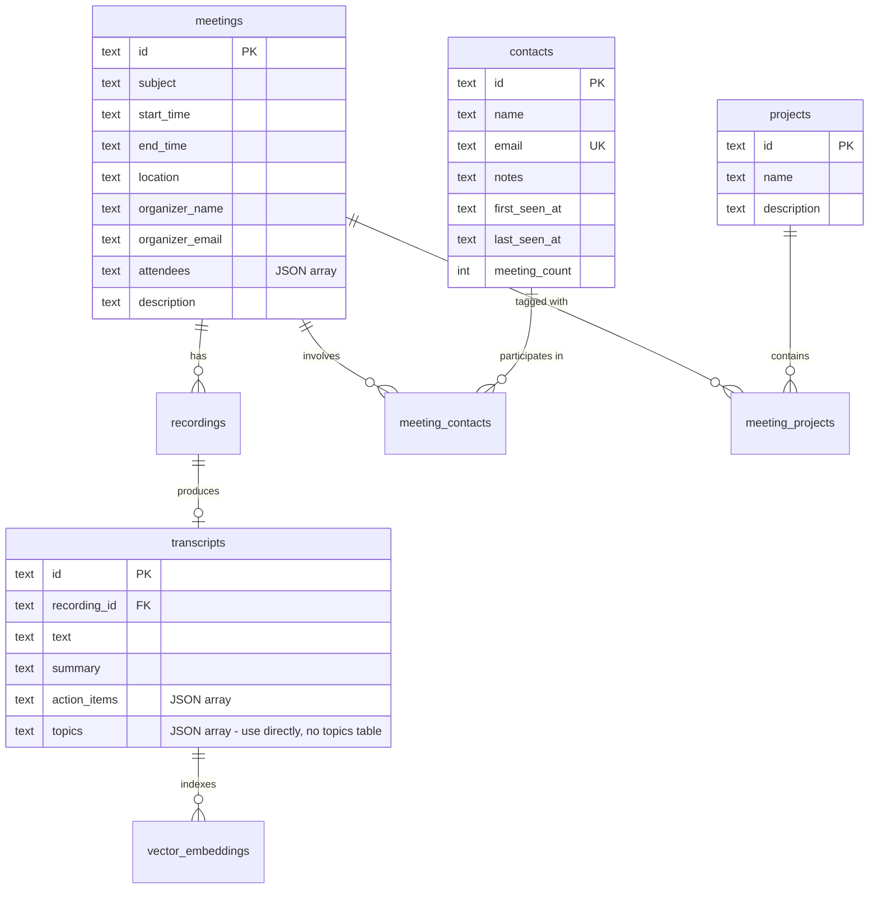

# HiDock Unified Meeting Intelligence Platform

## Overview

Transform HiDock Next from three separate applications (Desktop Python, Web React, Electron) into a single, unified Electron application that serves as a **calendar-first meeting intelligence platform** - a general compendium of all conversations recorded on HiDock devices.

**Epic Type:** Major Feature / Platform Consolidation

**Vision Statement:**
> "A platform where I can check on anything that is going on with the different topics or projects I am discussing over the Audio Conversations the device is recording. A general compendium of information on anything that I discuss, talk, or do while using this device."

**Plan Version:** 2.0 (Revised after multi-agent review)

---

## Review Summary

This plan was reviewed by three specialized agents:

| Reviewer | Key Insight | Impact |
|----------|-------------|--------|
| **DHH** | "Three views are just one view with filters" | Architecture simplification |
| **Kieran** | "Define TypeScript types BEFORE implementation" | Type safety requirements |
| **Simplicity** | "Cut 50% of schema, use JSON" | 9 tables → 4 tables |

**Key Changes from v1:**
- Simplified schema (removed speakers, topics, templates, outputs tables)
- Added mandatory type definitions phase
- Added Zod validation requirements
- Reduced timeline from 10 weeks to 8 weeks
- Deferred v2 features explicitly

---

## Problem Statement

### Current State
The HiDock ecosystem consists of four separate applications with fragmented capabilities:

| Application | Strengths | Gaps |
|-------------|-----------|------|
| **Desktop (Python)** | 8 AI providers, Outlook calendar | No RAG chat, no persistent DB |
| **Electron** | Calendar sync, RAG chat, SQLite, device management | No contacts, no projects, no output generation |
| **Web (React)** | WebUSB device connection | No calendar, no chat, no persistence |
| **Audio Insights** | Standalone transcription + insights | No integration with other apps |

### Problems to Solve
1. **Fragmented experience** - Users must choose between apps with different feature sets
2. **No people view** - Cannot browse recordings by contact/speaker
3. **No project view** - Cannot organize meetings by topic or project
4. **No quick outputs** - Meeting minutes and interview feedback require manual RAG prompts
5. **Limited navigation** - Only calendar view exists; users need multiple paths to the same data

---

## Proposed Solution

### Single Unified Electron App

Consolidate all functionality into the Electron app. The core insight from review: **Calendar, Contacts, and Projects are all just filters on the same meeting data.**

```
┌─────────────────────────────────────────────────────────────┐
│                    HiDock Meeting Intelligence               │
├─────────────────────────────────────────────────────────────┤
│  ┌─────────────────────────────────────────────────────┐   │
│  │                   Filter Bar                         │   │
│  │  [Date Range] [Contact ▾] [Project ▾] [Status ▾]    │   │
│  └─────────────────────────────────────────────────────┘   │
│                                                             │
│  ┌──────────────┐  ┌────────────────────────────────────┐  │
│  │   Sidebar    │  │          Meeting List              │  │
│  │              │  │                                    │  │
│  │ • Calendar   │  │  Each meeting shows:               │  │
│  │ • Contacts   │  │  • Title, date, attendees          │  │
│  │ • Projects   │  │  • Recording/transcript status     │  │
│  │ • Chat       │  │  • Quick actions (generate output) │  │
│  │              │  │                                    │  │
│  └──────────────┘  └────────────────────────────────────┘  │
└─────────────────────────────────────────────────────────────┘
```

### Key Features

#### 1. Unified Meeting Browser
- **One page, multiple filters** - Not separate pages for calendar/contacts/projects
- Sidebar provides navigation context (person profile, project dashboard)
- Filter bar allows combining: date + contact + project + status
- Meeting detail panel shows transcript, actions, RAG chat

#### 2. Contacts (filter dimension)
- Auto-extracted from meeting attendees
- Contact profile = sidebar panel showing:
  - Total meetings, total time
  - Recent interactions
  - "Chat about this person" button

#### 3. Projects (filter dimension)
- Manual project creation and tagging
- Project dashboard = sidebar panel showing:
  - Tagged meetings
  - Topics from transcript JSON (no separate table)
  - "Summarize this project" button

#### 4. Quick Output Generation
- **Hardcoded templates** (not database-stored):
  - Meeting Minutes
  - Interview Feedback
  - Project Status Report
  - Action Items Summary
- Generate → Copy to clipboard OR save to file
- No output history (v2 feature)

---

## Technical Approach

### Type-First Development (CRITICAL)

Before writing any implementation code, define all types:

```typescript
// electron/main/types/database.ts
export interface Contact {
  id: string
  name: string
  email: string | null
  notes: string | null
  first_seen_at: string
  last_seen_at: string
  meeting_count: number
  created_at: string
}

export interface Project {
  id: string
  name: string
  description: string | null
  created_at: string
}

export interface MeetingContact {
  meeting_id: string
  contact_id: string
  role: 'organizer' | 'attendee'
}

export interface MeetingProject {
  meeting_id: string
  project_id: string
}

// electron/main/types/api.ts
export interface ContactWithMeetings {
  contact: Contact
  meetings: Meeting[]
  totalMeetingTime: number
}

export interface ProjectWithMeetings {
  project: Project
  meetings: Meeting[]
  topics: string[] // Extracted from transcripts.topics JSON
}

// RAG filter - discriminated union for type safety
export type RAGFilter =
  | { type: 'none' }
  | { type: 'meeting'; meetingId: string }
  | { type: 'contact'; contactId: string }
  | { type: 'project'; projectId: string }
  | { type: 'dateRange'; startDate: string; endDate: string }
```

### IPC Validation with Zod (CRITICAL)

All IPC handlers MUST validate inputs:

```typescript
// electron/main/ipc/contacts-handlers.ts
import { z } from 'zod'

const GetContactByIdSchema = z.object({
  id: z.string().uuid()
})

export function registerContactsHandlers(): void {
  ipcMain.handle('contacts:getById', async (_, rawParams: unknown) => {
    // Runtime validation
    const { id } = GetContactByIdSchema.parse(rawParams)

    const contact = getContactById(id)
    if (!contact) {
      return { success: false, error: { code: 'NOT_FOUND', message: `Contact not found: ${id}` } }
    }

    const meetings = getMeetingsForContact(id)
    return {
      success: true,
      data: { contact, meetings, totalMeetingTime: calculateTotalTime(meetings) }
    }
  })
}
```

### Zustand Store Architecture

Split the monolithic store into feature stores:

```typescript
// src/store/useCalendarStore.ts
interface CalendarStore {
  meetings: Meeting[]
  loading: boolean
  currentDate: Date
  view: 'week' | 'month'

  loadMeetings: (startDate?: string, endDate?: string) => Promise<void>
  navigateWeek: (direction: 'prev' | 'next') => void
}

// src/store/useContactsStore.ts
interface ContactsStore {
  contacts: Contact[]
  selectedContact: Contact | null
  loading: boolean

  loadContacts: () => Promise<void>
  selectContact: (id: string) => Promise<void>
}

// src/store/useProjectsStore.ts
interface ProjectsStore {
  projects: Project[]
  selectedProject: Project | null
  loading: boolean

  loadProjects: () => Promise<void>
  selectProject: (id: string) => Promise<void>
  tagMeeting: (meetingId: string, projectId: string) => Promise<void>
}

// src/store/useFilterStore.ts
interface FilterStore {
  dateRange: { start: Date; end: Date } | null
  contactId: string | null
  projectId: string | null
  status: 'all' | 'recorded' | 'transcribed' | null

  setDateRange: (range: { start: Date; end: Date } | null) => void
  setContactFilter: (id: string | null) => void
  setProjectFilter: (id: string | null) => void
  clearFilters: () => void
}

// src/store/useUIStore.ts
interface UIStore {
  sidebarOpen: boolean
  sidebarContent: 'calendar' | 'contact' | 'project' | 'chat'
  selectedMeetingId: string | null

  setSidebarContent: (content: 'calendar' | 'contact' | 'project' | 'chat') => void
  selectMeeting: (id: string | null) => void
}
```

### Architecture Diagram

```
┌──────────────────────────────────────────────────────────────┐
│                     Renderer Process (React)                  │
│                                                               │
│  ┌─────────────────────────────────────────────────────────┐ │
│  │                    MeetingsPage                          │ │
│  │  ┌──────────┐ ┌──────────┐ ┌───────────────────────────┐│ │
│  │  │ Sidebar  │ │FilterBar │ │      MeetingList          ││ │
│  │  │ (context)│ │          │ │ + MeetingDetail panel     ││ │
│  │  └──────────┘ └──────────┘ └───────────────────────────┘│ │
│  └─────────────────────────────────────────────────────────┘ │
│                           │                                   │
│  ┌─────────────────────────────────────────────────────────┐ │
│  │              Feature Stores (Zustand)                    │ │
│  │  calendar │ contacts │ projects │ filters │ ui          │ │
│  └─────────────────────────────────────────────────────────┘ │
│                           │                                   │
│  ┌─────────────────────────────────────────────────────────┐ │
│  │                   electronAPI (preload)                  │ │
│  └─────────────────────────────────────────────────────────┘ │
└───────────────────────────┬───────────────────────────────────┘
                            │ IPC (validated with Zod)
┌───────────────────────────▼───────────────────────────────────┐
│                      Main Process (Node.js)                    │
│                                                                │
│  ┌──────────────────────────────────────────────────────────┐ │
│  │                    IPC Handlers                           │ │
│  │  contacts.* │ projects.* │ rag.* │ outputs.*             │ │
│  │  (all handlers use Zod validation)                        │ │
│  └──────────────────────────────────────────────────────────┘ │
│                           │                                    │
│  ┌──────────────────────────────────────────────────────────┐ │
│  │                      Services                             │ │
│  │  database │ rag │ transcription │ calendar │ outputs     │ │
│  └──────────────────────────────────────────────────────────┘ │
│                           │                                    │
│  ┌──────────────────────────────────────────────────────────┐ │
│  │               SQLite Database (SQL.js)                    │ │
│  │  meetings │ recordings │ transcripts │ contacts │ projects│ │
│  │  meeting_contacts │ meeting_projects                      │ │
│  └──────────────────────────────────────────────────────────┘ │
└────────────────────────────────────────────────────────────────┘
```

### Database Schema (Simplified)

**Only 4 new tables** (down from 9 in v1):

```sql
-- Contacts (extracted from meeting attendees)
CREATE TABLE contacts (
    id TEXT PRIMARY KEY,
    name TEXT NOT NULL,
    email TEXT UNIQUE,
    notes TEXT,
    first_seen_at TEXT NOT NULL,
    last_seen_at TEXT NOT NULL,
    meeting_count INTEGER DEFAULT 0,
    created_at TEXT DEFAULT CURRENT_TIMESTAMP
);

CREATE INDEX idx_contacts_email ON contacts(email);
CREATE INDEX idx_contacts_name ON contacts(name COLLATE NOCASE);
CREATE INDEX idx_contacts_meeting_count ON contacts(meeting_count DESC);

-- Meeting-Contact Junction
CREATE TABLE meeting_contacts (
    meeting_id TEXT NOT NULL,
    contact_id TEXT NOT NULL,
    role TEXT NOT NULL CHECK(role IN ('organizer', 'attendee')),
    PRIMARY KEY (meeting_id, contact_id),
    FOREIGN KEY (meeting_id) REFERENCES meetings(id) ON DELETE CASCADE,
    FOREIGN KEY (contact_id) REFERENCES contacts(id) ON DELETE CASCADE
);

CREATE INDEX idx_meeting_contacts_contact ON meeting_contacts(contact_id);

-- Projects (user-created tags for meetings)
CREATE TABLE projects (
    id TEXT PRIMARY KEY,
    name TEXT NOT NULL,
    description TEXT,
    created_at TEXT DEFAULT CURRENT_TIMESTAMP
);

-- Meeting-Project Junction
CREATE TABLE meeting_projects (
    meeting_id TEXT NOT NULL,
    project_id TEXT NOT NULL,
    PRIMARY KEY (meeting_id, project_id),
    FOREIGN KEY (meeting_id) REFERENCES meetings(id) ON DELETE CASCADE,
    FOREIGN KEY (project_id) REFERENCES projects(id) ON DELETE CASCADE
);

CREATE INDEX idx_meeting_projects_project ON meeting_projects(project_id);
```

**What we're NOT adding (deferred to v2):**
- `speakers` table → Use speaker labels from transcript JSON
- `topics` table → Query `transcripts.topics` JSON directly
- `output_templates` table → Hardcode as constants
- `generated_outputs` table → No history, export directly

### ERD Diagram



### Output Templates (Hardcoded)

```typescript
// electron/main/services/output-templates.ts
export const OUTPUT_TEMPLATES = {
  meeting_minutes: {
    id: 'meeting_minutes',
    name: 'Meeting Minutes',
    description: 'Formal meeting minutes with attendees, agenda, discussion, decisions, and action items',
    prompt: `Generate formal meeting minutes from this transcript.

Structure the output as:
## Meeting Minutes
**Date:** [date]
**Attendees:** [list]

### Agenda
[inferred from discussion]

### Discussion
[key points discussed]

### Decisions Made
[numbered list]

### Action Items
[who, what, when]

Transcript:
{transcript}`
  },

  interview_feedback: {
    id: 'interview_feedback',
    name: 'Interview Feedback',
    description: 'Structured candidate assessment for interview debriefs',
    prompt: `Generate interview feedback from this transcript.

Structure the output as:
## Interview Feedback
**Candidate:** [name if mentioned]
**Date:** [date]
**Interviewers:** [list]

### Technical Skills
[assessment with evidence]

### Communication
[assessment with evidence]

### Culture Fit
[assessment with evidence]

### Strengths
[bullet points]

### Areas of Concern
[bullet points]

### Recommendation
[Hire / No Hire / Maybe with reasoning]

Transcript:
{transcript}`
  },

  project_status: {
    id: 'project_status',
    name: 'Project Status Report',
    description: 'Progress summary with blockers and next steps',
    prompt: `Generate a project status report from these meeting transcripts.

Structure the output as:
## Project Status Report
**Project:** {project_name}
**Period:** [date range]

### Summary
[2-3 sentence overview]

### Progress
[what was accomplished]

### Blockers
[current impediments]

### Next Steps
[planned actions]

### Key Decisions
[decisions made in these meetings]

Transcripts:
{transcripts}`
  },

  action_items: {
    id: 'action_items',
    name: 'Action Items Summary',
    description: 'Consolidated list of action items from meeting(s)',
    prompt: `Extract all action items from this transcript.

Format as:
## Action Items

| Owner | Action | Due Date | Status |
|-------|--------|----------|--------|
| [name] | [task] | [date if mentioned] | Pending |

Be specific about who owns each action. If no owner mentioned, mark as "TBD".

Transcript:
{transcript}`
  }
} as const

export type OutputTemplateId = keyof typeof OUTPUT_TEMPLATES
```

---

## Implementation Phases

### Phase 0: Type Definitions (Week 1) - CRITICAL

**This phase MUST complete before any other work.**

#### 0.1 Database Entity Types
- [ ] Create `electron/main/types/database.ts`
  - Contact, Project, MeetingContact, MeetingProject types
  - Extend existing Meeting, Recording, Transcript types
- [ ] Create `electron/main/types/api.ts`
  - Request/response types for all IPC handlers
  - RAGFilter discriminated union type
  - Result wrapper type (success/error)

#### 0.2 Validation Schemas
- [ ] Add `zod` to dependencies
- [ ] Create `electron/main/validation/contacts.ts`
- [ ] Create `electron/main/validation/projects.ts`
- [ ] Create `electron/main/validation/common.ts` (shared schemas)

#### 0.3 Store Types
- [ ] Create `src/types/stores.ts`
  - CalendarStore, ContactsStore, ProjectsStore, FilterStore, UIStore interfaces
- [ ] Export from preload for renderer consumption

**Files to Create:**
- `electron/main/types/database.ts`
- `electron/main/types/api.ts`
- `electron/main/types/errors.ts`
- `electron/main/validation/contacts.ts`
- `electron/main/validation/projects.ts`
- `electron/main/validation/common.ts`
- `src/types/stores.ts`

---

### Phase 1: Database & Backend (Week 2-3)

#### 1.1 Schema Migration
- [ ] Add version check to database initialization
- [ ] Create 4 new tables (contacts, projects, junctions)
- [ ] Add indexes
- [ ] Backup existing database before migration

#### 1.2 Contact Extraction
- [ ] Parse `meetings.attendees` JSON on calendar sync
- [ ] Create/update contacts automatically
- [ ] Update meeting_count on contact records
- [ ] Handle duplicate emails (use existing contact)

#### 1.3 Contacts IPC Handlers
- [ ] Create `electron/main/ipc/contacts-handlers.ts`
  - `contacts:getAll` - List with meeting counts
  - `contacts:getById` - Contact with meetings
  - `contacts:update` - Edit notes field
- [ ] Register handlers in main process
- [ ] Add to preload API

#### 1.4 Projects IPC Handlers
- [ ] Create `electron/main/ipc/projects-handlers.ts`
  - `projects:getAll` - List all projects
  - `projects:getById` - Project with meetings + topics
  - `projects:create` - New project
  - `projects:update` - Edit name/description
  - `projects:delete` - Remove project
  - `projects:tagMeeting` - Add meeting to project
  - `projects:untagMeeting` - Remove meeting from project
- [ ] Get topics by querying transcript JSON (no topics table)
- [ ] Register handlers and add to preload

#### 1.5 RAG Filter Enhancement
- [ ] Add RAGFilter parameter to `rag:chat`
- [ ] Implement filter logic in vector search
- [ ] Filter embeddings by meeting IDs (contact's meetings or project's meetings)

**Files to Create/Modify:**
- `electron/main/services/database.ts` (schema migration)
- `electron/main/ipc/contacts-handlers.ts` (new)
- `electron/main/ipc/projects-handlers.ts` (new)
- `electron/main/ipc/calendar-handlers.ts` (contact extraction)
- `electron/main/ipc/rag-handlers.ts` (filter support)
- `electron/preload/index.ts` (API additions)

---

### Phase 2: Zustand Refactor & UI Foundation (Week 4)

#### 2.1 Split Zustand Stores
- [ ] Create `src/store/useCalendarStore.ts`
- [ ] Create `src/store/useContactsStore.ts`
- [ ] Create `src/store/useProjectsStore.ts`
- [ ] Create `src/store/useFilterStore.ts`
- [ ] Create `src/store/useUIStore.ts`
- [ ] Migrate existing state from monolithic store
- [ ] Remove old `useAppStore.ts` (or deprecate)

#### 2.2 Unified MeetingsPage
- [ ] Create `src/pages/Meetings.tsx` (replaces separate pages)
- [ ] Implement FilterBar component
- [ ] Implement MeetingList with virtual scrolling
- [ ] Implement responsive sidebar

#### 2.3 Sidebar Panels
- [ ] Create `src/components/sidebar/CalendarPanel.tsx`
- [ ] Create `src/components/sidebar/ContactPanel.tsx`
- [ ] Create `src/components/sidebar/ProjectPanel.tsx`
- [ ] Create `src/components/sidebar/ChatPanel.tsx`

#### 2.4 Contact Components
- [ ] Create `src/components/contacts/ContactCard.tsx`
- [ ] Create `src/components/contacts/ContactList.tsx`
- [ ] Create `src/components/contacts/ContactProfile.tsx`

#### 2.5 Project Components
- [ ] Create `src/components/projects/ProjectCard.tsx`
- [ ] Create `src/components/projects/ProjectList.tsx`
- [ ] Create `src/components/projects/ProjectDashboard.tsx`
- [ ] Create `src/components/projects/TopicList.tsx` (simple list, no cloud)

**Files to Create:**
- `src/store/useCalendarStore.ts`
- `src/store/useContactsStore.ts`
- `src/store/useProjectsStore.ts`
- `src/store/useFilterStore.ts`
- `src/store/useUIStore.ts`
- `src/pages/Meetings.tsx`
- `src/components/FilterBar.tsx`
- `src/components/sidebar/*.tsx`
- `src/components/contacts/*.tsx`
- `src/components/projects/*.tsx`

---

### Phase 3: Output Generation (Week 5-6)

#### 3.1 Output Service
- [ ] Create `electron/main/services/output-generator.ts`
  - Load hardcoded templates
  - Substitute variables (transcript, project_name, etc.)
  - Call Ollama for generation
- [ ] Create `electron/main/ipc/outputs-handlers.ts`
  - `outputs:getTemplates` - List available templates
  - `outputs:generate` - Generate output (returns content, not saved)
- [ ] Add to preload API

#### 3.2 Output UI
- [ ] Create `src/components/outputs/OutputGenerator.tsx`
  - Template selector dropdown
  - Generate button
  - Preview panel (markdown rendered)
  - Copy to clipboard button
  - Save to file button
- [ ] Add output generation to MeetingDetail view
- [ ] Add "Summarize Project" to ProjectDashboard

#### 3.3 Export Functionality
- [ ] Implement clipboard copy
- [ ] Implement save to file (via Electron dialog)
- [ ] Format as Markdown

**Files to Create:**
- `electron/main/services/output-templates.ts` (constants)
- `electron/main/services/output-generator.ts`
- `electron/main/ipc/outputs-handlers.ts`
- `src/components/outputs/OutputGenerator.tsx`
- `src/components/outputs/OutputPreview.tsx`

---

### Phase 4: Polish & Integration (Week 7-8)

#### 4.1 Calendar View Enhancement
- [ ] Add filter by recording status
- [ ] Add filter by transcription status
- [ ] Add combined filters (date + contact + project + status)
- [ ] Persist filter state in URL params

#### 4.2 Search Enhancement
- [ ] Integrate full-text search in FilterBar
- [ ] Search across transcripts, contacts, projects
- [ ] Highlight matches in results

#### 4.3 Performance
- [ ] Virtual scrolling for meeting list
- [ ] Lazy loading for meeting details
- [ ] Pagination for contacts/projects lists
- [ ] Loading states for all async operations

#### 4.4 Error Handling
- [ ] Define error types (`electron/main/types/errors.ts`)
- [ ] Consistent error responses from IPC handlers
- [ ] Toast notifications for user-facing errors
- [ ] Graceful degradation when Ollama unavailable

#### 4.5 Navigation & UX
- [ ] Update sidebar navigation
- [ ] Add keyboard shortcuts (Cmd+K for search)
- [ ] Breadcrumb navigation
- [ ] Remember last view state

---

## Acceptance Criteria

### Functional Requirements

#### Unified Meeting Browser
- [ ] User can view all meetings in a single list
- [ ] User can filter by date range
- [ ] User can filter by contact (shows all meetings with that person)
- [ ] User can filter by project (shows tagged meetings)
- [ ] User can filter by status (recorded, transcribed, both)
- [ ] User can combine multiple filters
- [ ] Filters persist across sessions

#### Contacts
- [ ] Contacts are auto-created from meeting attendees
- [ ] User can view contact profile in sidebar
- [ ] Contact profile shows meeting count and list
- [ ] User can add notes to contacts
- [ ] User can "Chat about this contact" with RAG

#### Projects
- [ ] User can create projects
- [ ] User can tag meetings to projects
- [ ] Project dashboard shows all tagged meetings
- [ ] Project dashboard shows topics from transcripts
- [ ] User can "Summarize this project" with RAG

#### Output Generation
- [ ] User can generate meeting minutes from any meeting
- [ ] User can generate interview feedback
- [ ] User can generate project status report
- [ ] User can generate action items summary
- [ ] Generated output appears in preview panel
- [ ] User can copy output to clipboard
- [ ] User can save output to file

#### RAG Chat
- [ ] User can query all meetings (existing)
- [ ] User can filter chat to specific meeting
- [ ] User can filter chat to specific contact's meetings
- [ ] User can filter chat to specific project's meetings

### Non-Functional Requirements

#### Type Safety
- [ ] All database entities have TypeScript types
- [ ] All IPC handlers validate inputs with Zod
- [ ] No `any` types in new code
- [ ] Preload API is fully typed

#### Performance
- [ ] App loads in < 3 seconds
- [ ] Meeting list renders < 1 second with 1000 meetings
- [ ] Contact list renders < 1 second with 500 contacts
- [ ] RAG query responds in < 5 seconds
- [ ] Output generation completes in < 10 seconds

#### Quality Gates
- [ ] All existing tests pass
- [ ] New features have test coverage
- [ ] No TypeScript errors
- [ ] ESLint passes
- [ ] App builds successfully for Windows/Mac/Linux

---

## Deferred to v2

Features explicitly NOT in scope for v1:

| Feature | Reason | v2 Consideration |
|---------|--------|------------------|
| Speakers table | Use transcript JSON | If users need speaker-level queries |
| Topics table | Use transcript JSON | If topic list performance is poor |
| Output templates table | Hardcode sufficient | If users want custom templates |
| Output history | Export directly | If users request history |
| Contact merge | Complex, low priority | If duplicate contacts become problem |
| Topic clustering | RAG handles discovery | If users want explicit topic management |
| Topic timeline | Visual sugar | If users request it |
| Project status field | Not used | If workflow management needed |

---

## Dependencies & Risks

### Dependencies
- **Ollama** - Required for RAG embeddings, chat, and output generation
- **Google Gemini** - Required for transcription
- **ICS Calendar Feed** - Required for calendar data
- **HiDock Device** - Required for recordings

### Risks & Mitigations

| Risk | Probability | Impact | Mitigation |
|------|-------------|--------|------------|
| Schema migration breaks existing data | Medium | High | Backup before migration, test with real data |
| JSON topic queries are slow | Low | Medium | Add topics table in v2 if needed |
| Zustand refactor introduces bugs | Medium | Medium | Comprehensive testing, gradual migration |
| Output generation quality varies | Medium | Low | Allow prompt editing, iterate on templates |
| Ollama unavailable | Low | High | Clear error messaging, show "Ollama required" |

---

## Success Metrics

| Metric | Target | Measurement |
|--------|--------|-------------|
| Navigation time to find meeting by person | < 10 seconds | User testing |
| Navigation time to find meeting by project | < 10 seconds | User testing |
| Time to generate meeting minutes | < 30 seconds | Timestamp logs |
| Filter usage rate | > 50% of sessions use filters | Analytics |
| Build/lint passing | 100% | CI/CD |

---

## References

### Internal
- Database Schema: `apps/electron/electron/main/services/database.ts`
- RAG Service: `apps/electron/electron/main/services/rag.ts`
- Current Pages: `apps/electron/src/pages/`

### External
- [Electron IPC Best Practices](https://www.electronjs.org/docs/latest/tutorial/ipc)
- [Zod Documentation](https://zod.dev)
- [Zustand Documentation](https://zustand.pmnd.rs)

---

## AI Assistance Notes

This plan was developed and reviewed with Claude Code assistance:
- **v1:** Initial plan with comprehensive schema
- **v2:** Revised after multi-agent review (DHH, Kieran, Simplicity)

Key simplifications in v2:
1. Schema reduced from 9 to 4 tables
2. Type definitions phase added as prerequisite
3. Zod validation made mandatory
4. Zustand store split required
5. Timeline reduced from 10 to 8 weeks
6. Multiple features deferred to v2
