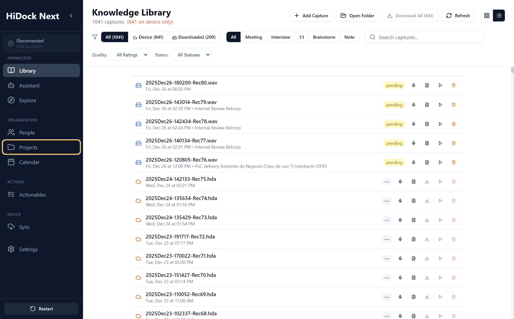

# Knowledge Library Specification

**Module:** Knowledge Management
**Screen:** Library (`/library`)
**Screenshot:** 

## Overview
The Library acts as the central **Knowledge Repository**, storing all captured conversations, meetings, and insights. It allows users to browse, filter, and manage their knowledge base efficiently.

## UI Components & Behavior

| Feature | UI Element | Action | Expected Outcome | Redesign Alignment |
| :--- | :--- | :--- | :--- | :--- |
| **Global Navigation** | Sidebar Link | Click "Library" | Navigates to `#/library`. Loads virtualized list of recordings. | Matches "Knowledge Library" renaming. |
| **Search** | Input Field | Type text (e.g., "Amazon") | Filters list by filename/title case-insensitive. Debounced (300ms). | Aligns with "Search & Filter" requirement. |
| **Source Filtering** | Tag Buttons | Click "Meeting", "Interview", etc. | Filters list to show only items with selected tag. Updates item count. | Matches "By Source" taxonomy. |
| **Status Filtering** | "All Statuses" Dropdown | Select "Processing", "Ready" | Filters list by transcription status. | Matches "By Status" taxonomy. |
| **Quality Filtering** | "All Ratings" Dropdown | Select "Valuable", "Low-Value" | Filters list by quality rating. | Matches "By Quality" taxonomy. |
| **Playback** | Play Button (▶) | Click on Item | **Local:** Plays immediately via AudioPlayer. **Device:** Queues download, shows spinner, plays on completion. | Aligns with "Actions per Knowledge Item". |
| **Download** | Download Icon (⬇) | Click on Device-Only Item | Initiates background download. Updates sync status to "Local". | Core "Device Management" utility. |
| **Management** | Trash Icon | Click Delete | Prompts confirmation. Removes from DB (and optionally device). | Standard management action. |

## Data Requirements
*   **Data Source:** Aggregation of Local DB (`recordings` table) and Connected Device (`deviceCache`).
*   **Entities:** `KnowledgeCapture` (formerly Recording).
*   **State:** Persists `viewMode` (List/Card) and active filters in `localStorage`.
