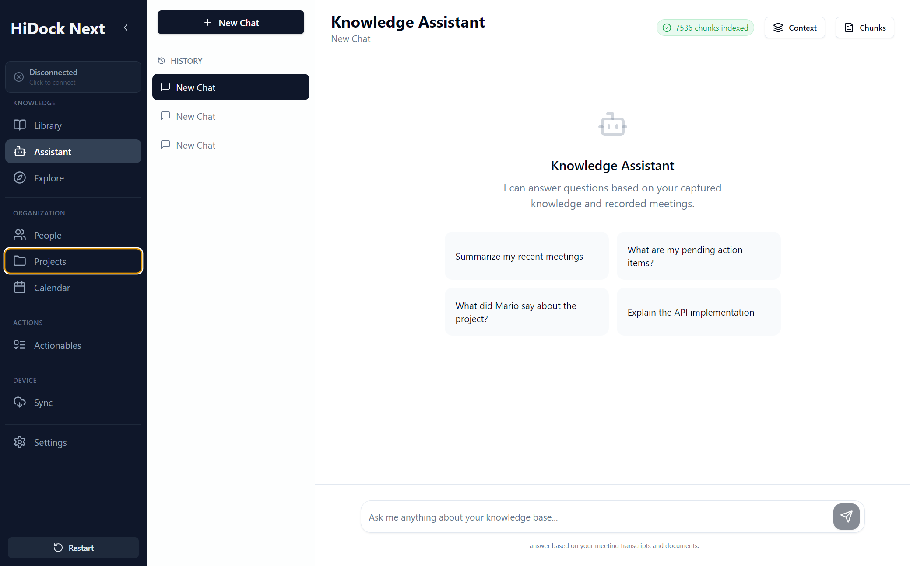

# Knowledge Assistant Specification

**Module:** Knowledge Management (Pillar III: THE ANALYST)
**Screen:** Assistant (`/assistant`)
**Component:** `src/pages/Chat.tsx`
**Screenshot:** 

## 1. Overview
The Assistant is the **Creative Engine** for synthesis and action. It grounded AI conversations in the truth of the Library and the context of the Explore graph to transform knowledge into artifacts (reports, emails, tasks).

## UI Components & Behavior

| Feature | UI Element | Action | Expected Outcome | Redesign Alignment |
| :--- | :--- | :--- | :--- | :--- |
| **Global Navigation** | Sidebar Link | Click "Assistant" | Navigates to `#/assistant`. Loads chat workspace. | Matches "Synthesis" metaphor. |
| **Interactive Chat** | Conversation | Ask Question | Retrieves context from Library/Explore. Streams answer. | "Talk with the data". |
| **Source Linking** | Citations `[1]` | Click/Hover | Opens the original Library segment (timestamp/page) for verification. | "Source Linking/Cross-reference". |
| **Transformation** | "Transform" Button | Click | Converts current chat insight into a specific Output (Actionable, Report). | "Generate Artifacts". |
| **Output Panel** | Note Thumbnail View | View | Shows small previews of AI-generated notes/actionables. | "Thumbnail view of notes". |

---

## 2. Component Specification

### 2.1 State Management
| State Variable | Type | Description | Persistence |
| :--- | :--- | :--- | :--- |
| `activeSession` | `Conversation` | Message history and context state. | DB-backed |
| `activeCitations` | `Citation[]` | Pointers to specific segments in Sources. | Session |
| `noteGallery` | `Note[]` | Preview thumbnails of generated insights. | Session |

### 2.2 Lifecycle & Events
*   **Mount:** Fetches recent conversation and any pending "Actionable" suggestions.
*   **Generation:** Real-time token streaming using the **Esperanto** AI Backbone.

---

## 3. Detailed Behavior

### 3.1 Synthesis & Transformation
*   **Prompting:** Users can use "Recipes" (e.g., "Draft Interview Feedback").
*   **Actionability:** Every insight is one click away from becoming an "Actionable" (See `07_ACTIONABLES.md`).

### 3.2 Metadata Auto-Tagging
*   **Logic:** Assistant detects People, Places, and Dates in chat and offers to update the Explore Graph.

---

## 4. API Contracts

### `Note` (AI Generated)
```typescript
interface Note {
  id: string;
  category: 'summary' | 'action_item' | 'insight';
  label: 'AI-Generated' | 'User-Edited';
  content: string; // Markdown
  sourceLink: string; // ID:Anchor
}
```

---

## 5. Error Handling

*   **Hallucination Warning:** If confidence < 0.7, Assistant adds a disclaimer to the citation.
*   **Offline Mode:** If LLM provider is unreachable, Assistant offers local fallback (Ollama).

---

## 6. Accessibility & Styling

*   **Keyboard:** `Cmd+Enter` to send. `Alt+Up` to edit last message.
*   **Layout:** Three-column: Chat | Preview Panel | References.

---

## 7. Testing Strategy

### Integration Tests
*   **Citations:** Ask question -> Verify citation link points to correct source ID.
*   **Artifact Flow:** Click "Create Report" -> Verify new item appears in Actionables.
