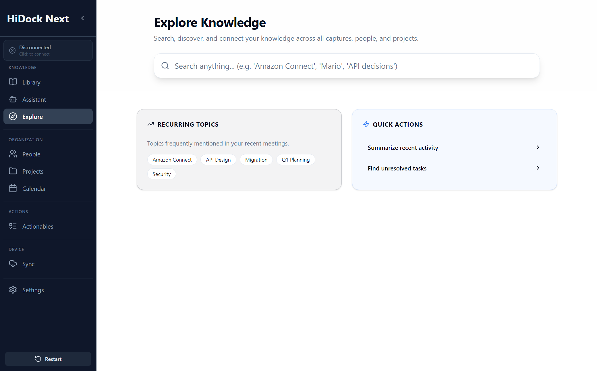

# Explore Specification

**Version:** 1.1 (2025-12-29)
**Module:** Knowledge Management (Pillar II: Explore)
**Screen / Route:** Explore (`/explore`)
**Component:** `apps/electron/src/pages/Explore.tsx` (Current) / Graph Explorer component (Target, TBD)
**References:** [11_CONCEPTUAL_FRAMEWORK.md](./11_CONCEPTUAL_FRAMEWORK.md), [11_REDESIGN_ARCH.md](./11_REDESIGN_ARCH.md)
**Screenshot:** 

## 1. Overview
Explore is the discovery layer for **entities + relationships** derived from Sources. It enables lateral navigation (People/Projects/Topics/Decisions) and global search over the knowledge base.

## UI Components & Behavior

| Feature | UI Element | Action | Expected Outcome | Redesign Alignment |
| :--- | :--- | :--- | :--- | :--- |
| **Global Navigation** | Sidebar Link | Click "Explore" | Navigates to `#/explore`. Loads the **Graph Visualizer**. | Matches "Map" metaphor. |
| **Graph View** | Interactive Canvas | Drag/Click Nodes | Navigate relationships between People, Projects, and Topics. | "Interactive display of knowledge graph". |
| **Lateral Nav** | Node Details | Click "Topic" | Shows all Meetings and People associated with that topic. | "Semantic Search & Navigation". |
| **Trend Analysis** | Sidebar Charts | View | Displays recurring themes and patterns over time. | "Trend Identification". |
| **Quick Actions** | Intelligence Panel | Click Action | Deep-links into Assistant for specific context ("Summarize this topic"). | "Proactive Insights". |

---

## 2. Component Specification (Target State)

### 2.1 State Management
| State Variable | Type | Description | Persistence |
| :--- | :--- | :--- | :--- |
| `activeNode` | `Node \| null` | The currently focused entity (Person, Project, Topic). | Session |
| `graphFilters` | `FilterSet` | Date range, entity types to show on graph. | Session |
| `trendData` | `Object` | Aggregated metrics for visualizations. | Polled |

### 2.2 Lifecycle & Events
*   **Mount:** Fetches derived data (entities/relationships) and/or dashboard summary.
*   **Search:** Keyword + semantic search over Sources and derived entities.

---

## 3. Detailed Behavior

### 3.1 Knowledge Graph Interface
*   **Entities:**
    *   **People:** (Merged from `05_PEOPLE.md`). Now pre-filtered graph views.
    *   **Projects:** (Merged from `06_PROJECTS.md`).
    *   **Topics:** AI-extracted themes.
*   **Interactions:** Double-click node to center graph. Right-click to "Ask Assistant about [Node]".

### 3.2 Metadata Extraction
*   **Flow:** Automated tagging of entities during background indexing.
*   **Persistence:** Metadata is written to the Graph DB for instant discovery.

---

## 4. API Contracts

### `GraphNode`
```typescript
interface GraphNode {
  id: string;
  label: string;
  type: 'PERSON' | 'PROJECT' | 'TOPIC' | 'SOURCE';
  properties: Record<string, any>;
}
```

---

## 5. Error Handling

*   **Graph Overload:** If results > 500 nodes, switch to "Clustered View" to maintain performance.

---

## 6. Accessibility & Styling

*   **Keyboard:** `Tab` focus cycles through major entity cards. Arrow keys pan graph.
*   **Theming:** Use existing design system tokens only; entity type distinction should not rely on bespoke hard-coded colors.

---

## 7. Testing Strategy

### Integration Tests
*   **Graph Filter:** Select "Date: Last 7 Days" -> Verify node count updates.
*   **lateral Nav:** Click Person A -> Verify linked Project B appears in focused view.