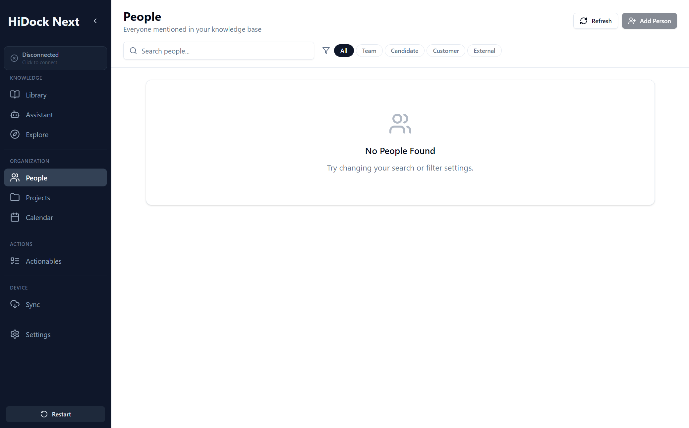

# People Specification

**Version:** 1.1 (2025-12-29)
**Module:** Organization (Entity: Person)
**Screen / Route:** People (`/people`)
**Component:** `apps/electron/src/pages/People.tsx`
**References:** [11_CONCEPTUAL_FRAMEWORK.md](./11_CONCEPTUAL_FRAMEWORK.md)
**Screenshot:** 

## 1. Overview
People is the **Person-Centric View** of knowledge. It is designed to be **auto-populated** from transcripts, identifying speakers and mentions to build a network of interactions. Currently serves as a read-only directory of detected contacts.

## UI Components & Behavior

| Feature | UI Element | Action | Expected Outcome | Redesign Alignment |
| :--- | :--- | :--- | :--- | :--- |
| **Contact List** | Card Grid | View | Displays contacts with Name, Role, Interaction Count. | "List View" design. |
| **Filtering** | Type Tags | Click "Team", "Customer" | Filters grid by contact type. | Matches "Auto-population" classification. |
| **Search** | Input Field | Type Name | Filters contacts by name/email (Backend Search). | Standard search. |
| **Creation** | "Add Person" Button | Click | **Current:** Disabled (No-op).<br>**Target:** Opens manual creation modal. | "Auto-populated... minimal manual creation". |
| **Detail View** | Click Card | Click | Navigates to `/person/:id` (Knowledge Map, Timeline). | "Person Detail" view. |

---

## 2. Component Specification

### 2.1 State Management
| State Variable | Type | Description | Persistence |
| :--- | :--- | :--- | :--- |
| `people` | `Person[]` | List of loaded contacts. | Session |
| `loading` | `boolean` | Fetching status. | Session |
| `searchQuery` | `string` | Name/Email search term. | Session |
| `typeFilter` | `'all'\|'team'\|...` | Active category filter. | Session |

### 2.2 Lifecycle & Events
*   **Mount:** Calls `loadPeople()` -> `contacts.getAll({ search: '', limit: 100 })`.
*   **Search:** Debounced effect on `searchQuery` -> Re-fetches `loadPeople`.
*   **Filter:** `filteredPeople` computed memoization on client-side (Note: Code does client-side filtering *after* fetching 100 items, which might be a bug if total > 100).

---

## 3. Detailed Behavior

### 3.1 List Rendering
*   **Grid:** Responsive `grid-cols-1 md:grid-cols-2 lg:grid-cols-3`.
*   **Card Content:**
    *   **Avatar:** Initials with color-coded background based on `type`.
    *   **Metadata:** Email, Company, Role.
    *   **Stats:** Interaction count, Last Seen date.
    *   **Tags:** Top 3 tags + count.

### 3.2 Interactions
*   **Click Card:** `navigate('/person/' + id)`.
*   **Refresh:** Calls `loadPeople` again.

---

## 4. API Contracts

### `Person` (Frontend Model)
```typescript
interface Person {
  id: string;
  name: string;
  type: 'team' | 'candidate' | 'customer' | 'external';
  email?: string;
  company?: string;
  role?: string;
  interactionCount: number;
  lastSeenAt: string; // ISO Date
  tags: string[];
}
```

### IPC Methods
*   `contacts.getAll(request)`:
    *   `request`: `{ search?: string, limit?: number }`.
    *   Returns: `{ success: true, data: { contacts: [...] } }`.

---

## 5. Error Handling

*   **Load Failure:** Logs error to console. Shows empty state (needs Toast).
*   **Empty State:** "No People Found" card if array is empty.

---

## 6. Accessibility & Styling

*   **Keyboard:** Cards are interactive (`cursor-pointer`) but need `tabIndex` for keyboard focus (Missing in code).
*   **Visual distinction:** Use existing theme tokens and components (badges/labels) rather than introducing new hard-coded colors.

---

## 7. Testing Strategy

### Unit Tests
*   Test `getTypeColor` mapping.
*   Test `filteredPeople` memoization logic.

### Integration Tests
*   **Search:** Mock `contacts.getAll` response -> Type "Alice" -> Verify `getAll` called with `{ search: 'Alice' }`.
*   **Navigation:** Click Card -> Verify `navigate` called with correct ID.

### Performance
*   **Render:** < 100ms for 100 cards.
*   **Search:** Debounce 300ms to prevent API spam.