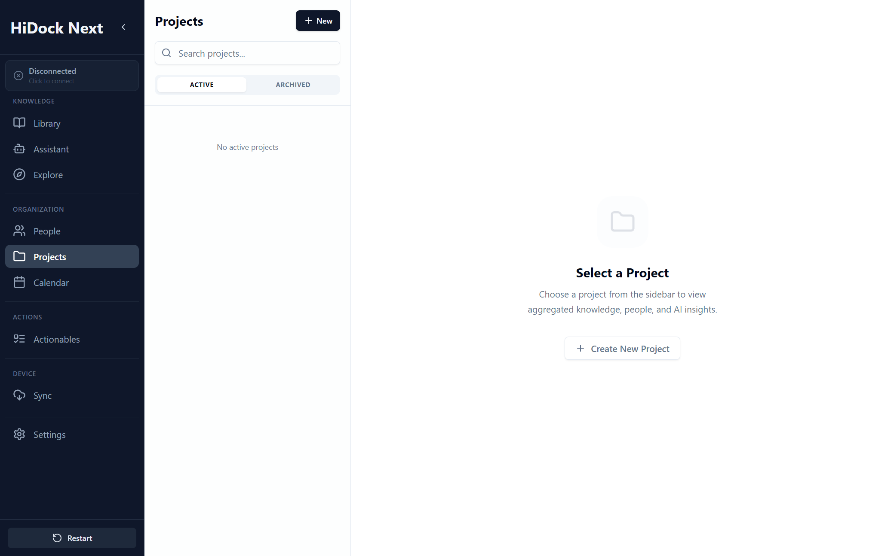

# Projects Specification

**Module:** Organization
**Screen:** Projects (`/projects`)
**Component:** `src/pages/Projects.tsx`
**Screenshot:** 

## 1. Overview
Projects provides a **Project-Centric View** of knowledge. It aggregates recordings, action items, and people under a common initiative. Projects are primarily **auto-detected** but can be manually managed.

## UI Components & Behavior

| Feature | UI Element | Action | Expected Outcome | Redesign Alignment |
| :--- | :--- | :--- | :--- | :--- |
| **Sidebar List** | Project Items | View | Lists Active/Archived projects. Shows unread/update indicators. | "Sidebar - Projects List". |
| **Selection** | Click Item | Click | Loads Project Detail view (Stats, Description, Insights). | "Project Detail" view. |
| **Creation** | "New Project" Button | Click | **Current:** Prompts for name.<br>**Target:** Opens Shadcn Modal for creation/suggestion review. | "Suggested Projects" workflow. |
| **Stats** | Cards (Knowledge, People) | View | Summarizes associated items (e.g., "12 Items", "5 People"). | "Overview" section. |
| **AI Insights** | "Project Insight" Card | View | Displays AI-generated summary of recent project activity. | "AI Project Insight". |

---

## 2. Component Specification

### 2.1 State Management
| State Variable | Type | Description | Persistence |
| :--- | :--- | :--- | :--- |
| `projects` | `Project[]` | Full list of projects. | Session |
| `activeProject` | `Project \| null` | Currently selected project in master-detail view. | Session |
| `statusFilter` | `'active'\|'archived'` | Sidebar list filter. | Session |
| `searchQuery` | `string` | Text filter for project names. | Session |

### 2.2 Lifecycle & Events
*   **Mount:** Calls `loadProjects()` -> `projects.getAll`.
*   **Selection:** Clicking a sidebar item updates `activeProject`.
*   **Creation:** `handleCreateProject` prompts for name -> Calls API -> Updates local state & selects new project.

---

## 3. Detailed Behavior

### 3.1 Sidebar (Master View)
*   **List:** Virtualized list not needed yet (expect < 100 projects).
*   **Sorting:** Most recently created/updated first.
*   **Visuals:** Active project highlighted with `primary` bg.

### 3.2 Detail View
*   **Header:** Shows Title, Status Badge, "Archive"/"Delete" actions.
*   **Stats Grid:**
    *   **Knowledge:** Count of linked recordings.
    *   **People:** Count of distinct speakers/mentions.
    *   **Actions:** Count of pending actionables.
*   **AI Insight:** "Project Insight" card showing automated summary (Placeholder UI).

### 3.3 Creation Workflow
*   **Trigger:** "New" button in sidebar header.
*   **Current:** Uses `window.prompt`. **DEPRECATED**.
*   **Target:** Shadcn Dialog with `Input` field and validation (Unique name check).

---

## 4. API Contracts

### `Project` (Frontend Model)
```typescript
interface Project {
  id: string;
  name: string;
  description?: string;
  status: 'active' | 'archived';
  createdAt: string; // ISO
  knowledgeCount: number;
  peopleCount: number;
}
```

### IPC Methods
*   `projects.getAll(request)`: Returns `{ projects: [...] }`.
*   `projects.create({ name })`: Returns created `Project` object.

---

## 5. Error Handling

*   **Create Fail:** Console error (needs Toast).
*   **Load Fail:** Infinite loading spinner if API hangs. Needs timeout/error state.

---

## 6. Accessibility & Styling

*   **Keyboard:** Sidebar items need `tabIndex`.
*   **Animation:** `animate-in fade-in slide-in-from-right-2` on detail view entry.
*   **Theme:** Uses `muted/10` for sidebar background.

---

## 7. Testing Strategy

### Unit Tests
*   Test filter logic (`statusFilter` + `searchQuery`).

### Integration Tests
*   **Render:** Verify sidebar list matches mock data.
*   **Select:** Click "Project A" -> Verify Detail View header shows "Project A".
*   **Create:** Mock `projects.create` -> Trigger creation -> Verify list updates.

### Performance
*   **Selection:** Detail view load < 50ms.
