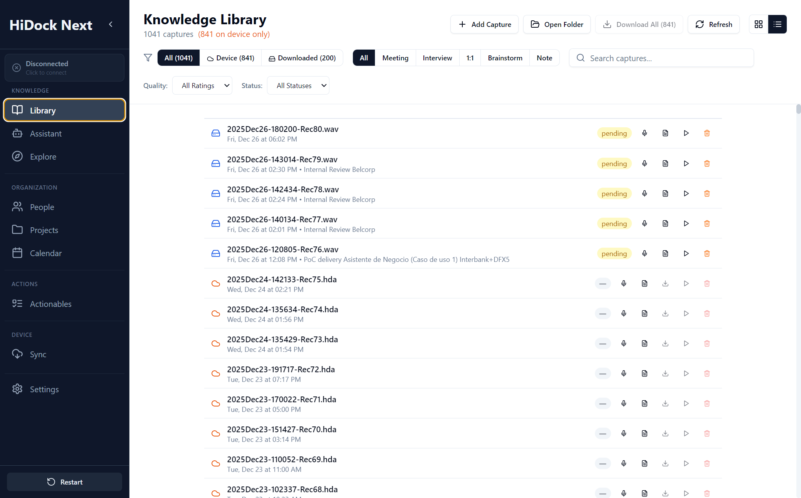

# Calendar Specification

**Version:** 1.1 (2025-12-29)
**Module:** Organization (Temporal view)
**Screen / Route:** Calendar (`/calendar`)
**Component:** `apps/electron/src/pages/Calendar.tsx`
**References:** [11_CONCEPTUAL_FRAMEWORK.md](./11_CONCEPTUAL_FRAMEWORK.md)
**Screenshot:** 

## 1. Overview
The Calendar provides an **Event-Centric View** of knowledge. It links recordings to scheduled meetings, allowing users to visualize gaps in their knowledge capture and organize content temporally.

## UI Components & Behavior

| Feature | UI Element | Action | Expected Outcome | Redesign Alignment |
| :--- | :--- | :--- | :--- | :--- |
| **View Switching** | Toggle Buttons | Click Day/Week/Month | Switches grid layout. Fetches events for new date range. | Standard Calendar views. |
| **Date Navigation** | Prev/Next (< >) | Click | Moves backward/forward by one unit (Day/Week/Month). | "Temporal Navigation". |
| **Sync** | "Syncing..." Indicator | Auto or Manual Click | Fetches latest events from Outlook/Google. Updates grid. | "Auto-population" trigger. |
| **Meeting Blocks** | Dashed Box | Click | Opens Meeting Details. Shows "No Recording Linked" status. | Visual distinction for missing knowledge. |
| **Recording Blocks** | Solid Box | Click | Navigates to Library/Player for that recording. | Visual confirmation of captured knowledge. |
| **Orphan Handling** | Solid Box (No Meeting) | View Grid | Displays recordings without matching meetings in their respective time slots. | "Knowledge without Event". |

---

## 2. Component Specification

### 2.1 State Management
| State Variable | Type | Description | Persistence |
| :--- | :--- | :--- | :--- |
| `calendarView` | `'day'\|'week'\|'month'` | Active grid view. | **Persisted** (Config) |
| `currentDate` | `Date` | Currently visible time range anchor. | Session (Store) |
| `hideEmptyMeetings` | `boolean` | Hide meetings without linked recordings. | **Persisted** (Config) |
| `showListView` | `boolean` | Toggle between Grid and List view. | **Persisted** (Config) |
| `linkDialogRecording` | `Recording \| null` | Controls "Link Recording" modal visibility. | Session |

### 2.2 Lifecycle & Events
*   **Mount:** Loads config -> Sets initial view -> Scrolls to current hour (`scrollContainerRef`).
*   **Fetch:** On `currentDate` or `calendarView` change, calls `loadMeetings(start, end)`.
*   **Sync:** `handleSync` calls `calendar.clearAndSync` then re-fetches meetings.

---

## 3. Detailed Behavior

### 3.1 Event Matching Logic
*   **Algorithm:** `matchRecordingsToMeetings` (utils).
*   **Rules:**
    1.  Time overlap > X minutes.
    2.  Title similarity (fuzzy match).
*   **Result:**
    *   **Matched:** `CalendarMeeting` with `hasRecording: true`.
    *   **Unmatched Recording:** `CalendarRecording` (Orphan).
    *   **Unmatched Meeting:** `CalendarMeetingOverlay` (Dashed).

### 3.2 Visual Rendering
*   **Grid Layout:** CSS Grid (`grid-cols-7`).
*   **Positioning:** Absolute positioning based on `(hour - START_HOUR) * HOUR_HEIGHT`.
*   **Office Hours:** Shaded background for non-work hours (Configurable).

### 3.3 Interactions
*   **Click Meeting:** Navigates to `/meeting/:id`.
*   **Click Orphan:** Opens `RecordingLinkDialog` to manually associate with a past/future meeting.
*   **Sync Button:** Triggers backend sync. Shows global spinner.

---

## 4. API Contracts

### `Meeting` (Database Entity)
```typescript
interface Meeting {
  id: string;
  subject: string;
  start_time: string; // ISO
  end_time: string; // ISO
  attendees: string[]; // JSON array
  source: 'outlook' | 'google';
}
```

### IPC Methods
*   `meetings.getAll(start, end)`: Returns meetings within range.
*   `calendar.clearAndSync()`: Force resync from provider.
*   `calendar.toggleAutoSync(bool)`: Updates background job settings.

---

## 5. Error Handling

*   **Sync Failure:** Toast notification "Sync failed: [Error]". Grid retains stale data.
*   **Date Errors:** `currentDate` guarded against `null` (Fix `CAL-02`).
*   **Navigation:** Bounds checking prevents navigating to invalid dates (e.g., year 1900).

---

## 6. Accessibility & Styling

*   **Scroll:** "Stable Gutter" ensures UI doesn't jump when scrollbar appears.
*   **Colors:**
    *   **Green:** Synced/Local recording.
    *   **Orange:** Device-only recording.
    *   **Dashed/Grey:** Empty meeting.
*   **Tooltips:** Hovering blocks shows full Title, Time, Duration.

---

## 7. Testing Strategy

### Unit Tests
*   Test `matchRecordingsToMeetings` with edge cases (partial overlap, exact match).
*   Test `getRecordingStyle` pixel calculations.

### Integration Tests
*   **Render:** Mock `meetings.getAll` -> Verify correct number of blocks appear.
*   **Navigation:** Click "Next Week" -> Verify `loadMeetings` called with new range.
*   **Orphan Link:** Click Orphan -> Select Meeting -> Verify `recordings.linkToMeeting` called.

### Performance
*   **Grid Render:** Instant (< 100ms) switching between views.
*   **Sync:** Background operation; UI must not freeze.