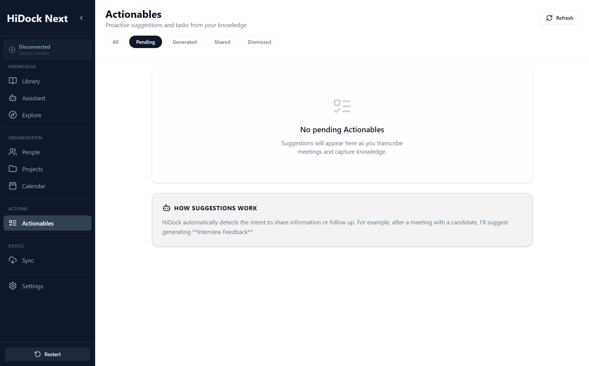

# Actionables Specification

**Version:** 1.1 (2025-12-29)
**Module:** Knowledge Management (Artifacts)
**Screen / Route:** Actionables (`/actionables`)
**Component:** `apps/electron/src/pages/Actionables.tsx`
**References:** [11_CONCEPTUAL_FRAMEWORK.md](./11_CONCEPTUAL_FRAMEWORK.md), [02_ASSISTANT.md](./02_ASSISTANT.md)
**Screenshot:** 

## 1. Overview
Actionables is the artifact repository. It stores finalized and semi-final outputs produced by the Assistant (and edited by the user), such as meeting minutes, follow-ups, task lists, and reports.

Key invariant: every Artifact must remain traceable to Sources via citations (anchors).

## UI Components & Behavior

| Feature | UI Element | Action | Expected Outcome | Redesign Alignment |
| :--- | :--- | :--- | :--- | :--- |
| **Output Gallery** | Thumbnail Grid | View | Displays cards for AI-generated reports, tasks, and notes. | "Thumbnail view of notes". |
| **Metadata Display** | Card Details | View | Shows category, date, and label (e.g., "AI Generated"). | "Details about them: label/category". |
| **Export** | Action Menu | Click Export | Offers PDF, Markdown, and JSON export options. | "Export Options". |
| **Source Link** | "View Source" Link | Click | Navigates back to the specific segment in Library. | "Source segment cross-reference". |

---

## 2. Data model (minimum)

```typescript
type ArtifactType = 'minutes' | 'email_draft' | 'task_list' | 'report' | 'note';

interface Artifact {
	id: string;
	type: ArtifactType;
	title: string;
	content: string; // markdown
	createdAt: string; // ISO
	updatedAt: string; // ISO
	origin: 'assistant' | 'user';
	status: 'draft' | 'final';
	citations: Array<{ sourceId: string; anchor: any; quote?: string }>;
}
```

Notes:
- citations must support deep linking into Library
- artifacts should preserve an immutable "original AI draft" for diff/history (even if UI is simple initially)

---

## 3. Component specification

### 3.1 Lifecycle & events
- Mount: load artifacts list + render thumbnails/cards.
- Create: Assistant produces artifact -> persisted -> appears at top.
- Edit: user modifies markdown content -> updates `updatedAt` and preserves original draft.
- Export: export is a pure transform of persisted artifact content.

### 3.2 Routing & deep links
- Actionables should link back to Library using `sourceId + anchor`.
- Library must accept a deep link and focus the cited segment (time range / text range).

---

## 4. Testing strategy

### Integration Tests
*   **Export:** Click Export PDF -> Verify file generation.
*   **Sync:** Verify "Mark as Shared" status propagates to the Graph (Explore).

---

## 5. Implementation notes

- Start with a simple persisted artifacts table (or JSON store) plus a markdown renderer/editor; add PDFs later.
- Do not introduce new UI surfaces beyond the existing Actionables route; keep UX minimal and consistent.