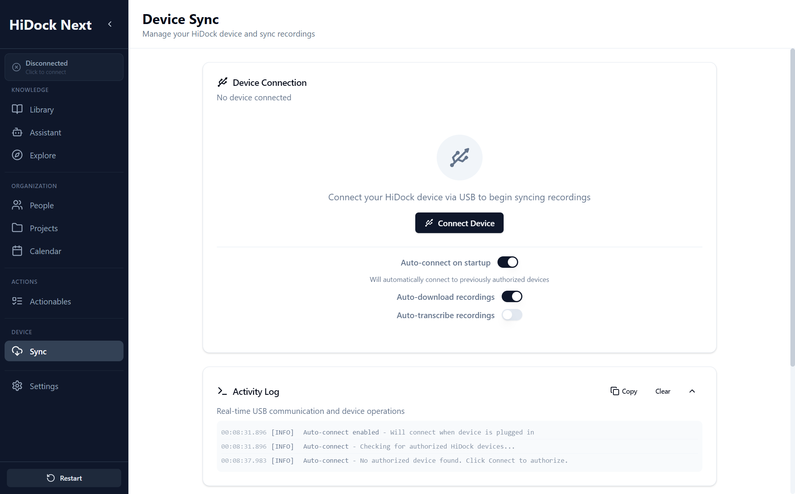

# Sync Specification

**Module:** Device Management
**Screen:** Sync (`/sync`)
**Screenshot:** 

## Overview
Sync covers the **Legacy Device Management** functionality. It handles the physical connection to HiDock hardware, file transfer, and storage cleanup.

## UI Components & Behavior

| Feature | UI Element | Action | Expected Outcome | Redesign Alignment |
| :--- | :--- | :--- | :--- | :--- |
| **Connection Status** | Status Indicator | Plug/Unplug USB | Updates to "Connected (H1E)" or "Disconnected". | "Device Status" panel. |
| **Storage Bar** | Progress Bar | View | Shows used/free space on device. | "Storage: X GB / Y GB". |
| **Sync All** | "Sync [N] Recordings" | Click | Queues all new files for download. Shows global progress. | "Quick Actions - Sync All New". |
| **Auto-Settings** | Toggles | Click | Enables/Disables "Auto-connect", "Auto-download", "Auto-transcribe". | "Auto-Sync Settings". |
| **Activity Log** | Log Console | View | Displays real-time protocol events (Connect, Handshake, File Transfer). | Debugging visibility. |

## Data Requirements
*   **Hardware:** WebUSB / Jensen Protocol.
*   **Services:** `DeviceService` (Hardware I/O), `DownloadService` (Queue Management).
*   **State:** `deviceState` (Global Store).
