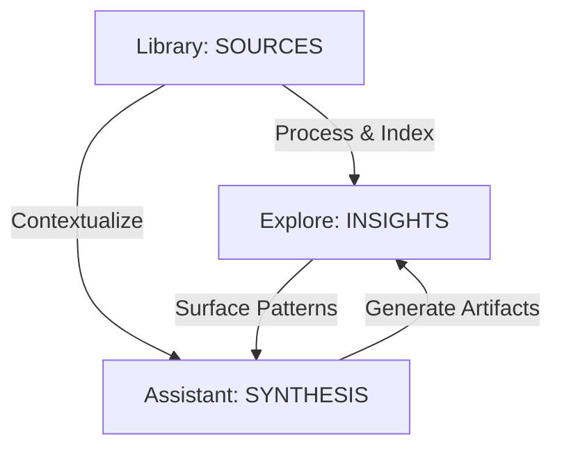

# Conceptual Framework: The HiDock Knowledge Trinity

**Version:** 1.0
**Date:** 2025-12-28
**Vision:** Defining the core pillars of the "Knowledge System" architecture.

---

## 1. The Trinity Model

The application architecture is built upon three distinct but interconnected pillars. Each pillar represents a specific stage in the lifecycle of knowledge.

| Pillar | Concept | Action Verbs | The "Metaphor" |
| :--- | :--- | :--- | :--- |
| **Library** | **Input & Processing** | Listen, Read, View, Transcribe | The **Archive** |
| **Explore** | **Discovery & Graph** | Connect, Visualize, Navigate | The **Map** |
| **Assistant** | **Interaction & Creation** | Ask, Generate, Transform | The **Analyst** |

---

## 2. Pillar I: Library (The Source)

**"The Immutable Truth"**

The Library is not just a file list; it is the **Reader and Player**. It is where raw reality (audio, text, images) enters the system and is normalized into a consumable format.

### Core Responsibilities
1.  **Ingestion:** Bringing data in from hardware (HiDock), APIs (Slack/Calendar), or uploads.
2.  **Rendering:** Providing the best possible consumption experience.
    *   *Audio:* Waveforms, Speaker Diarization, "Click-to-Seek".
    *   *Docs:* Markdown rendering, PDF viewer.
3.  **Processing:** Turning raw signals into text and embeddings.
    *   Transcription, OCR, Image Description.

### User Experience
*   **Focus:** Concentration and Review.
*   **UI:** Minimalist "Reader Mode". Split screens (Source vs. Transcript).
*   **Outcome:** "I have reviewed the material and verified its accuracy."

---

## 3. Pillar II: Explore (The Graph)

**"The Structured Intelligence"**

Explore is where **Data becomes Information**. It is the visualization of the *derived* layer—the metadata, entities, and connections extracted from the Library. It is about "Connecting the Dots".

### Core Responsibilities
1.  **The Knowledge Graph:** Visualizing relationships (e.g., "Person A" discussed "Topic B" in "Meeting C").
2.  **Trend Analysis:** Aggregating data over time (e.g., "Recurring Themes", "Sentiment Analysis").
3.  **Entity Management:** The home of **People** and **Projects** (which are just nodes in the graph).
4.  **Semantic Navigation:** Moving laterally through information ("Show me everything related to this decision").

### User Experience
*   **Focus:** Discovery and Pattern Recognition.
*   **UI:** Dashboards, Network Graphs, Timelines, Tag Clouds.
*   **Outcome:** "I understand the context, relationships, and hidden patterns."

---

## 4. Pillar III: Assistant (The Synthesis)

**"The Creative Engine"**

The Assistant is where **Information becomes Action**. It is the active agent that takes context from the Library and insights from Explore to produce *new* value.

### Core Responsibilities
1.  **Q&A (RAG):** Answering questions based on grounded truth from the Library.
2.  **Transformation:** Converting raw data into structured artifacts.
    *   *Interview* -> *Feedback Form*
    *   *Meeting* -> *Minutes*
    *   *Project Status* -> *Weekly Report*
3.  **Action Management:** Extracting tasks and "Actionables" from the conversation.

### User Experience
*   **Focus:** Creation and Execution.
*   **UI:** Chat Interface, Artifact Editor, Prompt Library.
*   **Outcome:** "I have produced a tangible output (document, email, task) from my knowledge."

---

## 5. The User Journey (Flow)

### Example: The "Hiring Manager" Loop

1.  **Library (Ingest):**
    *   User records an interview with a candidate using HiDock.
    *   System transcribes audio and identifies speakers.
    *   User reviews the transcript to correct a technical term.

2.  **Explore (Connect):**
    *   System auto-links the candidate to the "Engineering Hiring" project.
    *   User sees a "Recurring Topic": The candidate mentioned "Kubernetes" 5 times.
    *   User navigates to the "Kubernetes" topic node to see how it relates to team requirements.

3.  **Assistant (Create):**
    *   User asks: "Based on this interview and our 'Senior Dev' role definition, draft a feedback email."
    *   Assistant pulls the Transcript (Library) and the Role Definition (Library) as context.
    *   Assistant generates a draft email.
    *   User edits and saves it as an "Interview Feedback" artifact.

---

## 6. Architectural Implications

*   **Separation of Concerns:** The `Library` module handles file I/O. The `Explore` module handles the Graph DB. The `Assistant` module handles the LLM orchestration.
*   **Data Flow:** Data flows strictly `Library -> Index -> Explore -> Context -> Assistant`.
*   **Expansion:** New plugins (e.g., Slack) ingest into the **Library** (as sources), get indexed into **Explore** (as nodes), and become available to **Assistant** (as context).
