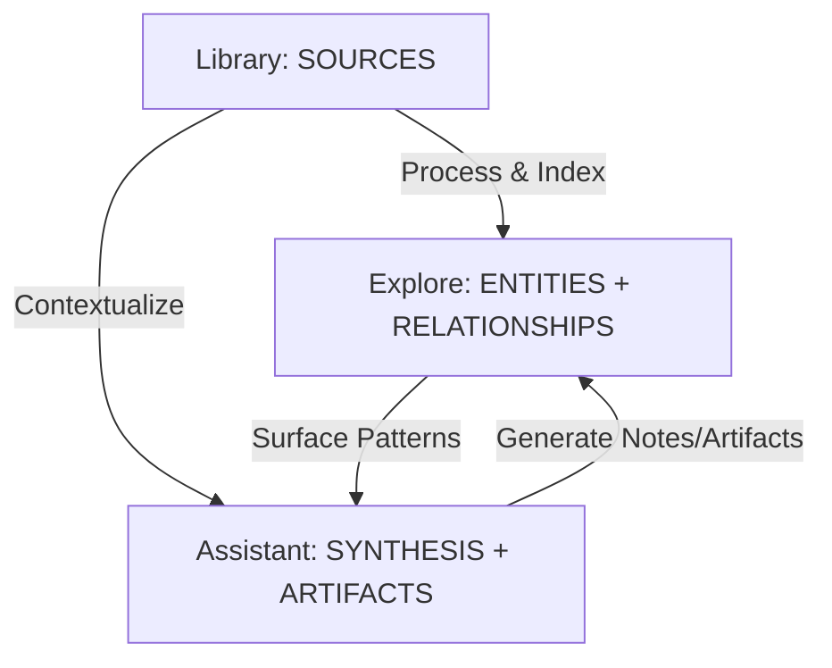

# Conceptual Framework: The HiDock Knowledge Trinity

**Version:** 1.1
**Date:** 2025-12-29
**Purpose:** Align all specs (010) to a single conceptual model and a single set of invariants.
**Primary Reference:** [11_REDESIGN_ARCH.md](./11_REDESIGN_ARCH.md)

---

## 0. Glossary (Canonical Terms)

This project is intentionally strict about language so that UI, DB, and AI behavior stay coherent.

- **Notebook**: A workspace boundary (sometimes called Project). It contains Sources and derived objects.
- **Source**: Immutable evidence (audio transcript, PDF text, web clip). Sources can be re-processed, but the original content is never edited.
- **Note**: Mutable, user-facing knowledge derived from Sources (summaries, insights, action items). Notes always cite Sources.
- **Entity**: A normalized node (Person, Project, Topic, Organization, Decision) derived from Sources/Notes.
- **Artifact**: A finalized, exportable output (minutes, email draft, report) produced by the Assistant and saved for reuse.

---

## 1. The Trinity Model (Lifecycle)

The architecture is built on three interconnected pillars. Each pillar corresponds to a stage in the knowledge lifecycle.

| Pillar | Owns | Action Verbs | Metaphor |
| :--- | :--- | :--- | :--- |
| **Library** | Sources + processing state | Ingest, Review, Correct, Process | **Archive** |
| **Explore** | Entities + relations + discovery | Connect, Browse, Search, Navigate | **Map** |
| **Assistant** | Conversations + transformations | Ask, Draft, Extract, Transform | **Analyst** |

---

## 2. Non-Negotiable Invariants

1. **Sources are immutable**
   - A Source may be reprocessed (new transcript version, new embeddings), but the original raw payload is preserved.
2. **Every AI claim that matters is traceable**
   - Notes/Artifacts must provide citations that point to specific Source anchors (timestamp range, paragraph offset, page range).
3. **Derived layers are reproducible**
   - Entities/relations can be recomputed from Sources; the system should not require manual re-entry after re-index.
4. **UI always distinguishes truth vs. synthesis**
   - Source content is shown as evidence; Notes/Artifacts are shown as derived/edited output.

---

## 3. Pillar I: Library (Sources)

**Definition:** The ingestion and consumption workspace. It is the entry point for raw reality (audio, text, images) and the place where users verify accuracy.

**Responsibilities**
- Ingest Sources (device sync, file import, integrations).
- Render Sources with best-possible playback/reading experience.
- Produce processing outputs (transcript/OCR, embeddings, extraction jobs) while retaining Source immutability.

**Key UX outcomes**
- "I can review the evidence and trust what it says."
- "I can correct errors (as annotations), not by mutating the evidence."

**Implementation implications**
- Library UI must expose Source processing state (queued/running/failed/ready).
- Anchoring must be a first-class primitive (timestamps, text ranges) to support citations.

---

## 4. Pillar II: Explore (Entities + Relationships)

**Definition:** The derived layer. Explore is where Sources become structured knowledge that can be navigated laterally.

**Responsibilities**
- Maintain entity records (People, Projects, Topics, Decisions).
- Maintain relationships and allow discovery queries ("show all meetings where X was mentioned").
- Provide global search (keyword + semantic) across Sources and Notes.

**Implementation implications**
- Normalize identity: map multiple appearances of the same person/entity into a single canonical node.
- Persist extraction outputs separately from Sources so re-index can replace them cleanly.

---

## 5. Pillar III: Assistant (Synthesis + Artifacts)

**Definition:** A context-aware co-pilot that consumes evidence (Library) and structure (Explore) to produce new, editable outputs.

**Responsibilities**
- Grounded Q&A (RAG) and transformations (minutes, reports, action items).
- Artifact creation and versioning (AI draft 1 user edit 1 export).
- Proactive extraction of actionables with explicit user confirmation.

**Implementation implications**
- Conversation context must be explicit (which Sources/Notes are in scope).
- Streaming is preferred but not required for correctness; citations are required.

---

## 6. User Journey (Canonical Loop)

Example: "Hiring Manager" loop

1. **Library (Ingest + Verify)**
   - Record interview  transcribe  user corrects key terms via annotations.
2. **Explore (Derive + Connect)**
   - Candidate becomes a Person entity; interview links to Project.
3. **Assistant (Transform + Save)**
   - Ask for an evaluation summary  produce an Artifact with citations  save to Actionables.

---

## 7. Boundary Map (Where Things Live)

To keep implementation consistent:

- **Renderer (UI)**: pages/components in `apps/electron/src/pages`.
- **Main process services**: IPC + heavy work (transcription, indexing, device sync).
- **Storage**: raw media on disk; metadata in SQLite; embeddings in vector store (local).

---

## 8. How This Maps to the Specs

The numbered specs (010) describe each module surface area:

- 01 Library: Sources + processing UX
- 02 Assistant: synthesis + artifacts + citations
- 03 Explore: search + entities + relationships
- 04 People, 05 Projects: entity specializations
- 06 Calendar: temporal organization + linking
- 07 Actionables: artifact repository
- 08 Sync: device ingestion path
- 09 Settings: configuration + provider selection
- 10 Extensions: future ingestion + plugin architecture
