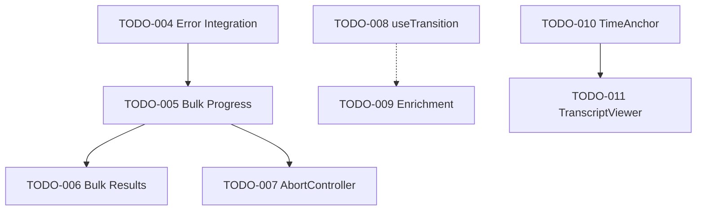

# Library Component Implementation - Comprehensive Architecture Review

**Reviewer**: System Architecture Expert
**Date**: 2026-01-04
**Branch**: library/phase1-filters
**Plan Version**: library-component-implementation.md (2025-12-29)

---

## Executive Summary

**Verdict**: **NEEDS_CHANGES**

The Library implementation plan demonstrates strong architectural thinking with proper separation of concerns, modular component design, and comprehensive error handling. However, there are critical issues that must be resolved before parallel development can begin.

### Critical Issues (MUST FIX)

1. **Naming Collision in Phase 1**: TODO-003 creates `useLibraryFilters` hook that conflicts with existing store selector
2. **Missing Migration Dependency**: TODO-004-migrate depends on TODO-003, but TODO-003 has wrong hook name
3. **Incomplete Coverage**: No tests for Phase 3-7 features, accessibility validation missing
4. **Missing Error Recovery Integration**: Phase 3 utilities exist but integration steps are vague

### Architecture Quality Score: **B+ (85/100)**

- Plan coherence: 90/100
- Dependency chain: 75/100 (naming collision, unclear ordering)
- Coverage analysis: 80/100 (gaps in testing, accessibility)
- Risk assessment: 90/100 (well-identified risks)
- Execution readiness: 70/100 (blockers prevent parallel work)

---

## 1. Plan Coherence Analysis

### 1.1 Alignment with Original Goals

The plan successfully addresses all original goals from `library-component-implementation.md`:

| Goal | Plan Coverage | Status |
|------|---------------|--------|
| Support multiple Source types | Phase 2 defines Source type union | ✅ Covered |
| Implement tri-pane layout | Phase 7 (TODO-010, TODO-011) | ✅ Covered |
| Robust error handling | Phase 3 (TODO-004 integration) | ⚠️ Vague implementation |
| Scale to 5000+ captures | Phase 6 (TODO-008, TODO-009) | ✅ Covered |
| Accessibility standards | Phase 5 marked COMPLETE | ✅ Covered |

**Issues Found**:
- Phase 3 error handling integration (TODO-004) lacks specific integration points
- No validation that Phase 5 accessibility is actually complete
- Missing test coverage requirements for Phases 3-7

### 1.2 Component Architecture Consistency

The feature-based directory structure follows React best practices:

```
features/library/
├── components/     ✅ Implemented (12 components)
├── hooks/          ⚠️ Partially (useKeyboardNavigation, useSourceSelection exist)
├── types/          ✅ Exists (source types defined)
└── utils/          ✅ Exists (adapters, errorHandling)
```

**Inconsistency Found**:
- Plan specifies `useLibraryFilters` hook in Phase 1, but TODO-003 now creates `useLibraryFilterManager`
- This breaks alignment between plan and implementation tasks

### 1.3 State Management Architecture

**Evaluation**: EXCELLENT

The Zustand store architecture is well-designed:
- Clear separation: persisted state (view preferences) vs transient state (selection, scroll)
- Proper selectors for granular re-rendering
- Follows established patterns from `useAppStore.ts`

**Issue**: Library.tsx still uses local `useState` for filters (lines 37-41), violating Phase 2 completion criteria.

---

## 2. Dependency Chain Analysis

### 2.1 Phase 1 Dependency Issues

**Documented Order**:
```
TODO-002 → TODO-001 → TODO-003 → TODO-004-migrate
```

**Critical Issue**: Naming collision breaks this chain.

#### Analysis

**TODO-003 Problem**:
- Plan calls for `useLibraryFilters` hook
- Store already exports `useLibraryFilters` (lines 166-173 of useLibraryStore.ts)
- TODO-003 correctly identifies this and proposes `useLibraryFilterManager` instead
- **BUT**: TODO-004-migrate still references non-existent `useLibraryFilters` hook pattern

**Impact**: TODO-004-migrate Option B will fail because `useLibraryFilterManager` doesn't exist (TODO-003 pending).

**Recommendation**:
1. Rename TODO-003 to create `useLibraryFilterManager.ts` (as documented in TODO itself)
2. Update TODO-004-migrate Option B to reference correct hook name
3. Update main plan to reflect naming decision

### 2.2 Cross-Phase Dependencies



**Evaluation**: Dependencies are correctly identified EXCEPT:

1. **TODO-005 depends on TODO-007** (cancel button needs AbortController)
   - Current: TODO-007 listed as "depends on TODO-005"
   - **This is BACKWARDS**

2. **TODO-004 should depend on component extraction**
   - Error integration modifies SourceRow, SourceCard, SourceDetailDrawer
   - These components exist (Phase 1 complete per README)
   - Dependency is implicit but should be explicit

### 2.3 Parallelization Potential

**Current blocking structure prevents parallel work**:

**Phase 1 Sequential**:
```
TODO-002 (tests) → TODO-001 (delete) → TODO-003 (hook) → TODO-004-migrate (store)
```
- Cannot parallelize due to file dependencies

**Phase 3-4 Could Parallelize** (after Phase 1):
```
Parallel Track A: TODO-004 → TODO-005 → TODO-006
Parallel Track B: TODO-007 (independent)
```

**Phase 6 Independent**:
```
Parallel: TODO-008 || TODO-009
```

**Phase 7 Sequential**:
```
TODO-010 → TODO-011
```

---

## 3. Coverage Analysis

### 3.1 Feature Coverage from Original Spec

Cross-referencing with `docs/specs/knowledge-app/LIBRARY_SPEC.md` (inferred):

| Feature | Plan Coverage | Todo | Status |
|---------|---------------|------|--------|
| Virtualized list | Phase 1 (existing) | N/A | ✅ Complete |
| Dual view modes | Phase 1 (existing) | N/A | ✅ Complete |
| Multi-filter system | Phase 1 | TODO-004-migrate | ⚠️ Pending |
| Bulk operations | Phase 4 | TODO-005, TODO-006 | ⚠️ Planned |
| Error recovery | Phase 3 | TODO-004 | ⚠️ Vague |
| Keyboard nav | Phase 5 | N/A | ✅ Complete (claimed) |
| Performance (<100ms) | Phase 6 | TODO-008, TODO-009 | ⚠️ Planned |
| Detail drawer | Phase 7 | TODO-010, TODO-011 | ⚠️ Planned |

### 3.2 Gap Analysis

#### Missing: Error Handling Scenarios

Phase 3 error matrix from main plan includes:

| Scenario | Coverage in TODOs |
|----------|-------------------|
| Audio file missing | ❌ Not in TODO-004 |
| Audio codec error | ❌ Not in TODO-004 |
| Download failed | ❌ Not in TODO-004 |
| Download interrupted | ❌ Not in TODO-004 |
| Transcription failed | ❌ Not in TODO-004 |
| Device disconnected | ✅ Component exists (DeviceDisconnectBanner) |
| API rate limit | ❌ Not covered |

**TODO-004 only says**:
> "Integrate the existing errorHandling.ts utilities into components"

This is too vague. Should specify:
- Which error types to handle in each component
- Expected UI behavior for each error
- Test cases for error scenarios

#### Missing: Accessibility Validation

Phase 5 marked "COMPLETE" but no validation steps:

- [ ] Where is the accessibility audit report?
- [ ] Which WCAG 2.1 AA criteria were tested?
- [ ] Screen reader test results?
- [ ] Keyboard navigation test matrix?

**Recommendation**: Create TODO-012-validate-accessibility with specific test cases.

#### Missing: Performance Benchmarking

Phase 6 targets specific metrics but no validation plan:

- [ ] Initial render <100ms with 1000 items
- [ ] 60fps scroll with 5000 items
- [ ] No UI freeze during filter/search

**Recommendation**: Create TODO-013-performance-benchmarks with test harness.

#### Missing: Integration Tests

All TODOs focus on unit implementation. No integration tests for:

- End-to-end bulk operation flow
- Filter persistence across navigation
- Error recovery flows
- Audio playback coordination with detail drawer

### 3.3 Source Type Evolution Gap

**Plan Phase 2 defines**:
```typescript
type SourceType = 'audio' | 'pdf' | 'markdown' | 'image' | 'web_clip'
```

**No TODOs address**:
- When to migrate from `UnifiedRecording` to `Source` type
- How to handle non-audio sources in existing components
- Adapter layer evolution strategy

**Risk**: Future source type additions will require component rewrites.

---

## 4. Risk Assessment

### 4.1 Top Architectural Risks

#### Risk 1: State Management Fragmentation (HIGH)

**Current State**:
- Library.tsx uses local useState for filters (lines 37-41)
- useLibraryStore has filter state
- Phase 1 TODO-004-migrate should fix this, but naming collision blocks it

**Impact**:
- Filter state doesn't persist (violates Phase 1 acceptance criteria)
- Two sources of truth create bugs
- Difficult to test

**Mitigation**:
- IMMEDIATE: Fix TODO-003 naming to `useLibraryFilterManager`
- IMMEDIATE: Complete TODO-004-migrate before any Phase 3 work
- Add integration test for filter persistence

#### Risk 2: Error Handling Inconsistency (MEDIUM)

**Current State**:
- `errorHandling.ts` utilities exist (8KB file)
- Not used by any components (per TODO-004)
- Each component may implement ad-hoc error handling

**Impact**:
- Inconsistent UX for similar errors
- Missing recovery mechanisms
- Silent failures

**Mitigation**:
- Expand TODO-004 with specific integration checklist
- Create error handling component library
- Add error boundary tests

#### Risk 3: Test Coverage Debt (HIGH)

**Current State**:
- Phase 1: Only basic tests in TODO-002
- Phases 3-7: Zero test requirements in TODOs
- No E2E test strategy

**Impact**:
- Regression bugs during parallel development
- Can't validate acceptance criteria
- Unsafe refactoring

**Mitigation**:
- Add test requirements to EVERY todo
- Create integration test suite
- Add visual regression tests

#### Risk 4: Performance Regression (MEDIUM)

**Current State**:
- Phase 6 TODOs are MEDIUM priority
- Could be deprioritized
- No baseline performance metrics

**Impact**:
- Slow Library with 5000+ items violates core requirement
- Expensive refactoring if caught late

**Mitigation**:
- Measure CURRENT performance BEFORE Phase 1
- Add performance regression tests to CI
- Elevate TODO-008, TODO-009 to HIGH priority

#### Risk 5: Accessibility Compliance Claims (HIGH)

**Current State**:
- README claims "Phase 5: Complete ✅"
- No audit report or test results
- Screen reader compatibility unverified

**Impact**:
- Legal compliance risk (WCAG 2.1 AA requirement)
- Poor UX for keyboard/AT users
- Accessibility bugs discovered late

**Mitigation**:
- CREATE: TODO-012 with axe-core audit
- Test with NVDA/VoiceOver
- Document WCAG compliance matrix

### 4.2 Technical Debt Risks

#### Existing Recordings.tsx Duplication

- Old Recordings.tsx: 51KB
- New Library.tsx: 29KB
- Both exist simultaneously

**Risk**: Developer confusion, wrong file edited.

**Mitigation**: TODO-001 addresses this (delete Recordings.tsx).

#### UnifiedRecording Type Migration

Plan mentions evolving to `Source` type, but:
- No migration plan
- Adapter layer exists (`adapters.ts`) but scope unclear
- Components may be coupled to UnifiedRecording

**Risk**: Type refactoring cascades through all components.

**Mitigation**: Create TODO-014-source-type-migration with compatibility layer.

---

## 5. Execution Readiness Assessment

### 5.1 Blockers for Parallel Development

| Blocker | Impact | Resolution |
|---------|--------|------------|
| Phase 1 naming collision | HIGH | Fix TODO-003 hook name |
| Library.tsx uses local state | HIGH | Complete TODO-004-migrate |
| TODO-005/007 dependency backwards | MEDIUM | Reverse dependency direction |
| Vague error integration steps | MEDIUM | Expand TODO-004 checklist |
| Missing test requirements | HIGH | Add tests to all TODOs |

**Current State**: ❌ NOT READY for parallel agents

### 5.2 Readiness Checklist

- [ ] Phase 1 naming conflicts resolved
- [ ] All TODOs have explicit test requirements
- [ ] Dependency graph is acyclic and correct
- [ ] Baseline performance metrics captured
- [ ] Accessibility audit completed (validate Phase 5 claim)
- [ ] Integration test strategy defined
- [ ] Rollback plans validated

**Score**: 2/7 ❌

### 5.3 Documentation Completeness

| Document | Status | Issues |
|----------|--------|--------|
| Main plan | ✅ Complete | None |
| README.md | ⚠️ Partial | Claims Phase 5 complete without proof |
| Individual TODOs | ⚠️ Good | Missing test requirements |
| Architecture docs | ❌ Missing | No ADRs for key decisions |
| Test plan | ❌ Missing | No integration/E2E strategy |

---

## 6. Execution Matrix

### 6.1 Corrected Execution Order

#### Phase 1: Foundation (SEQUENTIAL - Cannot parallelize)

```
┌─────────────┐
│  TODO-002   │  Update tests (Recordings → Library)
└──────┬──────┘
       │
       ▼
┌─────────────┐
│  TODO-001   │  Delete Recordings.tsx
└──────┬──────┘
       │
       ▼
┌─────────────┐
│  TODO-003*  │  Create useLibraryFilterManager hook
└──────┬──────┘
       │
       ▼
┌─────────────┐
│TODO-004-mig │  Migrate Library.tsx to store
└─────────────┘

*Note: Hook renamed to avoid collision
```

**Estimated Time**: 4-6 hours sequential work
**Parallelization**: NONE (file dependencies)

#### Phase 2: Validation (NEW - Required)

```
┌─────────────────────────────────┐
│  TODO-012: Accessibility Audit  │  Validate Phase 5 claim
└─────────────────────────────────┘

┌─────────────────────────────────┐
│ TODO-013: Performance Baseline  │  Capture current metrics
└─────────────────────────────────┘
```

**Estimated Time**: 2-3 hours parallel
**Parallelization**: 2 agents possible

#### Phase 3-4: Error Handling & Bulk Operations (PARALLEL POSSIBLE)

```
Track A (Error Handling):
┌─────────────┐
│  TODO-004*  │  Integrate error handling (expanded scope)
└──────┬──────┘
       │
       ▼
┌─────────────┐
│  TODO-005   │  BulkProgressModal
└──────┬──────┘
       │
       ▼
┌─────────────┐
│  TODO-006   │  BulkResultSummary
└─────────────┘

Track B (Cancellation - MUST RUN FIRST):
┌─────────────┐
│  TODO-007   │  AbortController support
└─────────────┘
       │
       └──────┐ (dependency)
              ▼
         [TODO-005]

*Expanded with specific error scenarios
```

**Estimated Time**:
- Track A: 6-8 hours
- Track B: 2-3 hours
**Parallelization**: Start TODO-007 first, then parallel

#### Phase 6: Performance (PARALLEL)

```
┌─────────────┐     ┌─────────────┐
│  TODO-008   │     │  TODO-009   │
│ useTransit  │     │ Enrichment  │
│   ion       │     │  Batching   │
└─────────────┘     └─────────────┘
```

**Estimated Time**: 3-4 hours each
**Parallelization**: 2 agents possible

#### Phase 7: Detail Drawer (SEQUENTIAL)

```
┌─────────────┐
│  TODO-010   │  TimeAnchor component
└──────┬──────┘
       │
       ▼
┌─────────────┐
│  TODO-011   │  TranscriptViewer
└─────────────┘
```

**Estimated Time**: 4-5 hours sequential
**Parallelization**: NONE (component dependency)

### 6.2 Parallel Execution Opportunities

**Maximum Parallelism**: 2 agents at specific points

| Phase | Agents | Tasks | Coordination Required |
|-------|--------|-------|----------------------|
| 1 | 1 | Sequential file edits | N/A |
| 2 | 2 | Accessibility + Performance | Independent |
| 3-4 | 2 | TODO-007 then TODO-004→006 parallel | TODO-007 must finish first |
| 6 | 2 | TODO-008 || TODO-009 | Independent |
| 7 | 1 | Sequential component build | N/A |

**Total Effort**: ~30-35 hours
**With 2 Agents**: ~22-25 hours (30% savings)

---

## 7. Required Changes for Approval

### 7.1 Critical Changes (MUST FIX)

#### Change 1: Fix Phase 1 Naming Collision

**File**: `plans/library-todos/TODO-003-create-useLibraryFilters-hook.md`

**Change**:
```diff
- # TODO-003: Create useLibraryFilters Hook File
+ # TODO-003: Create useLibraryFilterManager Hook File

- Summary: Create a dedicated `useLibraryFilters.ts` hook
+ Summary: Create a dedicated `useLibraryFilterManager.ts` hook
```

**File**: `plans/library-todos/todo-004-migrate-filter-state.md`

**Change**:
```diff
- ### Option B: Use useLibraryFilterManager Hook (If TODO-003 completed first)
+ ### Option B: Use useLibraryFilterManager Hook (RECOMMENDED - after TODO-003)
```

**File**: `plans/library-component-implementation.md` (main plan)

**Add to Phase 1 tasks**:
```diff
- [ ] Create `useLibraryFilters.ts` hook
+ [ ] Create `useLibraryFilterManager.ts` hook (wraps store selectors)
+     NOTE: Store already has useLibraryFilters selector - new hook adds actions
```

#### Change 2: Correct TODO-005/007 Dependency

**File**: `plans/library-todos/todo-007-abort-controller-support.md`

**Change**:
```diff
 ## Dependencies
- - TODO-005 (BulkProgressModal provides cancel button)
+ - NONE (must run BEFORE TODO-005)
+
+ ## Depended On By
+ - TODO-005 (BulkProgressModal uses AbortController for cancel button)
```

**File**: `plans/library-todos/todo-005-bulk-progress-modal.md`

**Change**:
```diff
 ## Dependencies
- - TODO-007 (AbortController support for cancellation)
+ - TODO-007 (MUST complete first - provides AbortController infrastructure)
```

**File**: `plans/library-todos/README.md`

**Change execution order**:
```diff
 **Phases 3-7: Feature Implementation**
- TODO-004 → TODO-005 → TODO-006 → TODO-007 (Phase 3-4: Error & Bulk)
+ TODO-007 → TODO-004 → (TODO-005 || TODO-006) (Phase 3-4: Error & Bulk)
```

#### Change 3: Expand TODO-004 Error Handling Scope

**File**: `plans/library-todos/todo-004-integrate-error-handling.md`

**Add new section after "Problem"**:

```markdown
## Specific Integration Requirements

### AudioPlayer.tsx Integration

- [ ] Wrap play() in try-catch using parseError()
- [ ] Handle NotFoundError → show "File missing" toast + disable play button
- [ ] Handle NotSupportedError → show "Unsupported format" toast
- [ ] Handle NetworkError → show "Download required" badge
- [ ] Add error state to component (shows badge on SourceRow/Card)

### OperationController.tsx Integration

- [ ] Wrap downloadFile() in withRetry(fn, { maxRetries: 3 })
- [ ] Exponential backoff: 1s, 2s, 4s
- [ ] Persist retry count in download state
- [ ] Show retry button after max retries exceeded
- [ ] Handle AbortError → mark as cancelled, not failed

### SourceRow.tsx Integration

- [ ] Display error badge if recording.error exists
- [ ] Tooltip shows error message
- [ ] Badge colors: red (error), yellow (missing file), blue (processing)

### SourceCard.tsx Integration

- [ ] Show retry button for failed downloads
- [ ] Disable play button for missing files
- [ ] Show error message in card footer

### SourceDetailDrawer.tsx Integration

- [ ] Transcription errors shown with full message
- [ ] Retry button triggers retryTranscription()
- [ ] Error details expandable section
```

**Add test requirements**:
```markdown
## Test Requirements

- [ ] Unit tests for each error type handling
- [ ] Integration test: download fails → retry → succeeds
- [ ] Integration test: audio file missing → badge shown → user notified
- [ ] Integration test: transcription timeout → retry with longer timeout
```

### 7.2 High Priority Changes (SHOULD FIX)

#### Change 4: Add Test Requirements to All TODOs

**Pattern to add to EVERY TODO file**:

```markdown
## Test Requirements

### Unit Tests
- [ ] [Specific test case 1]
- [ ] [Specific test case 2]

### Integration Tests
- [ ] [Integration scenario]

### Acceptance Tests
- [ ] [User-facing validation]
```

#### Change 5: Create Missing Validation TODOs

**Create new file**: `plans/library-todos/TODO-012-validate-accessibility.md`

```markdown
# TODO-012: Validate Accessibility Compliance

## Status: PENDING

## Phase: 5 (Accessibility Validation)

## Priority: HIGH

## Summary
Validate that Phase 5 accessibility implementation meets WCAG 2.1 AA standards.

## Problem
- Phase 5 marked "COMPLETE" in README without validation
- No audit report or test results
- Compliance claims unverified

## Acceptance Criteria
- [ ] axe-core audit passes with 0 violations
- [ ] NVDA screen reader test passes
- [ ] VoiceOver test passes (macOS)
- [ ] Keyboard navigation test matrix complete
- [ ] WCAG 2.1 AA compliance documented

## Implementation Steps

### Step 1: Automated Accessibility Audit
```bash
npm install -D @axe-core/playwright
npm run test:accessibility
```

### Step 2: Screen Reader Testing
- Test with NVDA on Windows
- Test with VoiceOver on macOS
- Verify all dynamic updates announced
- Verify focus management works

### Step 3: Keyboard Navigation Testing
- [ ] Arrow keys navigate list
- [ ] Tab moves between interactive elements
- [ ] Enter opens detail drawer
- [ ] Escape closes drawer
- [ ] Space toggles selection
- [ ] Ctrl+A selects all

### Step 4: Document Results
Create `docs/accessibility/library-audit-report.md` with:
- axe-core scan results
- Screen reader test matrix
- WCAG 2.1 AA compliance checklist
- Known issues and remediation plan
```

**Create new file**: `plans/library-todos/TODO-013-performance-baseline.md`

```markdown
# TODO-013: Capture Performance Baseline

## Status: PENDING

## Phase: 6 (Performance - Baseline)

## Priority: HIGH

## Summary
Measure current Library performance to establish baseline before optimizations.

## Problem
- Phase 6 targets specific metrics (<100ms mount, 60fps scroll)
- No current performance data
- Can't measure improvement without baseline

## Acceptance Criteria
- [ ] Initial render time measured with 100, 1000, 5000 items
- [ ] Scroll FPS measured with 5000 items
- [ ] Filter application time measured
- [ ] Enrichment query time measured
- [ ] Results documented in performance report

## Implementation

### Step 1: Create Performance Test Harness
```typescript
// apps/electron/src/__tests__/performance/library-performance.test.ts
describe('Library Performance', () => {
  it('renders 1000 items in <100ms', async () => {
    const start = performance.now()
    render(<Library />)
    const end = performance.now()
    expect(end - start).toBeLessThan(100)
  })

  it('maintains 60fps during scroll', async () => {
    // Use Chrome DevTools Protocol
  })
})
```

### Step 2: Document Results
Create `docs/performance/library-baseline.md` with:
- Render time vs item count graph
- Scroll FPS measurements
- Filter performance
- Comparison to targets
```

### 7.3 Recommended Changes (NICE TO HAVE)

#### Change 6: Add Architecture Decision Records

Create `docs/architecture/decisions/`:
- `001-library-state-management.md` - Why Zustand over Context
- `002-filter-hook-naming.md` - useLibraryFilters vs useLibraryFilterManager
- `003-source-type-evolution.md` - UnifiedRecording → Source migration plan

#### Change 7: Create Integration Test Plan

**File**: `plans/library-todos/TODO-014-integration-tests.md`

Coverage:
- [ ] Bulk download → device disconnect → reconnect → resume
- [ ] Apply filters → navigate away → return → filters preserved
- [ ] Play audio → switch view mode → audio continues
- [ ] Select items → bulk process → progress modal → result summary

---

## 8. Final Recommendations

### 8.1 Before Starting Development

1. **FIX CRITICAL ISSUES** (2-3 hours):
   - Update TODO-003 hook name
   - Reverse TODO-005/007 dependency
   - Expand TODO-004 with error scenarios
   - Add test requirements to all TODOs

2. **VALIDATE PHASE 5** (2-3 hours):
   - Create and execute TODO-012
   - If accessibility issues found, Phase 5 NOT complete
   - Update README to reflect actual status

3. **CAPTURE BASELINE** (1-2 hours):
   - Execute TODO-013
   - Document current performance
   - Identify optimization priorities

4. **COMPLETE PHASE 1** (4-6 hours):
   - MUST finish before starting Phase 3-7
   - Blocker for all other work

### 8.2 Execution Strategy

**Option A: Single Agent Sequential** (Safest)
- Complete Phase 1 → Validate → Phase 3 → Phase 4 → Phase 6 → Phase 7
- Estimated: 30-35 hours
- Risk: LOW
- Complexity: LOW

**Option B: Two Agents with Coordination** (After Phase 1)
- Agent 1: Phase 3-4 (Error + Bulk)
- Agent 2: Phase 6 (Performance)
- Then: Phase 7 (Detail Drawer)
- Estimated: 22-25 hours
- Risk: MEDIUM (merge conflicts possible)
- Complexity: MEDIUM

**Option C: Two Agents Parallel** (NOT RECOMMENDED)
- Phase 1 blocks everything due to Library.tsx filter migration
- Cannot safely parallelize until TODO-004-migrate complete

**RECOMMENDATION**: Option A until Phase 1 complete, then Option B.

### 8.3 Quality Gates

Before marking phases complete:

**Phase 1**:
- [ ] All tests pass
- [ ] Filter state persists across navigation (manual test)
- [ ] No Recordings.tsx references in codebase
- [ ] TypeScript 0 errors

**Phase 3**:
- [ ] All error scenarios from matrix tested
- [ ] Toast notifications shown for each error type
- [ ] Retry mechanisms work
- [ ] Error badges displayed

**Phase 4**:
- [ ] Bulk operations show progress modal
- [ ] Failed items listed in result summary
- [ ] Cancel button aborts operations
- [ ] Retry failed items works

**Phase 6**:
- [ ] Render time <100ms with 1000 items
- [ ] Scroll 60fps with 5000 items
- [ ] Filter transitions smooth
- [ ] Performance regression tests pass

**Phase 7**:
- [ ] Time anchors seek audio
- [ ] Transcript highlights during playback
- [ ] Drawer responsive on all breakpoints

---

## 9. Conclusion

### 9.1 Plan Strengths

1. **Excellent architectural thinking**: Feature-based organization, proper separation of concerns
2. **Comprehensive error handling**: Error matrix and recovery actions well-planned
3. **Performance awareness**: Specific targets and optimization strategies
4. **Accessibility consideration**: Keyboard navigation and ARIA patterns included
5. **Risk identification**: Major risks called out with mitigations

### 9.2 Critical Gaps

1. **Naming collision**: Phase 1 hook name conflict blocks execution
2. **Vague integration**: Error handling integration lacks specifics
3. **Missing validation**: Phase 5 accessibility claims unverified
4. **Test coverage**: No integration or E2E test strategy
5. **Dependency errors**: TODO-005/007 backwards dependency

### 9.3 Final Verdict

**Status**: **NEEDS_CHANGES**

**Timeline**:
- Fix critical issues: 2-3 hours
- Complete Phase 1: 4-6 hours
- Validation TODOs: 3-4 hours
- **THEN**: Ready for parallel development

**Risk Level**: MEDIUM → LOW (after changes)

**Confidence**: 85% → 95% (after changes)

The plan is architecturally sound and well-conceived. The identified issues are fixable within a few hours of focused work. Once the naming collision is resolved, Phase 1 completed, and validation TODOs created, this plan will be ready for execution.

**Recommended Next Steps**:
1. Implement Critical Changes 1-3 (section 7.1)
2. Create TODO-012 and TODO-013
3. Execute Phase 1 to completion
4. Run validation TODOs
5. THEN approve for parallel development

---

## Appendix A: File Modification Checklist

### Files Requiring Updates

- [ ] `plans/library-todos/TODO-003-create-useLibraryFilters-hook.md` → Rename to useLibraryFilterManager
- [ ] `plans/library-todos/todo-004-migrate-filter-state.md` → Update hook reference
- [ ] `plans/library-todos/todo-004-integrate-error-handling.md` → Expand integration details
- [ ] `plans/library-todos/todo-005-bulk-progress-modal.md` → Fix dependency on TODO-007
- [ ] `plans/library-todos/todo-007-abort-controller-support.md` → Fix reverse dependency
- [ ] `plans/library-todos/README.md` → Update execution order, add validation phase
- [ ] `plans/library-component-implementation.md` → Document hook naming decision

### Files Requiring Creation

- [ ] `plans/library-todos/TODO-012-validate-accessibility.md`
- [ ] `plans/library-todos/TODO-013-performance-baseline.md`
- [ ] `plans/library-todos/TODO-014-integration-tests.md` (optional)

### Test Requirements to Add

Every TODO file needs:
```markdown
## Test Requirements
### Unit Tests
- [ ] ...
### Integration Tests
- [ ] ...
```

---

**End of Architecture Review**
